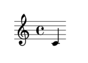

Abjad 3.6
=========

Abjad helps composers build up complex pieces of music notation in iterative and
incremental ways. Use Abjad to create a symbolic representation of all the notes, rests,
chords, tuplets, beams and slurs in any score. Because Abjad extends the Python
programming language, you can use Abjad to make systematic changes to music as you work.
Because Abjad wraps the LilyPond music notation package, you can use Abjad to control the
typographic detail of symbols on the page.

..  image:: https://img.shields.io/travis/Abjad/abjad/master.svg?style=flat-square
    :target: https://travis-ci.org/Abjad/abjad

..  image:: https://img.shields.io/pypi/v/abjad.svg?style=flat-square
    :target: https://pypi.python.org/pypi/abjad

..  image:: https://img.shields.io/pypi/dm/abjad.svg?style=flat-square
    :target: https://pypi.python.org/pypi/abjad

..  image:: https://img.shields.io/badge/code%20style-black-000000.svg
    :target: https://github.com/ambv/black

----

Abjad's documentation is available here: https://abjad.github.io

Abjad's install instructions are tested on macOS and Linux.

Abjad requires Python 3.10 or later:

..  code-block::

    ~$ python --version
    Python 3.10.2

Make sure LilyPond is installed: http://lilypond.org/development.html

Make sure LilyPond is callable from the commandline:

..  code-block::

    $ lilypond --version
    GNU LilyPond 2.22.1

    Copyright (c) 1996--2021 by
    Han-Wen Nienhuys <hanwen@xs4all.nl>
    Jan Nieuwenhuizen <janneke@gnu.org>
    and others.

    This program is free software.  It is covered by the GNU General Public
    License and you are welcome to change it and/or distribute copies of it
    under certain conditions.  Invoke as `lilypond --warranty' for more
    information.

Create a Python 3 virtual environment for Abjad: https://docs.python.org/3/tutorial/venv.html

Activate the virtual environment and then use pip to install Abjad:

..  code-block::

    ~$ python -m pip install abjad

Start Python, import Abjad, start making music notation:

..  code-block::

    ~$ python
    Python 3.10.2 (v3.10.2:a58ebcc701, Jan 13 2022, 14:50:16)
    [Clang 13.0.0 (clang-1300.0.29.30)] on darwin
    Type "help", "copyright", "credits" or "license" for more information.
    >>> import abjad
    >>> note = abjad.Note("c'4")
    >>> abjad.show(note)

----

Join the Abjad community: https://abjad.github.io/appendices/community.html
