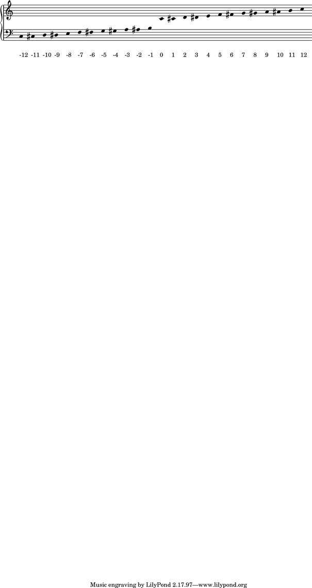
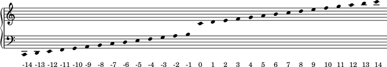

Pitch conventions
=================

Pitch numbers
-------------

Abjad numbers pitches like this:

::

   >>> score, treble_staff, bass_staff = scoretools.make_empty_piano_score()
   >>> duration = Duration(1, 32)

::

   >>> pitches = range(-12, 12 + 1)
   >>> abjad_configuration.set_default_accidental_spelling('sharps')

::

   >>> for pitch in pitches:
   ...     note = Note(pitch, duration)
   ...     rest = Rest(duration)
   ...     clef = pitchtools.suggest_clef_for_named_pitches([note.written_pitch])
   ...     if clef == indicatortools.Clef('treble'):
   ...         treble_staff.append(note)
   ...         bass_staff.append(rest)
   ...     else:
   ...         treble_staff.append(rest)
   ...         bass_staff.append(note)
   ...     pitch_number = note.written_pitch.pitch_number
   ...     markup = markuptools.Markup(str(pitch_number), Down)
   ...     markup = markup.attach(bass_staff[-1])
   ... 
   Traceback (most recent call last):
     File "<stdin>", line 13, in <module>
   AttributeError: 'Markup' object has no attribute 'attach'

::

   >>> score.override.beam.transparent = True
   Traceback (most recent call last):
     File "<stdin>", line 1, in <module>
   AttributeError: 'Score' object has no attribute 'override'
   >>> score.override.time_signature.stencil = False
   Traceback (most recent call last):
     File "<stdin>", line 1, in <module>
   AttributeError: 'Score' object has no attribute 'override'
   >>> score.override.flag.transparent = True
   Traceback (most recent call last):
     File "<stdin>", line 1, in <module>
   AttributeError: 'Score' object has no attribute 'override'
   >>> score.override.rest.transparent = True
   Traceback (most recent call last):
     File "<stdin>", line 1, in <module>
   AttributeError: 'Score' object has no attribute 'override'
   >>> score.override.stem.stencil = False
   Traceback (most recent call last):
     File "<stdin>", line 1, in <module>
   AttributeError: 'Score' object has no attribute 'override'
   >>> score.override.text_script.staff_padding = 6
   Traceback (most recent call last):
     File "<stdin>", line 1, in <module>
   AttributeError: 'Score' object has no attribute 'override'
   >>> contextualize(score).proportional_notation_duration = schemetools.SchemeMoment(1, 56)

::

   >>> lilypond_file = lilypondfiletools.make_basic_lilypond_file(score)
   >>> lilypond_file.global_staff_size = 15
   >>> show(lilypond_file)

Diatonic pitch numbers
----------------------

Abjad numbers diatonic pitches like this:

::

   >>> score, treble_staff, bass_staff = scoretools.make_empty_piano_score()
   >>> duration = Duration(1, 32)

::

   >>> pitches = []
   >>> diatonic_pitches = [0, 2, 4, 5, 7, 9, 11]

::

   >>> pitches.extend([-24 + x for x in diatonic_pitches])
   >>> pitches.extend([-12 + x for x in diatonic_pitches])
   >>> pitches.extend([0 + x for x in diatonic_pitches])
   >>> pitches.extend([12 + x for x in diatonic_pitches])
   >>> pitches.append(24)
   >>> abjad_configuration.set_default_accidental_spelling('sharps')

::

   >>> for pitch in pitches:
   ...     note = Note(pitch, duration)
   ...     rest = Rest(duration)
   ...     clef = pitchtools.suggest_clef_for_named_pitches([note.written_pitch])
   ...     if clef == indicatortools.Clef('treble'):
   ...         treble_staff.append(note)
   ...         bass_staff.append(rest)
   ...     else:
   ...         treble_staff.append(rest)
   ...         bass_staff.append(note)
   ...     diatonic_pitch_number = note.written_pitch.diatonic_pitch_number
   ...     markup = markuptools.Markup(str(diatonic_pitch_number), Down)
   ...     markup = markup.attach(bass_staff[-1])
   ... 
   Traceback (most recent call last):
     File "<stdin>", line 13, in <module>
   AttributeError: 'Markup' object has no attribute 'attach'

::

   >>> score.override.beam.transparent = True
   Traceback (most recent call last):
     File "<stdin>", line 1, in <module>
   AttributeError: 'Score' object has no attribute 'override'
   >>> score.override.time_signature.stencil = False
   Traceback (most recent call last):
     File "<stdin>", line 1, in <module>
   AttributeError: 'Score' object has no attribute 'override'
   >>> score.override.flag.transparent = True
   Traceback (most recent call last):
     File "<stdin>", line 1, in <module>
   AttributeError: 'Score' object has no attribute 'override'
   >>> score.override.rest.transparent = True
   Traceback (most recent call last):
     File "<stdin>", line 1, in <module>
   AttributeError: 'Score' object has no attribute 'override'
   >>> score.override.stem.stencil = False
   Traceback (most recent call last):
     File "<stdin>", line 1, in <module>
   AttributeError: 'Score' object has no attribute 'override'
   >>> score.override.text_script.staff_padding = 6
   Traceback (most recent call last):
     File "<stdin>", line 1, in <module>
   AttributeError: 'Score' object has no attribute 'override'
   >>> contextualize(score).proportional_notation_duration = schemetools.SchemeMoment(1, 52)

::

   >>> lilypond_file = lilypondfiletools.make_basic_lilypond_file(score)
   >>> lilypond_file.global_staff_size = 15
   >>> show(lilypond_file)

Accidental abbreviations
------------------------

Abjad abbreviates accidentals like this:

    ======================         ============================
    accidental name                abbreviation
    ======================         ============================
    quarter sharp                  'qs'
    quarter flat                   'qf'
    sharp                          's'
    flat                           'f'
    three-quarters sharp           'tqs'
    three-quarters flat            'tqf'
    double sharp                   'ss'
    double flat                    'ff'
    ======================         ============================

Octave designation
------------------

Abjad designates octaves with both numbers and ticks:

    ===============        =============
    octave notation        tick notation
    ===============        =============
    C7                     c''''
    C6                     c'''
    C5                     c''
    C4                     c'
    C3                     c
    C2                     c,
    C1                     c,,
    ===============        =============

Default accidental spelling
---------------------------

By default Abjad picks between enharmonic equivalents according to
the following table:

    ============================        ====================================
    pitch-class number                  pitch-class name
    ============================        ====================================
    0                                   C
    1                                   C#
    2                                   D
    3                                   Eb
    4                                   E
    5                                   F
    6                                   F#
    7                                   G
    8                                   Gb
    9                                   A
    10                                  Bb
    11                                  B
    ============================        ====================================

You can change the default accidental spelling like this:

::

   >>> abjad_configuration['default_accidental_spelling'] = 'sharps'

Or like this:

::

   >>> abjad_configuration['default_accidental_spelling'] = 'sharps'

Or like this:

::

   >>> abjad_configuration['default_accidental_spelling'] = 'mixed'

