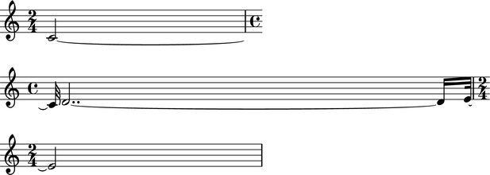
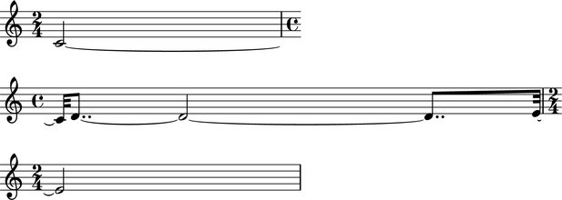
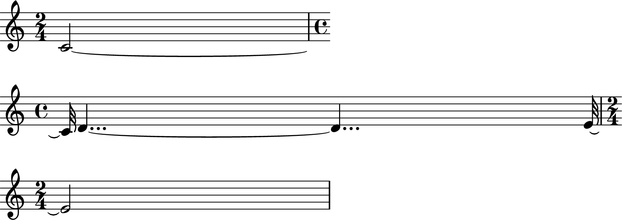
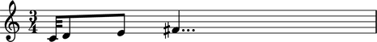
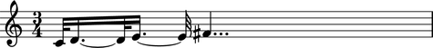
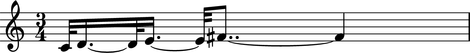
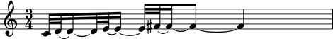
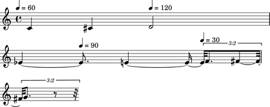

:orphan:

Abjad 2.11
----------

Released 2013-02-05. Built from r9468.  Implements 515 public classes and 1016
functions totaling 210,000 lines of code.

The ``Meter`` class
^^^^^^^^^^^^^^^^^^^^^^^^^^^^^^^

A new ``Meter`` class is now available in the
``metertools`` package.

The class implements a rhythm tree-based model of nested time signature
groupings.

The structure of the tree corresponds to factors of the time signature’s
numerator.

Each deeper level of the tree divides the previous by the next factor in
sequence.

Prime divisions greater than ``3`` are converted to sequences of ``2`` and
``3`` summing to that prime.  Hence ``5`` becomes ``3+2`` and ``7`` becomes
``3+2+2``.

The ``Meter`` class models a common-practice understanding of
meter::

    >>> meter = metertools.Meter((4, 4))

::

    >>> meter
    Meter('(4/4 (1/4 1/4 1/4 1/4))')

::

    >>> print meter.pretty_rtm_format
    (4/4 (
        1/4
        1/4
        1/4
        1/4))

::

    >>> print metertools.Meter((3, 4)).pretty_rtm_format
    (3/4 (
        1/4
        1/4
        1/4))

::

    >>> print metertools.Meter((6, 8)).pretty_rtm_format
    (6/8 (
        (3/8 (
            1/8
            1/8
            1/8))
        (3/8 (
            1/8
            1/8
            1/8))))

::

    >>> print metertools.Meter((5, 4)).pretty_rtm_format
    (5/4 (
        (3/4 (
            1/4
            1/4
            1/4))
        (2/4 (
            1/4
            1/4))))

::

    >>> print metertools.Meter((5, 4),
    ...     decrease_durations_monotonically=False).pretty_rtm_format
    (5/4 (
        (2/4 (
            1/4
            1/4))
        (3/4 (
            1/4
            1/4
            1/4))))

::

    >>> print metertools.Meter((12, 8)).pretty_rtm_format
    (12/8 (
        (3/8 (
            1/8
            1/8
            1/8))
        (3/8 (
            1/8
            1/8
            1/8))
        (3/8 (
            1/8
            1/8
            1/8))
        (3/8 (
            1/8
            1/8
            1/8))))

Rewriting rhythms according to a different metric hierarchy
^^^^^^^^^^^^^^^^^^^^^^^^^^^^^^^^^^^^^^^^^^^^^^^^^^^^^^^^^^^

A new ``rewrite_meter()`` function is now available in the
``metertools`` package.

The function rewrites the contents of logical ties to match a meter.

Example 1. Rewrite the contents of a measure in a staff using the default
meter for that measure's time signature:

::

    >>> parseable = "abj: | 2/4 c'2 ~ || 4/4 c'32 d'2.. ~ d'16 e'32 ~ || 2/4 e'2 |"

::

    >>> staff = Staff(parseable)
    >>> f(staff)
    \new Staff {
        {
            \time 2/4
            c'2 ~
        }
        {
            \time 4/4
            c'32
            d'2.. ~
            d'16
            e'32 ~
        }
        {
            \time 2/4
            e'2
        }
    }

::

    >>> hierarchy = metertools.Meter((4, 4))
    >>> print hierarchy.pretty_rtm_format
    (4/4 (
        1/4
        1/4
        1/4
        1/4))

::

    >>> metertools.rewrite_meter(staff[1][:], hierarchy)
    >>> f(staff)
    \new Staff {
        {
            \time 2/4
            c'2 ~
        }
        {
            \time 4/4
            c'32
            d'8.. ~
            d'2 ~
            d'8..
            e'32 ~
        }
        {
            \time 2/4
            e'2
        }
    }

Example 2. Rewrite the contents of a measure in a staff using a custom
meter:

::

    >>> staff = Staff(parseable)
    >>> f(staff)
    \new Staff {
        {
            \time 2/4
            c'2 ~
        }
        {
            \time 4/4
            c'32
            d'2.. ~
            d'16
            e'32 ~
        }
        {
            \time 2/4
            e'2
        }
    }

::

    >>> rtm = '(4/4 ((2/4 (1/4 1/4)) (2/4 (1/4 1/4))))'
    >>> hierarchy = metertools.Meter(rtm)
    >>> print hierarchy.pretty_rtm_format
    (4/4 (
        (2/4 (
            1/4
            1/4))
        (2/4 (
            1/4
            1/4))))

::

    >>> metertools.rewrite_meter(staff[1][:], hierarchy)
    >>> f(staff)
    \new Staff {
        {
            \time 2/4
            c'2 ~
        }
        {
            \time 4/4
            c'32
            d'4... ~
            d'4...
            e'32 ~
        }
        {
            \time 2/4
            e'2
        }
    }

Example 3. Limit the maximum number of dots per leaf using
`maximum_dot_count`:

::

    >>> parseable = "abj: | 3/4 c'32 d'8 e'8 fs'4... |"
    >>> measure = p(parseable)
    >>> f(measure)
    {
        \time 3/4
        c'32
        d'8
        e'8
        fs'4...
    }

Do not constrain the `maximum_dot_count`:

::

    >>> metertools.rewrite_meter(measure[:], measure)
    >>> f(measure)
    {
        \time 3/4
        c'32
        d'16. ~
        d'32
        e'16. ~
        e'32
        fs'4...
    }

Constrain the `maximum_dot_count` to `2`:

::

    >>> measure = p(parseable)
    >>> metertools.rewrite_meter(measure[:], measure,
    ...     maximum_dot_count=2)
    >>> f(measure)
    {
        \time 3/4
        c'32
        d'16. ~
        d'32
        e'16. ~
        e'32
        fs'8.. ~
        fs'4
    }

Constrain the `maximum_dot_count` to `1`:

::

    >>> measure = p(parseable)
    >>> metertools.rewrite_meter(measure[:], measure,
    ...     maximum_dot_count=1)
    >>> f(measure)
    {
        \time 3/4
        c'32
        d'16. ~
        d'32
        e'16. ~
        e'32
        fs'16. ~
        fs'8 ~
        fs'4
    }

.. image:: images/establish-7.png

Constrain the `maximum_dot_count` to `0`:

::

    >>> measure = p(parseable)
    >>> metertools.rewrite_meter(measure[:], measure,
    ...     maximum_dot_count=0)
    >>> f(measure)
    {
        \time 3/4
        c'32
        d'32 ~
        d'16 ~
        d'32
        e'32 ~
        e'16 ~
        e'32
        fs'32 ~
        fs'16 ~
        fs'8 ~
        fs'4
    }

Many further examples are available in the API entry for the class.

The ``quantizationtools`` package
^^^^^^^^^^^^^^^^^^^^^^^^^^^^^^^^^

The ``quantizationtools`` package has been completely rewritten.

``Quantizer`` quantizes sequences of attack-points in score trees.

``QEventSequences`` bundle attack-points together:

::

    >>> quantizer = quantizationtools.Quantizer()

::

    >>> durations = [1000] * 8
    >>> pitches = range(8)
    >>> q_event_sequence = quantizationtools.QEventSequence.from_millisecond_pitch_pairs(
    ...     zip(durations, pitches))

Quantization defaults to ``4/4`` output at ``quarter=60``:

::

    >>> result = quantizer(q_event_sequence)
    >>> score = Score([Staff([result])])
    >>> f(score)
    \new Score <<
        \new Staff {
            \new Voice {
                {
                    \time 4/4
                    \tempo 4=60 
                    c'4
                    cs'4
                    d'4
                    ef'4
                }
                {
                    e'4
                    f'4
                    fs'4
                    g'4
                }
            }
        }
    >>

.. image:: images/quantization-1.png

The behavior of the ``Quantizer`` can be modified at call-time.

Pass a ``QSchema`` instance to alter the macro-structure of quantizer output.

Here, we quantize using settings specified by a ``MeasurewiseQSchema``.  This
causes the ``Quantizer`` to group the output into measures with different tempi
and time signatures:

::

    >>> measurewise_q_schema = quantizationtools.MeasurewiseQSchema(
    ...     {'tempo': ((1, 4), 78), 'time_signature': (2, 4)},
    ...     {'tempo': ((1, 8), 57), 'time_signature': (5, 4)},
    ...     )

::

    >>> result = quantizer(q_event_sequence, q_schema=measurewise_q_schema)
    >>> score = Score([Staff([result])])
    >>> f(score)
    \new Score <<
        \new Staff {
            \new Voice {
                {
                    \time 2/4
                    \tempo 4=78
                    c'4 ~
                    \times 4/5 {
                        c'16.
                        cs'8.. ~
                    }
                }
                {
                    \time 5/4
                    \tempo 8=57
                    \times 4/7 {
                        cs'16.
                        d'8 ~
                    }
                    \times 4/5 {
                        d'16
                        ef'16. ~
                    }
                    \times 2/3 {
                        ef'16
                        e'8 ~
                    }
                    \times 4/7 {
                        e'16
                        f'8 ~
                        f'32 ~
                    }
                    f'32
                    fs'16. ~
                    \times 4/5 {
                        fs'32
                        g'8 ~
                    }
                    \times 4/7 {
                        g'32
                        r4. ~
                        r32 ~
                    }
                    r4
                }
            }
        }
    >>

.. image:: images/quantization-2.png

Here we quantize using settings specified by a ``BeatwiseQSchema``.  This keeps
the output of the quantizer flattened and produces neither measures nor
explicit time signatures.  The default beatwise setting of ``quarter=60``
persists until the third beatspan:

::

    >>> beatwise_q_schema = quantizationtools.BeatwiseQSchema(
    ... {
    ...     2: {'tempo': ((1, 4), 120)},
    ...     5: {'tempo': ((1, 4), 90)},
    ...     7: {'tempo': ((1, 4), 30)},
    ... })

::

    >>> result = quantizer(q_event_sequence, q_schema=beatwise_q_schema)
    >>> score = Score([Staff([result])])
    >>> f(score)
    \new Score <<
        \new Staff {
            \new Voice {
                \tempo 4=60 
                c'4
                cs'4
                \tempo 4=120 
                d'2
                ef'4 ~
                \tempo 4=90 
                ef'8.
                e'4 ~
                e'16 ~
                \times 2/3 {
                    \tempo 4=30 
                    e'32
                    f'8.
                    fs'8 ~
                    fs'32 ~
                }
                \times 2/3 {
                    fs'32
                    g'8.
                    r8 ~
                    r32
                }
            }
        }
    >>

Refer to the ``BeatwiseQSchema`` and ``MeasurewiseQSchema`` API entires for
more information on controlling ``Quantizer`` output.

Refer to the ``SearchTree`` API entry for information on controlling the
rhythmic complexity of ``Quantizer`` output.

The ``timespantools`` package
^^^^^^^^^^^^^^^^^^^^^^^^^^^^^^^^^

A new ``timespantools`` package is now available.

The ``timespantools`` package features seven functions for using natural
language to compare the in-time position on an offset relative to a reference
timespan::

    timespantools.offset_happens_after_timespan_starts()
    timespantools.offset_happens_after_timespan_stops()
    timespantools.offset_happens_before_timespan_starts()
    timespantools.offset_happens_before_timespan_stops()
    timespantools.offset_happens_during_timespan()
    timespantools.offset_happens_when_timespan_starts()
    timespantools.offset_happens_when_timespan_stops()

The ``timespantools`` package contains ``26`` functions for using natural
language to compare the in-time position of one timespan relative to another::

    timespantools.timespan_2_contains_timespan_1_improperly()
    timespantools.timespan_2_curtails_timespan_1()
    timespantools.timespan_2_delays_timespan_1()
    timespantools.timespan_2_happens_during_timespan_1()
    timespantools.timespan_2_intersects_timespan_1()
    timespantools.timespan_2_is_congruent_to_timespan_1()
    timespantools.timespan_2_overlaps_all_of_timespan_1()
    timespantools.timespan_2_overlaps_only_start_of_timespan_1()
    timespantools.timespan_2_overlaps_only_stop_of_timespan_1()
    timespantools.timespan_2_overlaps_start_of_timespan_1()
    timespantools.timespan_2_overlaps_stop_of_timespan_1()
    timespantools.timespan_2_starts_after_timespan_1_starts()
    timespantools.timespan_2_starts_after_timespan_1_stops()
    timespantools.timespan_2_starts_before_timespan_1_starts()
    timespantools.timespan_2_starts_before_timespan_1_stops()
    timespantools.timespan_2_starts_during_timespan_1()
    timespantools.timespan_2_starts_when_timespan_1_starts()
    timespantools.timespan_2_starts_when_timespan_1_stops()
    timespantools.timespan_2_stops_after_timespan_1_starts()
    timespantools.timespan_2_stops_after_timespan_1_stops()
    timespantools.timespan_2_stops_before_timespan_1_starts()
    timespantools.timespan_2_stops_before_timespan_1_stops()
    timespantools.timespan_2_stops_during_timespan_1()
    timespantools.timespan_2_stops_when_timespan_1_starts()
    timespantools.timespan_2_stops_when_timespan_1_stops()
    timespantools.timespan_2_trisects_timespan_1()

Here's an example of some of the natural language comparison functions
available in the ``timespantools`` package::

    >>> staff_1 = Staff(r"\times 2/3 { c'4 d'4 e'4 } \times 2/3 { f'4 g'4 a'4 }")
    >>> staff_2 = Staff("c'2. d'4")
    >>> score = Score([staff_1, staff_2])

::

    >>> f(score)
    \new Score <<
        \new Staff {
            \times 2/3 {
                c'4
                d'4
                e'4
            }
            \times 2/3 {
                f'4
                g'4
                a'4
            }
        }
        \new Staff {
            c'2.
            d'4
        }
    >>

::

    >>> last_tuplet = staff_1[-1]
    >>> long_note = staff_2[0]

::

    >>> timespantools.timespan_2_happens_during_timespan_1(
    ... timespan_1=last_tuplet, timespan_2=long_note)
    False

::

    >>> timespantools.timespan_2_intersects_timespan_1(
    ... timespan_1=last_tuplet, timespan_2=long_note)
    True

::

    >>> timespantools.timespan_2_is_congruent_to_timespan_1(
    ... timespan_1=last_tuplet, timespan_2=long_note)
    False

::

    >>> timespantools.timespan_2_overlaps_all_of_timespan_1(
    ... timespan_1=last_tuplet, timespan_2=long_note)
    False

::

    >>> timespantools.timespan_2_overlaps_start_of_timespan_1(
    ... timespan_1=last_tuplet, timespan_2=long_note)
    True

::

    >>> timespantools.timespan_2_overlaps_stop_of_timespan_1(
    ... timespan_1=last_tuplet, timespan_2=long_note)
    False

::

    >>> timespantools.timespan_2_starts_after_timespan_1_starts(
    ... timespan_1=last_tuplet, timespan_2=long_note)
    False

::

    >>> timespantools.timespan_2_starts_after_timespan_1_stops(
    ... timespan_1=last_tuplet, timespan_2=long_note)
    False

Other new features
^^^^^^^^^^^^^^^^^^

Autocompletion is now available at the Abjad prompt.

New tutorials describe how to get started with Abjad:

::

    Getting started
    LilyPond “hello, world!”
    Python “hello, world!” (at the interpreter)
    Python “hello, world!” (in a file)
    More about Python
    Abjad “hello, world” (at the interpreter)
    Abjad “hello, world!” (in a file)
    More about Abjad

Music notation images now appear in the docstrings of many functions throughout
the API.

Added new ``topleveltools.graph()`` function to the ``systemtools`` package.  A small
number of classes throughout the system have started to gain a
`graphviz_format` attribute, including ``datastructuretools.Digraph``,
``documentationtools.InheritanceGraph``, some of the
``rhythmtreetools.RhythmTreeNode`` subclasses, and even
``metertools.Meter``::

    >>> hierarchy = metertools.Meter((7, 4))
    >>> topleveltools.graph(hierarchy)

.. image:: images/graph.png

Forced accidentals and cautionary accidentals are now available as properties::

    >>> note = scoretools.Note("c'4")
    >>> note.note_head.is_forced = True
    >>> f(note)
    c'!4

::

    >>> note.note_head.is_cautionary = True
    >>> f(note)
    c'!?4

Forced accidentals and cautionary accidentals are also now available at
instantiation::

    >>> note = Note("c'!?4")
    >>> note
    Note("c'!?4")

::

    >>> chord = Chord("<c'!? e'? g'! b'>4")
    >>> chord
    Chord("<c'!? e'? g'! b'>4")

::

    >>> Note(chord)
    Note("c'!?4")

::

    >>> Chord(note)
    Chord("<c'!?>4")

Added a function to register custom markup globally with the LilyPond parser::

    >>> from abjad.tools.lilypondparsertools import LilyPondParser

::

    >>> name = 'my-custom-markup-function'
    >>> signature = ['markup?']
    >>> LilyPondParser.register_markup_function(name, signature)

::

    >>> parser = LilyPondParser()
    >>> string = r"\markup { \my-custom-markup-function { foo bar baz } }"
    >>> parser(string)
    Markup((MarkupCommand('my-custom-markup-function', ['foo', 'bar', 'baz']),))

::

    >>> f(_)
    \markup { \my-custom-markup-function { foo bar baz } }

Note that this once registered, the custom markup command is also recognized
when instantiating parsed markup objects::

    >>> markuptools.Markup(r"\my-custom-markup-function { foo bar baz }")
    Markup((MarkupCommand('my-custom-markup-function', ['foo', 'bar', 'baz']),))

Added new ``markuptools.MusicGlyph`` class.  This is a subclass of
``markuptools.MarkupCommand``, and can therefore be used anywhere
``MarkupCommand`` can appear.  It guarantees correct quoting around the glyph
name (which is easy to forget, or not always clear how to do for new users),
and also checks that the glyph name is recognized in LilyPond::

    >>> markuptools.MusicGlyph('accidentals.sharp')
    MusicGlyph('accidentals.sharp')

::

    >>> print _
    \musicglyph #"accidentals.sharp"

The ``durationtools`` package now implements three related classes.  All three
classes are now available in the global namespace.  Durations, multipliers and
offsets are now distinguished everywhere in Abjad::

    Duration
    Multiplier
    Offset

Implemented new ``NonreducedRatio`` class. Compare with existing ``Ratio``
class::

    >>> mathtools.NonreducedRatio(2, 4, 2)
    NonreducedRatio(2, 4, 2)

::

    >>> mathtools.Ratio(2, 4, 2)
    Ratio(1, 2, 1)

Added new ``scoretools.ScoreSelection`` subclasses. All selections are
improper::

    selectiontools.Descendants
    selectiontools.Lineage
    selectiontools.Parentage

New score selection subclasses are also accessible via::

    Component.descendants
    Component.lineage
    Component.parentage

Added ``lilypondfiletools.LilyPondDimension`` class::

    >>> dimension = lilypondfiletools.LilyPondDimension(2, 'in')
    >>> f(dimension)
    2.0\in

Added a new parseable tag to abjad-book: ``<abjadextract module \>[flags]``.
This single-line tag imports the code found at `module`, and copies the actual
code text itself into the abjad-book session, just as though it had been
manually included between a pair of ``<abjad></abjad>`` tags.  The intended use
is in Abjad's literature examples.  Most of the examples are also written up in
the ``demos/`` directory.

The ``abjad-book`` executable now handles multi-page PNG output.

Implemented page selection in ``abjad-book``.
Example: show pages 2 through 5 of a multipage score::

    <abjad>
    show(foo) <page 2-5
    </abjad>

Added new ``EvenRunRhythmMaker`` class to the ``rhythmmakertools`` package.
For each division on which the class is called, the class produces an even run
of notes each equal in duration to ``1/d`` with ``d`` equal to the division
denominator::

    >>> maker = rhythmmakertools.EvenRunRhythmMaker()

::

    >>> divisions = [(4, 16), (3, 8), (2, 8)]
    >>> lists = maker(divisions)
    >>> containers = sequencetools.flatten_sequence(lists)

::

    >>> staff = Staff(containers)

::

    >>> f(staff)
    \new Staff {
        {
            c'16 [
            c'16
            c'16
            c'16 ]
        }
        {
            c'8 [
            c'8
            c'8 ]
        }
        {
            c'8 [
            c'8 ]
        }
    }
