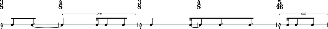
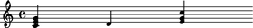
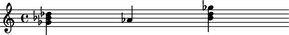
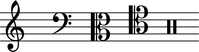
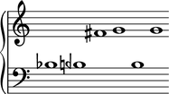
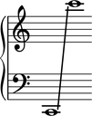
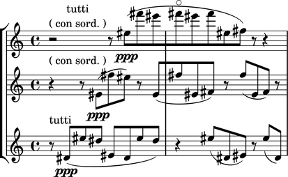
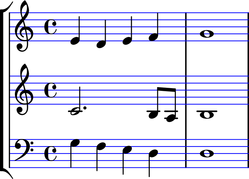
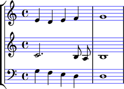
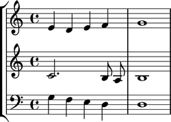

:tocdepth: 2

Abjad 2.14
----------

Released 2013-12-26. Implements 429 public classes and 438 functions totaling
163,595 lines of code.

The most important changes made in Abjad 2.14 concern the implementation of a
set of nine interlocking system protocols, described below.

Abjad 2.14 also includes extensive changes to the ``instrumenttools`` package
and new classes available in the global namespace when you import Abjad.

Abjad system protocols
^^^^^^^^^^^^^^^^^^^^^^

Abjad 2.14 reorganizes important elements of the system's functionality
according to a collection of protocols. A protocol is the recognized way of
doing something. In the context of Python development a protocol refers to the
collection of classes and functions that must be called in sequence to
accomplish a task. (Experienced Python programmers will recognize this use of
protocol from the "pickle protocol" which describes how to use the ``pickle``
and ``cPickle`` modules included in Python's standard library and from the
"copy protocol" which describes how implement ``__copy__()`` and
``__deepcopy__()`` methods on your classes to make them work with Python's
built-in ``copy`` module.)

Abjad 2.13 introduced an inspection protocol (for examining the derived
properties of score components) and a mutation protocol (for making structural
changes to score). The user interface to these two protocols are Abjad's
``inspect_()`` and ``mutate()`` functions.

Abjad 2.14 introduces additional protocols. These are the attachment protocol
(for attaching and detaching indicators like clefs and articulations to and
from score components); the iteration protocol (for stepping through components
in a score); the format protocol (for formatting objects as LilyPond input or
as some other type of human-readable string); the persistence protocol (for
writing objects to disk); the typesetter protocol (for overriding the
attributes of LilyPond graphic objects and for making LilyPond context
settings); the illustration protocol (to make custom classes viewable as music
notation); and the make-new protocol (for making copies of immutable objects
with changes made to selected attributes at copy time). To summarize, Abjad
2.14 now implements all of the following:

    * attachment protcocol
    * format protocol
    * illustration protocol
    * inspection protocol
    * iteration protocol
    * make-new protocol
    * mutation protocol
    * persistence protocol
    * typesetter protocol 

These are described in the sections below.

The attachment protocol
^^^^^^^^^^^^^^^^^^^^^^^

New ``attach()`` and ``detach()`` functions are available when you start Abjad.

Use ``attach()`` to attach indicators to your score. Indicators are
things like clefs, key signatures, time signatures and articulations:

::

   >>> staff = Staff()
   >>> key_signature = KeySignature('g', 'major')
   >>> attach(key_signature, staff)
   >>> time_signature = TimeSignature((2, 4), partial=Duration(1, 8))
   >>> attach(time_signature, staff)
   >>> clef = Clef('treble')
   >>> attach(clef, staff)
   >>> staff.extend("d'8 f'8 a'8 d''8 f''8 gs'4 r8 e'8 gs'8 b'8 e''8 gs''8 a'4")
   >>> articulation = Articulation('turn')
   >>> attach(articulation, staff[5])
   >>> show(staff)

You can also use ``attach()`` to attach spanners to your score:

::

   >>> slur = Slur()
   >>> attach(slur, staff[:6])
   >>> slur = Slur()
   >>> attach(slur, staff[-6:])
   >>> show(staff)

Use ``detach()`` to detach indicators and spanners from your score:

::

   >>> detach(KeySignature, staff)
   (KeySignature('g', 'major'),)
   >>> detach(Slur, staff[0])
   (Slur(''),)
   >>> detach(Slur, staff[-1])
   (Slur(''),)
   >>> show(staff)

The ``attach()`` and ``detach()`` functions replace the old ``attach()`` and
``detach()`` methods bound to indicators in older versions of Abjad. 

Abjad's indicator classes are housed in the new ``indicatortools`` package:

::

    indicatortools.Annotation
    indicatortools.Articulation
    indicatortools.BarLine
    indicatortools.BendAfter
    indicatortools.Clef
    indicatortools.Dynamic
    indicatortools.IsAtSoundingPitch
    indicatortools.IsUnpitched
    indicatortools.KeySignature
    indicatortools.LilyPondCommand
    indicatortools.LilyPondComment
    indicatortools.StaffChange
    indicatortools.StemTremolo
    indicatortools.Tempo
    indicatortools.TimeSignature

The new ``indicatortools`` package replaces the old ``marktools`` and
``contexttools`` packages.

Abjad 2.14 also introduces arbitrary attachment. Any object can be attached to
any score component, not only those classes housed in ``indicatortools``:

::

   >>> staff = Staff("c'4 d'4 e'4 f'4")
   >>> indicator = {'foo': 1, 'bar': 2}
   >>> attach(indicator, staff[0], scope=Staff)
   >>> inspect_(staff[-1]).get_effective(dict)
   {'foo': 1, 'bar': 2}

The format protocol
^^^^^^^^^^^^^^^^^^^

Python introduced a built-in ``format()`` function in version 2.6 of the
language. The purpose of ``format()`` is to change an object into a
human-readable string according to some type of format specification; the usual
way to call the function is something like ``format(x,
'format_specification')``.  Abjad 2.14 now implements the protocol
suggested by Python's ``format()`` function.

You can use Python's ``format()`` function to get the LilyPond format of Abjad
score components:

::

   >>> staff = Staff("c'4 d'4 e'4 f'4")
   >>> print format(staff, 'lilypond')
   \new Staff {
       c'4
       d'4
       e'4
       f'4
   }

And you can use ``format()`` to get the so-called storage format of other Abjad
objects:

::

   >>> violin = instrumenttools.Violin()
   >>> print format(violin, 'storage')
   instrumenttools.Violin(
       instrument_name='violin',
       short_instrument_name='vn.',
       instrument_name_markup=markuptools.Markup(
           ('Violin',)
           ),
       short_instrument_name_markup=markuptools.Markup(
           ('Vn.',)
           ),
       allowable_clefs=indicatortools.ClefInventory(
           [
               indicatortools.Clef(
                   'treble'
                   ),
               ]
           ),
       pitch_range=pitchtools.PitchRange(
           '[G3, G7]'
           ),
       sounding_pitch_of_written_middle_c=pitchtools.NamedPitch("c'"),
       )

These uses of ``format()`` replace the ``lilypond_format`` and
``storage_format`` properties bound to classes in older versions of Abjad.

The illustration protocol
^^^^^^^^^^^^^^^^^^^^^^^^^

In Abjad 2.14 you can call the top-level ``show()`` function on many objects.

You can show a clef inventory:

::

   >>> clef_inventory = indicatortools.ClefInventory()
   >>> clef_inventory.extend(['treble', 'bass', 'alto', 'tenor', 'percussion'])
   >>> show(clef_inventory)

You can show a pitch segment:

::

   >>> segment = pitchtools.PitchSegment([-2, -1.5, 6, 7, -1.5, 7])
   >>> show(segment)

You can show a pitch range:

::

   >>> pitch_range = pitchtools.PitchRange('[C2, C6]')
   >>> show(pitch_range)

Classes that "know what to do" when you call ``show()`` on them implement the
illustration protocol. You can teach custom classes to follow the illustration
protocol by implementing ``__illustrate__()`` methods against them.

The iteration protocol
^^^^^^^^^^^^^^^^^^^^^^

A new ``iterate()`` function is available when you start Abjad.

Here's an example score:

::

   >>> string = r"""
   ... \new Score <<
   ...     \new StaffGroup <<
   ...         \new Staff {
   ...             r2 ^ \markup { \center-column { tutti \line { ( con sord. ) } } }
   ...             r8
   ...             es'' [ ( \ppp
   ...             fs'''
   ...             es'''
   ...             fs''' \flageolet
   ...             es'''
   ...             fs'''
   ...             es''
   ...             fs'' ] )
   ...             r
   ...             r4
   ...         }
   ...         \new Staff {
   ...             r4 ^ \markup { ( con sord. ) }
   ...             r8
   ...             es' [ ( \ppp 
   ...             fs''
   ...             es'' ] )
   ...             r
   ...             es' [ (
   ...             fs''
   ...             es'
   ...             fs' ] )
   ...             r
   ...             fs'' [ (
   ...             es'
   ...             fs' ] )
   ...             r
   ...         }
   ...         \new Staff {
   ...             r8 ^ \markup { tutti }
   ...             ds' [ ( \ppp
   ...             es''
   ...             ds'' ]
   ...             es' [
   ...             ds'
   ...             es''
   ...             ds'' ] )
   ...             r4
   ...             es''8 [ (
   ...             ds'
   ...             es' ] )
   ...             r
   ...             es'' [ (
   ...             ds' ] )
   ...         }
   ...     >>
   ... >>
   ... """

::

   >>> score = parse(string)
   >>> show(score)

Here's how to iterate notes in the score's first staff:

::

   >>> staff_group = score[0]
   >>> first_staff = staff_group[0]
   >>> for note in iterate(first_staff).by_class(Note):
   ...     note
   ... 
   Note("es''8")
   Note("fs'''8")
   Note("es'''8")
   Note("fs'''8")
   Note("es'''8")
   Note("fs'''8")
   Note("es''8")
   Note("fs''8")

``iterate()`` is factory function that returns an instance of the new
``IterationAgent`` included in the ``agenttools`` package.

``IterationAgent`` provides the following interface:

::

    IterationAgent.by_class()
    IterationAgent.by_components_and_grace_containers()
    IterationAgent.by_leaf_pair()
    IterationAgent.by_logical_tie()
    IterationAgent.by_logical_voice()
    IterationAgent.by_logical_voice_from_component()
    IterationAgent.by_run()
    IterationAgent.by_semantic_voice()
    IterationAgent.by_timeline()
    IterationAgent.by_timeline_from_component()
    IterationAgent.by_topmost_logical_ties_and_components()
    IterationAgent.by_vertical_moment()
    IterationAgent.depth_first()

The new ``iterate()`` function replaces the old ``iterationtools`` package.

The make-new protocol
^^^^^^^^^^^^^^^^^^^^^

Many classes in Abjad 2.14 are immutable. You can not, for example, change the
pitch range of a violin after you create it:

::

   >>> violin = instrumenttools.Violin()
   >>> violin.pitch_range
   PitchRange('[G3, G7]')

To work with a violin with a different range you can initialize the violin
differently:

::

   >>> scordatura_range = pitchtools.PitchRange('[F#3, G7]')
   >>> scordatura_violin_1 = instrumenttools.Violin(pitch_range=scordatura_range)
   >>> scordatura_violin_1.pitch_range
   PitchRange('[F#3, G7]')

Or you can make a new violin based an existing violin:

::

   >>> scordatura_violin_2 = new(violin, pitch_range=scordatura_range)
   >>> scordatura_violin_2.pitch_range
   PitchRange('[F#3, G7]')

Abjad 2.14 introduces a ``new()`` function to work with the make-new protocol
shown in this second example. Use ``new()`` to make a new object with new
properties based on an old object with different properties.  The classes in
``datastructuretools``, ``instrumenttools``, ``pitchtools``,
``rhythmmakertools`` and ``timespantools`` implement the make-new protocol in
Abjad 2.14.

The persistence protocol
^^^^^^^^^^^^^^^^^^^^^^^^

A new ``persist()`` function is available when you start Abjad.

``persist()`` is a factory function that creates an instance of the new
``PersistenceAgent`` housed in the ``agenttools`` package.

``PersistenceAgent`` offers the following public interface:

::

    as_ly()
    as_midi()
    as_module()
    as_pdf()

Use ``persist(score).as_pdf()`` to write a score to disk as a PDF and use
``persist(score).as_ly()`` to write a score to disk as a LilyPond file. See the
``PersistenceAgent`` API entry for examples.

The typesetter protocol
^^^^^^^^^^^^^^^^^^^^^^^

New ``override()`` and ``set_()`` functions are available when you
start Abjad.

Here's an example score:

::

   >>> treble_staff_1 = Staff("e'4 d'4 e'4 f'4 g'1")
   >>> treble_staff_2 = Staff("c'2. b8 a8 b1")
   >>> bass_staff = Staff("g4 f4 e4 d4 d1")
   >>> clef = Clef('bass')
   >>> attach(clef, bass_staff)
   >>> staff_group = scoretools.StaffGroup()
   >>> staff_group.extend([treble_staff_1, treble_staff_2, bass_staff])
   >>> score = Score([staff_group])
   >>> show(score)

Use ``override()`` to override the attributes of LilyPond graphic objects:

::

   >>> override(score).staff_symbol.color = 'blue'
   >>> show(score)

Use ``set_()`` to create LilyPond context settings:

::

   >>> set_(score).auto_beaming = False
   >>> show(score)

And use Python's built-in ``del()`` function to remove the settings you make
with ``override()`` and ``set_()``:

::

   >>> del(override(score).staff_symbol)
   >>> show(score)

Abjad 2.14 components and spanners follow the typesetter protocol described
here.

The ``override()`` and ``set_()`` functions replace the ``override``
and ``set`` propertiess bound to classes in previous versions of Abjad.

Improvements to instrumenttools
^^^^^^^^^^^^^^^^^^^^^^^^^^^^^^^

Abjad 2.14 features an extensive set of changes made the 48 instrument classes
implemented in ``instrumenttools``:

::

   >>> for name in dir(instrumenttools):
   ...     if name[0].isupper():
   ...         command = 'instrument = instrumenttools.{}()'
   ...         command = command.format(name)
   ...         exec(command)
   ...         if isinstance(instrument, instrumenttools.Instrument):
   ...             instrument
   ... 
   Accordion()
   AltoFlute()
   AltoSaxophone()
   AltoTrombone()
   AltoVoice()
   BaritoneSaxophone()
   BaritoneVoice()
   BassClarinet()
   BassFlute()
   BassSaxophone()
   BassTrombone()
   BassVoice()
   Bassoon()
   Cello()
   ClarinetInA()
   ClarinetInBFlat()
   ClarinetInEFlat()
   Contrabass()
   ContrabassClarinet()
   ContrabassFlute()
   ContrabassSaxophone()
   Contrabassoon()
   EnglishHorn()
   Flute()
   FrenchHorn()
   Glockenspiel()
   Guitar()
   Harp()
   Harpsichord()
   Instrument()
   Marimba()
   MezzoSopranoVoice()
   Oboe()
   Piano()
   Piccolo()
   SopraninoSaxophone()
   SopranoSaxophone()
   SopranoVoice()
   TenorSaxophone()
   TenorTrombone()
   TenorVoice()
   Trumpet()
   Tuba()
   UntunedPercussion()
   Vibraphone()
   Viola()
   Violin()
   Xylophone()

All instrument classes now implement the following seven properties:

::

    Instrument.allowable_clefs
    Instrument.instrument_name
    Instrument.insturment_name_markup
    Insturment.pitch_range
    Instrument.short_instrument_name
    Instrument.short_instrument_name_markup
    Instrument.sounding_pitch_of_written_middle_c

Set instrument properties at initialization or change them later with
``new()``.

Instrument API entries now feature illustrated examples of all properties
listed here.

More classes available in the global namespace
^^^^^^^^^^^^^^^^^^^^^^^^^^^^^^^^^^^^^^^^^^^^^^

Abjad 2.14 makes more classes available to you in the global namespace:

::

   >>> dir()
   ['Articulation', 'Beam', 'Chord', 'Clef', 'Container', 'Crescendo', 'Decrescendo', 'Duration', 'Dynamic', 'Fraction', 'Glissando', 'Hairpin', 'KeySignature', 'Markup', 'Measure', 'Multiplier', 'NamedPitch', 'Note', 'Offset', 'Rest', 'Score', 'Slur', 'Staff', 'StaffGroup', 'Tempo', 'Tie', 'TimeSignature', 'Tuplet', 'Voice', '__builtins__', '__doc__', '__name__', '__package__', '__result__', '__warningregistry__', 'abctools', 'abjad_configuration', 'abjadbooktools', 'agenttools', 'articulation', 'attach', 'bass_staff', 'clef', 'clef_inventory', 'command', 'set_', 'datastructuretools', 'detach', 'developerscripttools', 'documentationtools', 'durationtools', 'exceptiontools', 'f', 'first_staff', 'indicator', 'indicatortools', 'inspect', 'instrument', 'instrumenttools', 'iterate', 'key_signature', 'labeltools', 'layouttools', 'lilypondfiletools', 'lilypondnametools', 'lilypondparsertools', 'markuptools', 'mathtools', 'metertools', 'mutate', 'name', 'new', 'note', 'override', 'parse', 'persist', 'pitch_range', 'pitcharraytools', 'pitchtools', 'play', 'quantizationtools', 'rhythmmakertools', 'rhythmtreetools', 'schemetools', 'scordatura_range', 'scordatura_violin_1', 'scordatura_violin_2', 'score', 'scoretools', 'segment', 'select', 'selectiontools', 'sequencetools', 'show', 'sievetools', 'slur', 'spannertools', 'staff', 'staff_group', 'string', 'stringtools', 'systemtools', 'templatetools', 'time_signature', 'timespantools', 'tonalanalysistools', 'topleveltools', 'treble_staff_1', 'treble_staff_2', 'violin']

``Articulation``, ``Beam``, ``Clef``, ``Crescendo``, ``Decrescendo``,
``Dynamic``, ``Glissando``, ``Hairpin``, ``KeySignature``, ``Markup``,
``Slur``, ``Tempo``, ``Tie`` and ``TimeSignature`` are available in the
global namespace for the first time in Abjad 2.14.

This means that you can now say ``Clef('treble')`` instead of
``indicatortoools.Clef('treble')`` and keep the score code you write compact.

