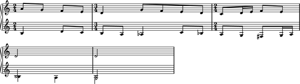
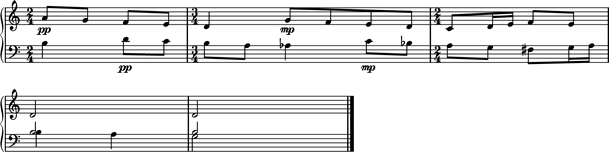
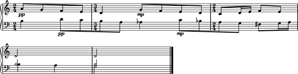

Bartók: *Mikrokosmos*
=====================

This example reconstructs the last five measures of Bartók's "Wandering"
from *Mikrokosmos*, volume III.
The end result is just a few measures long but covers the basic features
you'll use most often in Abjad.

Here is what we want to end up with:

.. image :: images/bartok-final.png

The score
---------

We'll construct the fragment top-down from containers to notes. We could have
done it the other way around but it will be easier to keep the big picture in
mind this way. Later, you can rebuild the example bottom-up as an exercise.

First let's create an empty score with a pair of staves connected by a brace:

::

   >>> score = Score([])
   >>> piano_staff = scoretools.PianoStaff([])
   >>> upper_staff = Staff([])
   >>> lower_staff = Staff([])

::

   >>> piano_staff.append(upper_staff)
   >>> piano_staff.append(lower_staff)
   >>> score.append(piano_staff)

The measures
------------

Now let's add some empty measures:

::

   >>> upper_measures = []
   >>> upper_measures.append(Measure((2, 4), []))
   >>> upper_measures.append(Measure((3, 4), []))
   >>> upper_measures.append(Measure((2, 4), []))
   >>> upper_measures.append(Measure((2, 4), []))
   >>> upper_measures.append(Measure((2, 4), []))

::

   >>> import copy
   >>> lower_measures = copy.deepcopy(upper_measures)

::

   >>> upper_staff.extend(upper_measures)
   >>> lower_staff.extend(lower_measures)

The notes
---------

Now let's add some notes.

We begin with the upper staff:

::

   >>> upper_measures[0].extend("a'8 g'8 f'8 e'8")
   >>> upper_measures[1].extend("d'4 g'8 f'8 e'8 d'8")
   >>> upper_measures[2].extend("c'8 d'16 e'16 f'8 e'8")
   >>> upper_measures[3].append("d'2")
   >>> upper_measures[4].append("d'2")

The first three measures of the lower staff contain only one voice:

::

   >>> lower_measures[0].extend("b4 d'8 c'8")
   >>> lower_measures[1].extend("b8 a8 af4 c'8 bf8")
   >>> lower_measures[2].extend("a8 g8 fs8 g16 a16")

The last two measures of the lower staff contain two voices each.

We use LilyPond ``\voiceOne`` and ``\voiceTwo`` commands to set
the direction of stems in different voices. And we set ``is_simltaneous``
to true for each of the last two measures:

::

   >>> upper_voice = Voice("b2", name='upper voice')
   >>> command = marktools.LilyPondCommand('voiceOne')
   >>> command.attach(upper_voice)
   LilyPondCommand('voiceOne')(Voice-"upper voice"{1})
   >>> lower_voice = Voice("b4 a4", name='lower voice')
   >>> command = marktools.LilyPondCommand('voiceTwo')
   >>> command.attach(lower_voice)
   LilyPondCommand('voiceTwo')(Voice-"lower voice"{2})
   >>> lower_measures[3].extend([upper_voice, lower_voice])
   >>> lower_measures[3].is_simultaneous = True

::

   >>> upper_voice = Voice("b2", name='upper voice')
   >>> command = marktools.LilyPondCommand('voiceOne')
   >>> command.attach(upper_voice)
   LilyPondCommand('voiceOne')(Voice-"upper voice"{1})
   >>> lower_voice = Voice("g2", name='lower voice')
   >>> command = marktools.LilyPondCommand('voiceTwo')
   >>> command.attach(lower_voice)
   LilyPondCommand('voiceTwo')(Voice-"lower voice"{1})
   >>> lower_measures[4].extend([upper_voice, lower_voice])
   >>> lower_measures[4].is_simultaneous = True

Here's our work so far:

::

   >>> show(score)

The details
-----------

Ok, let's add the details. First, notice that the bottom staff has a treble
clef just like the top staff. Let's change that:

::

   >>> clef = marktools.Clef('bass')
   >>> clef.attach(lower_staff)
   Clef('bass')(Staff{5})

Now let's add dynamic marks. For the top staff, we'll add them to the first
note of the first measure and the second note of the second measure. For the
bottom staff, we'll add dynamic markings to the second note of the first
measure and the fourth note of the second measure:

::

   >>> dynamic = marktools.Dynamic('pp')
   >>> dynamic.attach(upper_measures[0][0])
   Dynamic('pp')(a'8)

::

   >>> dynamic = marktools.Dynamic('mp')
   >>> dynamic.attach(upper_measures[1][1])
   Dynamic('mp')(g'8)

::

   >>> dynamic = marktools.Dynamic('pp')
   >>> dynamic.attach(lower_measures[0][1])
   Dynamic('pp')(d'8)

::

   >>> dynamic = marktools.Dynamic('mp')
   >>> dynamic.attach(lower_measures[1][3])
   Dynamic('mp')(c'8)

Let's add a double bar to the end of the piece:

::

   >>> score.add_double_bar()
   BarLine('|.')(g2)

And see how things are coming out:

::

   >>> show(score)

Notice that the beams of the eighth and sixteenth notes appear as you would
usually expect: grouped by beat. We get this for free thanks to LilyPond's
default beaming algorithm. But this is not the way Bartók notated the beams.
Let's set the beams as Bartók did with some crossing the bar lines:

::

   >>> upper_leaves = upper_staff.select_leaves(allow_discontiguous_leaves=True)
   >>> lower_leaves = lower_staff.select_leaves(allow_discontiguous_leaves=True)

::

   >>> beam = spannertools.BeamSpanner()
   >>> beam.attach(upper_leaves[:4])

::

   >>> beam = spannertools.BeamSpanner()
   >>> beam.attach(lower_leaves[1:5])

::

   >>> beam = spannertools.BeamSpanner()
   >>> beam.attach(lower_leaves[6:10])

::

   >>> show(score)

Now some slurs:

::

   >>> slur = spannertools.SlurSpanner()
   >>> slur.attach(upper_leaves[:5])

::

   >>> slur = spannertools.SlurSpanner()
   >>> slur.attach(upper_leaves[5:])

::

   >>> slur = spannertools.SlurSpanner()
   >>> slur.attach(lower_leaves[1:6])

Hairpins:

::

   >>> crescendo = spannertools.CrescendoSpanner()
   >>> crescendo.attach(upper_leaves[-7:-2])

::

   >>> decrescendo = spannertools.DecrescendoSpanner()
   >>> decrescendo.attach(upper_leaves[-2:])

A ritardando marking above the last seven notes of the upper staff:

::

   >>> markup = markuptools.Markup('ritard.')
   >>> text_spanner = spannertools.TextSpanner()
   >>> text_spanner.override.text_spanner.bound_details__left__text = markup
   >>> text_spanner.attach(upper_leaves[-7:])

And ties connecting the last two notes in each staff:

::

   >>> tie = spannertools.TieSpanner()
   >>> tie.attach(upper_leaves[-2:])

::

   >>> note_1 = lower_staff[-2]['upper voice'][0]
   >>> note_2 = lower_staff[-1]['upper voice'][0]
   >>> notes = [note_1, note_2]
   >>> tie = spannertools.TieSpanner()
   >>> tie.attach(notes)

The final result:

::

   >>> show(score)

.. image:: images/index-4.png

