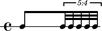
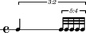
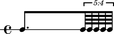
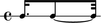
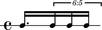
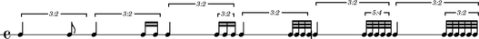
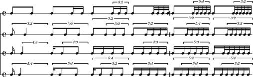
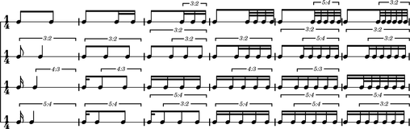
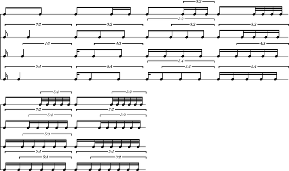
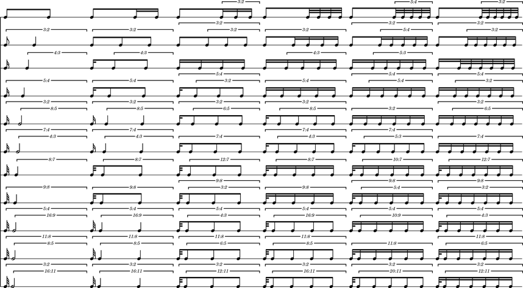

Ferneyhough: *Unsichtbare Farben*
=================================

..  note::  Explore the `abjad/demos/ferneyhough/` directory for the complete
    code to this example, or import it into your Python session directly with:

    * `from abjad.demos import ferneyhough`

Mikhïal Malt analyzes the rhythmic materials of Ferneyhough's `Unsichtbare
Farben` in `The OM Composer's Book 2`.

Malt explains that Ferneyhough used OpenMusic to create an "exhaustive
catalogue of rhythmic cells" such that:

    1.  They are subdivided into two pulses, with proportions from ``1/1`` to 
        ``1/11``.

    2.  The second pulse is subdivided successively by ``1``, ``2``, ``3``, 
        ``4``, ``5`` and ``6``.

Let's recreate Malt's results in Abjad.

The proportions
---------------

First we define proportions:

::

   >>> proportions = [(1, n) for n in range(1, 11 + 1)]

::

   >>> proportions
   [(1, 1), (1, 2), (1, 3), (1, 4), (1, 5), (1, 6), (1, 7), (1, 8), (1, 9), (1, 10), (1, 11)]

The transforms
--------------

Next we'll show how to divide a quarter note into various ratios, and then
divide the final `tie chain` of the resulting tuplet into yet another ratio:

::

   def make_nested_tuplet(
       tuplet_duration,
       outer_tuplet_proportions,
       inner_tuplet_subdivision_count,
       ):
       outer_tuplet = Tuplet.from_duration_and_ratio(
           tuplet_duration, outer_tuplet_proportions)
       inner_tuplet_proportions = inner_tuplet_subdivision_count * [1]
       last_leaf = outer_tuplet.select_leaves()[-1]
       right_tie_chain = inspect(last_leaf).get_tie_chain()
       right_tie_chain.to_tuplet(inner_tuplet_proportions)
       return outer_tuplet

::

   >>> tuplet = make_nested_tuplet(Duration(1, 4), (1, 1), 5)
   >>> staff = scoretools.RhythmicStaff([tuplet])
   >>> show(staff)

::

   >>> tuplet = make_nested_tuplet(Duration(1, 4), (2, 1), 5)
   >>> staff = scoretools.RhythmicStaff([tuplet])
   >>> show(staff)

::

   >>> tuplet = make_nested_tuplet(Duration(1, 4), (3, 1), 5)
   >>> staff = scoretools.RhythmicStaff([tuplet])
   >>> show(staff)

A `tie chain` is a selection of notes or chords connected by ties. It lets us
talk about a notated rhythm of ``5/16``, for example, which can not be expressed
with only a single leaf.

Note how we can divide a tuplet whose outer proportions are ``3/5``, where
the second `tie chain` requires two notes to express the ``5/16`` duration:

::

   >>> normal_tuplet = Tuplet.from_duration_and_ratio(Duration(1, 4), (3, 5))
   >>> staff = scoretools.RhythmicStaff([normal_tuplet])
   >>> show(staff)

::

   >>> subdivided_tuplet = make_nested_tuplet(Duration(1, 4), (3, 5), 3)
   >>> staff = scoretools.RhythmicStaff([subdivided_tuplet])
   >>> show(staff)

The rhythms
-----------

Now that we know how to make the basic building block, let's make a lot of
tuplets all at once.

We'll set the duration of each tuplet equal to a quarter note:

::

   >>> duration = Fraction(1, 4)

And then we make one row of rhythms, with the last `tie chain` increasingly
subdivided:

::

   def make_row_of_nested_tuplets(tuplet_duration, outer_tuplet_proportions, column_count):
       assert 0 < column_count
       row_of_nested_tuplets = []
       for n in range(column_count):
           inner_tuplet_subdivision_count = n + 1
           nested_tuplet = make_nested_tuplet(
               tuplet_duration, outer_tuplet_proportions, inner_tuplet_subdivision_count)
           row_of_nested_tuplets.append(nested_tuplet)
       return row_of_nested_tuplets

::

   >>> tuplets = make_row_of_nested_tuplets(duration, (2, 1), 6)
   >>> staff = scoretools.RhythmicStaff(tuplets)
   >>> show(staff)

If we can make one single row of rhythms, we can make many rows of rhythms.
Let's try:

::

   def make_rows_of_nested_tuplets(tuplet_duration, row_count, column_count):
       assert 0 < row_count
       rows_of_nested_tuplets = []
       for n in range(row_count):
           outer_tuplet_proportions = (1, n + 1)
           row_of_nested_tuplets = make_row_of_nested_tuplets(
               tuplet_duration, outer_tuplet_proportions, column_count)
           rows_of_nested_tuplets.append(row_of_nested_tuplets)
       return rows_of_nested_tuplets

::

   >>> score = Score()
   >>> for tuplet_row in make_rows_of_nested_tuplets(duration, 4, 6):
   ...     score.append(scoretools.RhythmicStaff(tuplet_row))
   ... 
   >>> show(score)

That's getting close to what we want, but the typography isn't as good as it
could be.

The score
---------

First we'll package up the logic for making the un-styled score into a single
function:

::

   def make_score(tuplet_duration, row_count, column_count):
       score = Score()
       rows_of_nested_tuplets = make_rows_of_nested_tuplets(
           tuplet_duration, row_count, column_count)
       for row_of_nested_tuplets in rows_of_nested_tuplets:
           staff = scoretools.RhythmicStaff(row_of_nested_tuplets)
           time_signature = indicatortools.TimeSignature((1, 4))
           time_signature.attach(staff)
           score.append(staff)
       return score

::

   >>> score = make_score(Duration(1, 4), 4, 6)
   >>> show(score)

Then we'll apply some formatting overrides to improve its overall appearance:

::

   def configure_score(score):
       score.set.proportional_notation_duration = schemetools.SchemeMoment(1, 56)
       score.set.tuplet_full_length = True
       score.override.bar_line.stencil = False
       score.override.bar_number.transparent = True
       score.override.spacing_spanner.uniform_stretching = True
       score.override.spacing_spanner.strict_note_spacing = True
       score.override.time_signature.stencil = False
       score.override.tuplet_bracket.padding = 2
       score.override.tuplet_bracket.staff_padding = 4
       score.override.tuplet_number.text = schemetools.Scheme('tuplet-number::calc-fraction-text')

::

   >>> configure_score(score)
   >>> show(score)

..  note: Consult LilyPond's documentation on `proportional notation <http://www.lilypond.org/doc/v2.16/Documentation/notation/proportional-notation>`_
    to learn all about what the formatting overrides above do.

The proportional spacing makes the score much easier to read, but now the
notation is much too big.  We'll clean that up next.

The LilyPond file
-----------------

Let's adjust the overall size of our output, and put everything together:

::

   def make_lilypond_file(tuplet_duration, row_count, column_count):
       score = make_score(tuplet_duration, row_count, column_count)
       configure_score(score)
       lilypond_file = lilypondfiletools.make_basic_lilypond_file(score)
       configure_lilypond_file(lilypond_file)
       return lilypond_file

::

   def configure_lilypond_file(lilypond_file):
       lilypond_file.default_paper_size = '11x17', 'portrait'
       lilypond_file.global_staff_size = 12
       lilypond_file.layout_block.indent = 0
       lilypond_file.layout_block.ragged_right = True
       lilypond_file.paper_block.ragged_bottom = True
       spacing_vector = layouttools.make_spacing_vector(0, 0, 8, 0)
       lilypond_file.paper_block.system_system_spacing = spacing_vector

::

   >>> lilypond_file = make_lilypond_file(Duration(1, 4), 11, 6)
   >>> show(lilypond_file)

