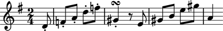
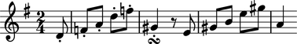
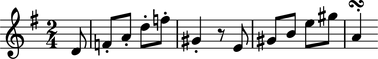
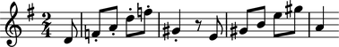
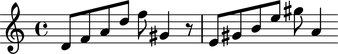
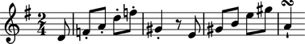
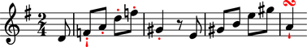

Articulations
=============

Articulations model staccato dots, marcato wedges and other symbols.
Articulations attach to notes, rests or chords.

Creating articulations
----------------------

Use ``marktools`` to create articulations:

::

   >>> articulation = marktools.Articulation('turn')

::

   >>> articulation
   Articulation('turn')

Attaching articulations to a leaf
---------------------------------

Use ``attach()`` to attach articulations to a leaf:

::

   >>> staff = Staff()
   >>> key_signature = marktools.KeySignatureMark('g', 'major')
   >>> key_signature.attach(staff)
   KeySignatureMark(NamedPitchClass('g'), Mode('major'))(Staff{})
   >>> time_signature = marktools.TimeSignatureMark((2, 4), partial=Duration(1, 8))
   >>> time_signature.attach(staff)
   TimeSignatureMark((2, 4), partial=Duration(1, 8))(Staff{})

::

   >>> staff.extend("d'8 f'8 a'8 d''8 f''8 gs'4 r8 e'8 gs'8 b'8 e''8 gs''8 a'4")

::

   >>> articulation.attach(staff[5])
   Articulation('turn')(gs'4)

::

   >>> show(staff)

(The example is based on Haydn's piano sonata number 42, Hob. XVI/27.)

Attaching articulations to many notes and chords at once
--------------------------------------------------------

Write a loop to attach articulations to many notes and chords at one time:

::

   >>> for leaf in staff[:6]:
   ...     staccato = marktools.Articulation('staccato')
   ...     staccato.attach(leaf)
   ... 
   Articulation('staccato')(d'8)
   Articulation('staccato')(f'8)
   Articulation('staccato')(a'8)
   Articulation('staccato')(d''8)
   Articulation('staccato')(f''8)
   Articulation('staccato')(gs'4)

::

   >>> show(staff)

Getting the articulations attached to a leaf
--------------------------------------------

Use the inspector to get the articulations attached to a leaf:

::

   >>> inspect(staff[5]).get_marks(mark_classes=marktools.Articulation)
   (Articulation('turn')(gs'4), Articulation('staccato')(gs'4))

Detaching articulations from a leaf
-----------------------------------

Detach articulations with ``detach()``:

::

   >>> articulation.detach()
   Articulation('turn')

::

   >>> articulation
   Articulation('turn')

::

   >>> show(staff)

Detaching all articulations attached to a leaf at once
------------------------------------------------------

Write a loop to detach all articulations attached to a leaf:

::

   >>> staff[0]
   Note("d'8")

::

   >>> articulations = inspect(staff[0]).get_marks(marktools.Articulation)
   >>> for articulation in articulations:
   ...     articulation.detach()
   ... 
   Articulation('staccato')

::

   >>> show(staff)

Inspecting the leaf to which an articulation is attached
--------------------------------------------------------

Use ``start_component`` to inspect the component to which 
an articulation is attached:

::

   >>> articulation = marktools.Articulation('turn')
   >>> articulation.attach(staff[-1])
   Articulation('turn')(a'4)

::

   >>> show(staff)

::

   >>> articulation.start_component
   Note("a'4")

Understanding the interpreter representation of an articulation that is not attached to a leaf
----------------------------------------------------------------------------------------------

The interpreter representation of an articulation that is not attached 
to a leaf contains three parts:

::

   >>> articulation = marktools.Articulation('staccato')

::

   >>> articulation
   Articulation('staccato')
   >>> print repr(articulation)
   Articulation('staccato')

``Articulation`` tells you the articulation's class.

``'staccato'`` tells you the articulation's name.

If you set the direction string of the articulation then that will appear, too:

::

   >>> articulation.direction = '^'

::

   >>> articulation
   Articulation('staccato', Up)
   >>> print repr(articulation)
   Articulation('staccato', Up)

Understanding the interpreter representation of an articulation that is attached to a leaf
------------------------------------------------------------------------------------------

The interpreter representation of an articulation that is attached 
to a leaf contains four parts:

::

   >>> articulation.attach(staff[-1])
   Articulation('staccato', Up)(a'4)

::

   >>> articulation
   Articulation('staccato', Up)(a'4)
   >>> print repr(articulation)
   Articulation('staccato', Up)(a'4)

::

   >>> show(staff)

``Articulation`` tells you the articulation's class.

``'staccato'`` tells you the articulation's name.

``'^'`` tells you the articulation's direction string.

``(a''4)`` tells you the component to which the articulation is attached.

If you set the direction string of the articulation to none then the direction
will no longer appear:

::

   >>> articulation.direction = None

::

   >>> articulation
   Articulation('staccato')(a'4)

Understanding the string representation of an articulation
----------------------------------------------------------

The string representation of an articulation comprises two parts:

::

   >>> str(articulation)
   '-\\staccato'

``-`` tells you the articulation's direction string.

``staccato`` tells you the articulation's name.

Inspecting the LilyPond format of an articulation
-------------------------------------------------

Get the LilyPond input format of an articulation with ``format``:

::

   >>> articulation.lilypond_format
   '-\\staccato'

Use ``f()`` as a short-cut to print the LilyPond format of an articulation:

::

   >>> f(articulation)
   -\staccato

Controlling whether an articulation appears above or below the staff
--------------------------------------------------------------------

Set ``direction`` to ``'^'`` to force an articulation to appear
above the staff:

::

   >>> articulation.direction = '^'
   >>> show(staff)

Set ``direction`` to ``'_'`` to force an articulation to appear
above the staff:

::

   >>> articulation.direction = '_'
   >>> show(staff)

Set ``direction`` to none to allow LilyPond to position
an articulation automatically:

::

   >>> articulation.direction = None
   >>> show(staff)

Getting and setting the name of an articulation
-----------------------------------------------

Set the ``name`` of an articulation to change the symbol 
an articulation prints:

::

   >>> articulation.name = 'staccatissimo'
   >>> show(staff)

Copying articulations
---------------------

Use ``copy.copy()`` to copy an articulation:

::

   >>> import copy

::

   >>> articulation_copy_1 = copy.copy(articulation)

::

   >>> articulation_copy_1
   Articulation('staccatissimo')

::

   >>> articulation_copy_1.attach(staff[1])
   Articulation('staccatissimo')(f'8)

::

   >>> show(staff)

Or use ``copy.deepcopy()`` to do the same thing.

Comparing articulations
-----------------------

Articulations compare equal with equal direction names and direction strings:

::

   >>> articulation.name
   'staccatissimo'
   >>> articulation.direction

::

   >>> articulation_copy_1.name
   'staccatissimo'
   >>> articulation_copy_1.direction

::

   >>> articulation == articulation_copy_1
   True

Otherwise articulations do not compare equal.

Overriding attributes of the LilyPond script grob
-------------------------------------------------

Override attributes of the LilyPond script grob like this:

::

   >>> staff.override.script.color = 'red'
   >>> show(staff)

See the LilyPond documentation for a list of script grob attributes available.
