Chords
======

Making chords from a LilyPond input string
------------------------------------------

You can make chords from a LilyPond input string:

::

   >>> chord = Chord("<ef' f' cs''>4")
   >>> show(chord)

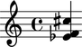

Making chords from numbers
--------------------------

You can also make chords from numbers:

::

   >>> chord = Chord([4, 6, 14], Duration(1, 4))
   >>> show(chord)

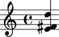

Understanding the interpreter representation of a chord
-------------------------------------------------------

::

   >>> chord
   Chord("<e' fs' d''>4")

``Chord`` tells you the chord's class.

``"<e' fs' d''>4"`` tells you chord's LilyPond input string.

Getting and setting the written duration of a chord
---------------------------------------------------

Get the written duration of a chord like this:

::

   >>> chord.written_duration
   Duration(1, 4)

Set the written duration of a chord like this:

::

   >>> chord.written_duration = Duration(3, 16)
   >>> show(chord)

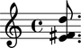

Getting and setting the written pitches of a chord
--------------------------------------------------

Get the written pitches of a chord like this:

::

   >>> chord.written_pitches
   (NamedPitch("e'"), NamedPitch("fs'"), NamedPitch("d''"))

Set the written pitches of a chord like this:

::

   >>> chord.written_pitches = ("e'", "fs'", "gs'")
   >>> show(chord)

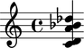

Getting chord note heads
------------------------

Get the note heads of a chord like this:

::

   >>> for note_head in chord.note_heads: note_head
   ... 
   NoteHead("e'")
   NoteHead("fs'")
   NoteHead("gs'")

Appending note heads to a chord
-------------------------------

Use ``append()`` to add one note head to a chord.

You can append with a pitch name:

::

   >>> chord = Chord("<f' g' ef''>4")
   >>> show(chord)

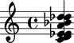

::

   >>> chord.note_heads.append("a'")
   >>> show(chord)

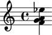

Or with a pitch number:

::

   >>> chord.note_heads.append(10)
   >>> show(chord)

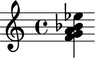

Extending chords
----------------

Use ``extend()`` to add multiple note heads to a chord.

You can extend with pitch names:

::

   >>> chord = Chord("<fs' gs' e''>4")
   >>> show(chord)

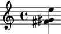

::

   >>> chord.note_heads.extend(["a'", "b'"])
   >>> show(chord)

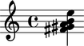

Or with pitch numbers:

::

   >>> chord.note_heads.extend([13, 14])
   >>> show(chord)

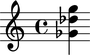

Deleting chord note heads
-------------------------

Delete chord note heads with ``del()``.

::

   >>> chord = Chord("<g' a' f''>4")
   >>> show(chord)

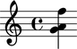

::

   >>> del(chord.note_heads[-1])
   >>> show(chord)

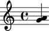

Tweaking chord note heads
-------------------------

Tweak chord note heads like this:

::

   >>> chord = Chord("<af' bf' gf''>4")
   >>> show(chord)

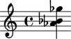

::

   >>> chord.note_heads[0].tweak.color = 'red'
   >>> chord.note_heads[1].tweak.color = 'blue'
   >>> chord.note_heads[2].tweak.color = 'green'
   >>> show(chord)

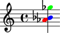

Working with empty chords
-------------------------

Abjad allows empty chords:

::

   >>> chord = Chord([], Duration(1, 4))
   >>> chord
   Chord('<>4')

Empty chords don't constitute valid LilyPond input.

This means LilyPond will complain if you pass empty chords to ``show()``.

You can add pitches back to an empty chord at any time:

::

   >>> chord.note_heads.extend([9, 11, 17])
   >>> show(chord)

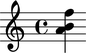
