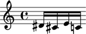
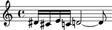
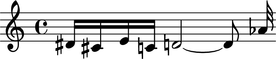
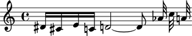
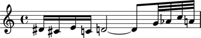
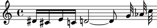
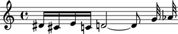
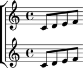
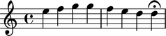
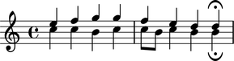

Containers
==========

Creating containers
-------------------

Create a container with components:

::

   >>> notes = [Note("ds'16"), Note("cs'16"), Note("e'16"), Note("c'16")]
   >>> container = Container(notes)
   >>> show(container)

Or with a LilyPond input string:

.. Xenakis: Jalons (1986): Contrabass: m58

::

   >>> container = Container("ds'16 cs'16 e'16 c'16 d'2 ~ d'8")
   >>> show(container)

Selecting music
---------------

Slice a container to select its components:

::

   >>> container[:]
   SliceSelection(Note("ds'16"), Note("cs'16"), Note("e'16"), Note("c'16"), Note("d'2"), Note("d'8"))

Inspecting length
-----------------

Get the length of a container with Python's built-in ``len()`` function:

::

   >>> len(container)
   6

Inspecting duration
-------------------

Use the inspector the get the duration of a container:

::

   >>> inspect(container).get_duration()
   Duration(7, 8)

Adding one component to the end of a container
----------------------------------------------

Add one component to the end of a container with ``append()``:

::

   >>> container.append(Note("af'32"))
   >>> show(container)

Adding many components to the end of a container
------------------------------------------------

Add many components to the end of a container with ``extend()``:

::

   >>> container.extend([Note("c''32"), Note("a'32")])
   >>> show(container)

Finding the index of a component
--------------------------------

Find the index of a component with ``index()``:

::

   >>> note = container[7]

::

   >>> container.index(note)
   7

Inserting a component by index
------------------------------

Insert a component by index with ``insert()``:

::

   >>> container.insert(-3, Note("g'32"))
   >>> show(container)

Removing a component by index
-----------------------------

Remove a component by index with ``pop()``:

::

   >>> container.pop(-1)
   Note("a'32")
   >>> show(container)

Removing a component by reference
---------------------------------

Remove a component by reference with ``remove()``:

::

   >>> container.remove(container[-1])
   >>> show(container)

..  ``__getslice__``, ``__setslice__`` and ``__delslice__`` 
    remain to be documented.

Naming containers
-----------------

You can name Abjad containers:

::

   >>> flute_staff = Staff("c'8 d'8 e'8 f'8")
   >>> flute_staff.name = 'Flute'
   >>> violin_staff = Staff("c'8 d'8 e'8 f'8")
   >>> violin_staff.name = 'Violin'
   >>> staff_group = scoretools.StaffGroup([flute_staff, violin_staff])
   >>> score = Score([staff_group])

Container names appear in LilyPond input:

::

   >>> f(score)
   \new Score <<
       \new StaffGroup <<
           \context Staff = "Flute" {
               c'8
               d'8
               e'8
               f'8
           }
           \context Staff = "Violin" {
               c'8
               d'8
               e'8
               f'8
           }
       >>
   >>

And make it easy to retrieve containers later:

::

   >>> score['Flute']
   Staff-"Flute"{4}

But container names do not appear in notational output:

::

   >>> show(score)

Understanding ``{ }`` and ``<< >>`` in LilyPond
-----------------------------------------------

LilyPond uses curly ``{ }`` braces to wrap a stream of musical events
that are to be engraved one after the other::

    \new Voice {
        e''4
        f''4
        g''4
        g''4
        f''4
        e''4
        d''4
        d''4 \fermata
    }

LilyPond uses skeleton ``<< >>`` braces to wrap two or more musical
expressions that are to be played at the same time::

    \new Staff <<
        \new Voice {
            \voiceOne
            e''4
            f''4
            g''4
            g''4
            f''4
            e''4
            d''4
            d''4 \fermata
        }
        \new Voice {
            \voiceTwo
            c''4
            c''4
            b'4
            c''4
            c''8
            b'8
            c''4
            b'4
            b'4 \fermata
        }
    >>

The examples above are both LilyPond input.

The most common use of LilyPond ``{ }`` is to group a 
potentially long stream of notes and rests into a single expression.

The most common use of LilyPond ``<< >>`` is to group a relatively smaller
number of note lists together polyphonically.

Understanding sequential and simultaneous containers
----------------------------------------------------

Abjad implements LilyPond ``{ }`` and ``<< >>`` in the container 
``is_simultaneous`` attribute.

Some containers set ``is_simultaneous`` to false at initialization:

::

   >>> staff = Staff([])
   >>> staff.is_simultaneous
   False

Other containers set ``is_simultaneous`` to true:

::

   >>> score = Score([])
   >>> score.is_simultaneous
   True

Changing sequential and simultaneous containers
-----------------------------------------------

Set ``is_simultaneous`` by hand as necessary:

::

   >>> voice_1 = Voice(r"e''4 f''4 g''4 g''4 f''4 e''4 d''4 d''4 \fermata")
   >>> voice_2 = Voice(r"c''4 c''4 b'4 c''4 c''8 b'8 c''4 b'4 b'4 \fermata")
   >>> staff = Staff([voice_1, voice_2])
   >>> staff.is_simultaneous = True
   >>> command = indicatortools.LilyPondCommand('voiceOne')
   >>> attach(command, voice_1)
   >>> command = indicatortools.LilyPondCommand('voiceTwo')
   >>> attach(command, voice_2)
   >>> show(staff)

The staff in the example above is set to simultaneous after initialization 
to create a type of polyphonic staff.
