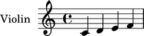
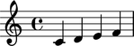
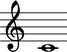
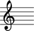
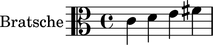

Instruments
===========

Creating instruments
--------------------

Use ``instrumenttools`` to create an instrument:

::

   >>> violin = instrumenttools.Violin()

Understanding the interpreter representation of an instrument
-------------------------------------------------------------

The interpreter representation of an instrument tells you the instrument's
class:

::

   >>> violin
   Violin()

Attaching instruments to a component
------------------------------------

Use ``attach()`` to attach an instrument to a component:

::

   >>> staff = Staff("c'4 d'4 e'4 f'4")
   >>> attach(violin, staff)
   >>> show(staff)

Inspecting the instrument attached to a component
-------------------------------------------------

Use the inspector to get the instrument attached to a component:

::

   >>> inspect_(staff).get_indicator(instrumenttools.Instrument)
   Violin()

Inspecting a component's effective instrument
---------------------------------------------

Use the inspector to get the instrument currently in effect for a component:

::

   >>> for note in staff:
   ...     inspect_(note).get_effective(instrumenttools.Instrument)
   ... 
   Violin()
   Violin()
   Violin()
   Violin()

Detaching instruments from a component
--------------------------------------

Use ``detach()`` to detach an instrument from a component:

::

   >>> detach(violin, staff)
   (Violin(),)
   >>> show(staff)

Getting the name of an instrument
---------------------------------

Use ``instrument_name`` to get the name of any instrument:

::

   >>> violin.instrument_name
   'violin'

Use ``instrument_name_markup`` to get the instrument name markup of
any instrument:

::

   >>> violin.instrument_name_markup
   Markup(('Violin',))

::

   >>> show(violin.instrument_name_markup)

Getting the short name of an instrument
---------------------------------------

Use ``short_instrument_name`` to get the short name of any instrument:

::

   >>> violin.short_instrument_name
   'vn.'

Use ``short_instrument_name_markup`` to get the short instrument name
markup of any instrument:

::

   >>> violin.short_instrument_name_markup
   Markup(('Vn.',))

::

   >>> show(violin.short_instrument_name_markup)

Getting an instrument's range
-----------------------------

Use ``pitch_range`` to get the range of any instrument:

::

   >>> violin.pitch_range
   PitchRange('[G3, G7]')

::

   >>> show(violin.pitch_range)

.. image:: images/index-5.png

Getting an instrument's level of transposition
----------------------------------------------

Use ``sounding_pitch_of_written_middle_c`` to get an instrument's level of
transposition:

::

   >>> violin.sounding_pitch_of_written_middle_c
   NamedPitch("c'")

::

   >>> show(violin.sounding_pitch_of_written_middle_c)

Getting an instrument's allowable clefs
---------------------------------------

Use ``allowable_clefs`` to get clefs on which an instrument is conventionally
notated:

::

   >>> violin.allowable_clefs
   ClefInventory([Clef('treble')])

::

   >>> show(violin.allowable_clefs)

Customizing instrument properties
---------------------------------

You can change the properties of any instrument at initialization:

::

   >>> viola = instrumenttools.Viola(
   ...     instrument_name='Bratsche',
   ...     short_instrument_name='Br.',
   ...     allowable_clefs=['alto', 'treble'],
   ...     pitch_range='[C3, C6]',
   ...     )

::

   >>> staff = Staff("c'4 d'4 e'4 fs'4")
   >>> attach(viola, staff)
   >>> clef = Clef('alto')
   >>> attach(clef, staff)
   >>> show(staff)

