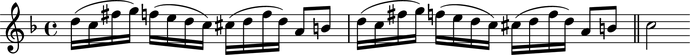
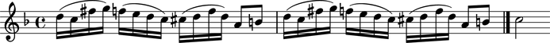
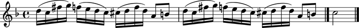

LilyPond command marks
======================

LilyPond command marks allow you to attach arbitrary LilyPond commands
to Abjad score components.

Creating LilyPond command marks
-------------------------------

Use ``marktools`` to create LilyPond command marks:

::

   >>> command = marktools.LilyPondCommandMark('bar "||"', 'after')

::

   >>> command
   LilyPondCommandMark('bar "||"')

Attaching LilyPond command marks to Abjad components
----------------------------------------------------

Use ``attach()`` to attach a LilyPond command mark to any Abjad component:

::

   >>> import copy
   >>> staff = Staff([])
   >>> key_signature = marktools.KeySignature('f', 'major')
   >>> key_signature.attach(staff)
   KeySignature(NamedPitchClass('f'), Mode('major'))(Staff{})
   >>> staff.extend(p("{ d''16 ( c''16 fs''16 g''16 ) }"))
   >>> staff.extend(p("{ f''16 ( e''16 d''16 c''16 ) }"))
   >>> staff.extend(p("{ cs''16 ( d''16 f''16 d''16 ) }"))
   >>> staff.extend(p("{ a'8 b'8 }"))
   >>> staff.extend(p("{ d''16 ( c''16 fs''16 g''16 )} "))
   >>> staff.extend(p("{ f''16 ( e''16 d''16 c''16 ) }"))
   >>> staff.extend(p("{ cs''16 ( d''16 f''16 d''16 ) }"))
   >>> staff.extend(p("{ a'8 b'8 c''2 }"))

::

   >>> command.attach(staff[-2])
   LilyPondCommandMark('bar "||"')(b'8)

::

   >>> show(staff)

.. image:: images/index-1.png

Inspecting the LilyPond command marks attached to an Abjad component
--------------------------------------------------------------------

Use the inspector to get the LilyPond command marks attached to a leaf:

::

   >>> inspect(staff[-2]).get_marks(marktools.LilyPondCommandMark)
   (LilyPondCommandMark('bar "||"')(b'8),)

Detaching LilyPond command marks from a component
-------------------------------------------------

Use ``detach()`` to detach LilyPond command marks from a component:

::

   >>> command.detach()
   LilyPondCommandMark('bar "||"')

::

   >>> command
   LilyPondCommandMark('bar "||"')

::

   >>> show(staff)

Inspecting the component to which a LilyPond command mark is attached
---------------------------------------------------------------------

Use ``start_component`` to inspect the component to which a LilyPond command
mark is attached:

::

   >>> command = marktools.LilyPondCommandMark('bar "||"', 'closing')
   >>> command.attach(staff[-2])
   LilyPondCommandMark('bar "||"')(b'8)

::

   >>> show(staff)

::

   >>> command.start_component
   Note("b'8")

Getting and setting the command name of a LilyPond command mark
---------------------------------------------------------------

Set the ``command_name`` of a LilyPond command mark to change the
LilyPond command a LilyPond command mark prints:

::

   >>> command.command_name = 'bar "|."'

::

   >>> show(staff)

Copying LilyPond commands
-------------------------

Use ``copy.copy()`` to copy a LilyPond command mark:

::

   >>> import copy

::

   >>> command_copy_1 = copy.copy(command)

::

   >>> command_copy_1
   LilyPondCommandMark('bar "|."')

::

   >>> command_copy_1.attach(staff[-1])
   LilyPondCommandMark('bar "|."')(c''2)

::

   >>> show(staff)

Or use ``copy.deepcopy()`` to do the same thing.

Comparing LilyPond command marks
--------------------------------

LilyPond command marks compare equal with equal command names:

::

   >>> command.command_name
   'bar "|."'

::

   >>> command_copy_1.command_name
   'bar "|."'

::

   >>> command == command_copy_1
   True

Otherwise LilyPond command marks do not compare equal.
