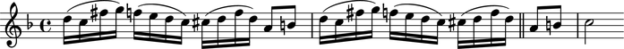
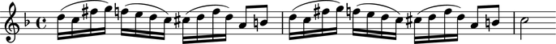

LilyPond commands
=================

LilyPond commands allow you to attach arbitrary LilyPond commands
to Abjad score components.

Creating LilyPond commands
--------------------------

Use ``indicatortools`` to create a LilyPond command:

::

   >>> command = indicatortools.LilyPondCommand('bar "||"', 'after')

Understanding the interpreter representation of LilyPond commands
-----------------------------------------------------------------

::

   >>> command
   LilyPondCommand('bar "||"', 'after')

``LilyPondCommand`` tells you the command's class.

``'bar "||"'`` tells you the LilyPond command to be formatted.

``'after'`` tells you where the command will be formatted relative to the leaf
to which it is attached.

Attaching LilyPond command marks to Abjad components
----------------------------------------------------

Use ``attach()`` to attach a LilyPond command mark to any Abjad component:

::

   >>> import copy
   >>> staff = Staff([])
   >>> key_signature = KeySignature('f', 'major')
   >>> attach(key_signature, staff)
   >>> staff.extend("{ d''16 ( c''16 fs''16 g''16 ) }")
   >>> staff.extend("{ f''16 ( e''16 d''16 c''16 ) }")
   >>> staff.extend("{ cs''16 ( d''16 f''16 d''16 ) }")
   >>> staff.extend("{ a'8 b'8 }")
   >>> staff.extend("{ d''16 ( c''16 fs''16 g''16 )} ")
   >>> staff.extend("{ f''16 ( e''16 d''16 c''16 ) }")
   >>> staff.extend("{ cs''16 ( d''16 f''16 d''16 ) }")
   >>> staff.extend("{ a'8 b'8 c''2 }")

::

   >>> attach(command, staff[-2])

::

   >>> show(staff)

Inspecting the LilyPond commands attached to a leaf
---------------------------------------------------

Use the inspector to get the LilyPond commands attached to a leaf:

::

   >>> inspect(staff[-2]).get_indicators(indicatortools.LilyPondCommand)
   (LilyPondCommand('bar "||"', 'after'),)

Detaching LilyPond commands
---------------------------

Use ``detach()`` to detach LilyPond commands:

::

   >>> detach(command, staff[-2])
   (LilyPondCommand('bar "||"', 'after'),)

::

   >>> show(staff)

Getting the name of a LilyPond command
--------------------------------------

Use ``name`` to get the name of a LilyPond command:

::

   >>> command.name
   'bar "||"'

Comparing LilyPond command marks
--------------------------------

LilyPond command marks compare equal with equal names. Otherwise LilyPond
command marks do not compare equal:

::

   >>> command_1 = indicatortools.LilyPondCommand('bar "||"', 'after')
   >>> command_2 = indicatortools.LilyPondCommand('bar "||"', 'before')
   >>> command_3 = indicatortools.LilyPondCommand('slurUp')

::

   >>> command_1 == command_1
   True
   >>> command_1 == command_2
   True
   >>> command_1 == command_3
   False

::

   >>> command_2 == command_1
   True
   >>> command_2 == command_2
   True
   >>> command_2 == command_3
   False

::

   >>> command_3 == command_1
   False
   >>> command_3 == command_2
   False
   >>> command_3 == command_3
   True

