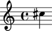

LilyPond comments
=================

LilyPond comments begin with the ``%`` sign.

You can include comments in the LilyPond output of the scores you create with
Abjad.

Creating LilyPond comments
--------------------------

Use ``indicatortools`` to create a LilyPond comment:

::

   >>> contents_string = 'This is a LilyPond comment before a note.'
   >>> comment_1 = indicatortools.LilyPondComment(contents_string, 'before')

Understanding the interpreter representation of a LilyPond comment
------------------------------------------------------------------

::

   >>> comment_1
   LilyPondComment('This is a LilyPond comment before a note.', 'before')

``LilyPondComment`` tells you the comment's class.

``'This is a LilyPond comments before a note.'`` tells you the contents string
of the comment.

``'before'`` tells you the slot in which the comment will be formatted.

Attaching LilyPond comments to leaves
-------------------------------------

Use ``attach()`` to attach LilyPond comments to any note, rest or chord.

You can add LilyPond comments before, after or to the right of any leaf:

::

   >>> note = Note("cs''4")

::

   >>> show(note)

::

   >>> attach(comment_1, note)

::

   >>> f(note)
   % This is a LilyPond comment before a note.
   cs''4

Attaching LilyPond comments to containers
-----------------------------------------

Use ``attach()`` to attach LilyPond comments to a container.

You can add LilyPond comments before, after, in the opening or in the closing
of any container:

::

   >>> staff = Staff("c'8 d'8 e'8 f'8")

::

   >>> show(staff)

::

   >>> contents_string_1 = 'Here is a LilyPond comment before the staff.'
   >>> contents_string_2 = 'Here is a LilyPond comment in the staff opening.'
   >>> contents_string_3 = 'Here is another LilyPond comment in the staff opening.'
   >>> contents_string_4 = 'LilyPond comment in the staff closing.'
   >>> contents_string_5 = 'LilyPond comment after the staff.'

::

   >>> staff_comment_1 = indicatortools.LilyPondComment(contents_string_1, 'before')
   >>> staff_comment_2 = indicatortools.LilyPondComment(contents_string_2, 'opening')
   >>> staff_comment_3 = indicatortools.LilyPondComment(contents_string_3, 'opening')
   >>> staff_comment_4 = indicatortools.LilyPondComment(contents_string_4, 'closing')
   >>> staff_comment_5 = indicatortools.LilyPondComment(contents_string_5, 'after')

::

   >>> attach(staff_comment_1, staff)
   >>> attach(staff_comment_2, staff)
   >>> attach(staff_comment_3, staff)
   >>> attach(staff_comment_4, staff)
   >>> attach(staff_comment_5, staff)

::

   >>> f(staff)
   % Here is a LilyPond comment before the staff.
   \new Staff {
       % Here is a LilyPond comment in the staff opening.
       % Here is another LilyPond comment in the staff opening.
       c'8
       d'8
       e'8
       f'8
       % LilyPond comment in the staff closing.
   }
   % LilyPond comment after the staff.

Getting the LilyPond comments attached to a component
-----------------------------------------------------

Use the inspector to get the LilyPond comments attached to any component:

::

   >>> inspect(note).get_indicators(indicatortools.LilyPondComment)
   (LilyPondComment('This is a LilyPond comment before a note.', 'before'),)

Detaching LilyPond comments
---------------------------

Use ``detach()`` to detach LilyPond comments:

::

   >>> detach(comment_1, note)
   (LilyPondComment('This is a LilyPond comment before a note.', 'before'),)

::

   >>> f(note)
   cs''4

::

   >>> detached_comments = detach(indicatortools.LilyPondComment, staff)
   >>> for comment in detached_comments: comment
   ... 
   LilyPondComment('Here is a LilyPond comment before the staff.', 'before')
   LilyPondComment('Here is a LilyPond comment in the staff opening.', 'opening')
   LilyPondComment('Here is another LilyPond comment in the staff opening.', 'opening')
   LilyPondComment('LilyPond comment in the staff closing.', 'closing')
   LilyPondComment('LilyPond comment after the staff.', 'after')

::

   >>> f(staff)
   \new Staff {
       c'8
       d'8
       e'8
       f'8
   }

Getting the contents string of a LilyPond comment
----------------------------------------------------

Use ``contents_string`` to get the contents string of a LiliyPond comment:

::

   >>> comment_1.contents_string
   'This is a LilyPond comment before a note.'

