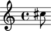

Named pitches
=============

Named pitches are the everyday pitches of notes and chords:

::

   >>> note = Note("cs''8")
   >>> note.written_pitch
   NamedPitch("cs''")

::

   >>> show(note)

Creating named pitches
----------------------

Create named pitches like this:

::

   >>> named_pitch = NamedPitch("cs''")

Understanding the interpreter representation of a named pitch
-------------------------------------------------------------

::

   >>> named_pitch
   NamedPitch("cs''")

``NamedPitch`` tells you the pitch's class.

``cs''`` tells you the pitch is equal to ``C#5``.

Understanding the string representation of a named pitch
--------------------------------------------------------

::

   >>> str(named_pitch)
   "cs''"

``cs''`` tells you the pitch is equal to ``C#5``.

Getting the accidental of a named pitch
---------------------------------------

Use ``accidental`` to get the accidental of a named pitch:

::

   >>> named_pitch.accidental
   Accidental('s')

Getting the octave of a named pitch
-----------------------------------

Use ``octave`` to get the octave of a named pitch:

::

   >>> named_pitch.octave
   Octave(5)

Comparing named pitches
-----------------------

Named pitches compare equal with equal pitch-class and octave:

::

   >>> named_pitch_1 = pitchtools.NamedPitch("cs''")
   >>> named_pitch_2 = pitchtools.NamedPitch("df''")

::

   >>> named_pitch_1 == named_pitch_1
   True
   >>> named_pitch_1 == named_pitch_2
   False

::

   >>> named_pitch_2 == named_pitch_1
   False
   >>> named_pitch_2 == named_pitch_2
   True

You can also compare named pitches with greater-than and less-than:

::

   >>> named_pitch_1 < named_pitch_1
   False
   >>> named_pitch_1 < named_pitch_2
   True
   >>> named_pitch_2 < named_pitch_1
   False
   >>> named_pitch_2 < named_pitch_2
   False

::

   >>> named_pitch_1 <= named_pitch_1
   True
   >>> named_pitch_1 <= named_pitch_2
   True
   >>> named_pitch_2 <= named_pitch_1
   False
   >>> named_pitch_2 <= named_pitch_2
   True

::

   >>> named_pitch_1 > named_pitch_1
   False
   >>> named_pitch_1 > named_pitch_2
   False
   >>> named_pitch_2 > named_pitch_1
   True
   >>> named_pitch_2 > named_pitch_2
   False

::

   >>> named_pitch_1 >= named_pitch_1
   True
   >>> named_pitch_1 >= named_pitch_2
   False
   >>> named_pitch_2 >= named_pitch_1
   True
   >>> named_pitch_2 >= named_pitch_2
   True

Changing named pitches to named pitch-classes
---------------------------------------------

Use ``named_pitch_class`` to change a named pitch to a named pitch-class:

::

   >>> named_pitch.named_pitch_class
   NamedPitchClass('cs')

Or use ``pitchtools``:

::

   >>> pitchtools.NamedPitchClass(named_pitch)
   NamedPitchClass('cs')

Changing named pitches to numbered pitches
------------------------------------------

Use ``numbered_pitch`` to change a named pitch to a numbered pitch:

::

   >>> named_pitch.numbered_pitch
   NumberedPitch(13)

Or use ``pitchtools``:

::

   >>> pitchtools.NumberedPitch(named_pitch)
   NumberedPitch(13)

Changing named pitches to numbered pitch-classes
------------------------------------------------

Use ``numbered_pitch_class`` to change a named pitch to a numbered pitch-class:

::

   >>> named_pitch.numbered_pitch_class
   NumberedPitchClass(1)

Or use ``pitchtools``:

::

   >>> pitchtools.NumberedPitchClass(named_pitch)
   NumberedPitchClass(1)
