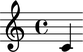
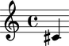
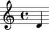
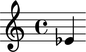
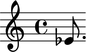

Notes
=====

Making notes from a LilyPond input string
-----------------------------------------

You can make notes from a LilyPond input string:

::

   >>> note = Note("c'4")
   >>> show(note)

Making notes from numbers
-------------------------

You can also make notes from numbers:

::

   >>> note = Note(0, Duration(1, 4))
   >>> show(note)

Understanding the interpreter representation of a note
------------------------------------------------------

::

   >>> note
   Note("c'4")

``Note`` tells you the note's class.

``c'`` tells you that the note's pitch is equal to middle C.

``4`` tells you that the note's duration is equal to a quarter note.

Getting and setting the written pitch of notes
----------------------------------------------

Get the written pitch of notes like this:

::

   >>> note.written_pitch
   NamedPitch("c'")

Set the written pitch of notes like this:

::

   >>> note.written_pitch = NamedPitch("cs'")
   >>> show(note)

Or this:

::

   >>> note.written_pitch = "d'"
   >>> show(note)

Or this:

::

   >>> note.written_pitch = 3
   >>> show(note)

Getting and setting the written duration of notes
-------------------------------------------------

Get the written duration of notes like this:

::

   >>> note.written_duration
   Duration(1, 4)

Set the written duration of notes like this:

::

   >>> note.written_duration = Duration(3, 16)
   >>> show(note)

