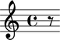
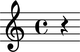
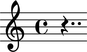
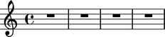
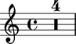
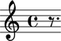

Rests
=====

Making rests from strings
-------------------------

You can make rests from a LilyPond input string:

::

   >>> rest = Rest('r8')
   >>> show(rest)

Making rests from durations
---------------------------

You can also make rests from a duration:

::

   >>> rest = Rest(Duration(1, 4))
   >>> show(rest)

Making rests from other Abjad leaves
------------------------------------

You can make rests from other Abjad leaves:

::

   >>> note = Note("d'4..")
   >>> show(note)

::

   >>> rest = Rest(note)
   >>> show(rest)

Making multi-measure rests
--------------------------

You can create multimeasure rests too:

::

   >>> multimeasure_rest = scoretools.MultimeasureRest('R1')
   >>> show(multimeasure_rest)

::

   >>> multimeasure_rest.lilypond_duration_multiplier = 4
   >>> staff = Staff([multimeasure_rest])
   >>> show(staff)

::

   >>> command = marktools.LilyPondCommandMark('compressFullBarRests')
   >>> command.attach(staff)
   LilyPondCommandMark('compressFullBarRests')(Staff{1})
   >>> show(staff)

.. image:: images/index-7.png

Getting and setting the written duration of rests
-------------------------------------------------

Get the written duration of rests like this:

::

   >>> rest.written_duration
   Duration(7, 16)

Set the written duration of rests like this:

::

   >>> rest.written_duration = Duration(3, 16)
   >>> show(rest)

