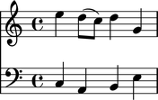
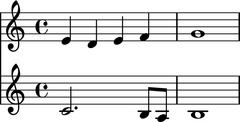
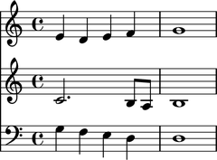
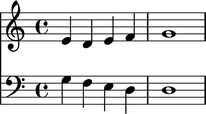
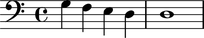

Scores
======

Making a score from a LilyPond input string
-------------------------------------------

You can make an Abjad score from a LilyPond input string:

::

   >>> input = r'''
   ... \new Staff { e''4 d''8 ( c''8 ) d''4 g'4 }
   ... \new Staff { \clef bass c4 a,4 b,4 e4 }
   ... '''

::

   >>> score = Score(input)

::

   >>> show(score)

Making a score from a list of Abjad components
----------------------------------------------

You can also make a score from a list of other Abjad components:

::

   >>> treble_staff_1 = Staff("e'4 d'4 e'4 f'4 g'1")
   >>> treble_staff_2 = Staff("c'2. b8 a8 b1")

::

   >>> score = Score([treble_staff_1, treble_staff_2])

::

   >>> show(score)

Understanding the interpreter representation of a score
-------------------------------------------------------

The interpreter representation of an Abjad score contains three parts:

::

   >>> score
   Score<<2>>

``Score`` tells you the score's class.

``2`` tells you the score's length (which is the number of top-level components
the score contains).

Curly braces ``{`` and ``}`` tell you that the music inside the score is
interpreted sequentially rather than simultaneously.

Understanding the LilyPond format of a score
--------------------------------------------

Use ``format()`` to get the LilyPond format of a score:

::

   >>> print format(score, 'lilypond')
   \new Score <<
       \new Staff {
           e'4
           d'4
           e'4
           f'4
           g'1
       }
       \new Staff {
           c'2.
           b8
           a8
           b1
       }
   >>

Selecting the music in a score
------------------------------

Slice a score to select its components:

::

   >>> score[:]
   SimultaneousSelection(Staff{5}, Staff{4})

Selecting a score's leaves
--------------------------

Use ``select_leaves()`` to select the leaves in a score:

::

   >>> score.select_leaves(allow_discontiguous_leaves=True)
   Selection(Note("e'4"), Note("d'4"), Note("e'4"), Note("f'4"), Note("g'1"), Note("c'2."), Note('b8'), Note('a8'), Note('b1'))

Getting the length of a score
-----------------------------

Use ``len()`` to get the length of a score.

The length of a score is defined equal to the number of top-level components
the score contains:

::

   >>> len(score)
   2

Inspecting duration
-------------------

Use the inspector to get the duration of a score:

::

   >>> inspect(score).get_duration()
   Duration(2, 1)

Appending one component to the bottom of a score
------------------------------------------------

Use ``append()`` to append one component to the bottom of a score:

::

   >>> staff = Staff("g4 f4 e4 d4 d1")
   >>> clef = Clef('bass')
   >>> attach(clef, staff)

::

   >>> score.append(staff)

::

   >>> show(score)

Finding the index of a score component
--------------------------------------

Use ``index()`` to find the index of a score component:

::

   >>> score.index(treble_staff_1)
   0

Removing a score component by index
-----------------------------------

Use ``pop()`` to remove a score component by index:

::

   >>> score.pop(1)
   Staff{4}

::

   >>> show(score)

Removing a score component by reference
---------------------------------------

Use ``remove()`` to remove a score component by reference:

::

   >>> score.remove(treble_staff_1)

::

   >>> show(score)

Inspecting whether or not a score contains a component
------------------------------------------------------

Use ``in`` to find out whether a score contains a given component:

::

   >>> treble_staff_1 in score
   False

::

   >>> treble_staff_2 in score
   False

::

   >>> staff in score
   True

Naming scores
-------------

You can name Abjad scores:

::

   >>> score.name = 'Example Score'

Score names appear in LilyPond input but not in notational output:

::

   >>> f(score)
   \context Score = "Example Score" <<
       \new Staff {
           \clef "bass"
           g4
           f4
           e4
           d4
           d1
       }
   >>

::

   >>> show(score)

