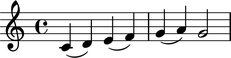
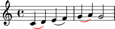
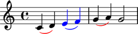
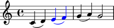

Spanners
========

Overriding spanners
-------------------

The symbols below are black with fixed thickness and predetermined spacing:

::

   >>> staff = Staff("c'4 d'4 e'4 f'4 g'4 a'4 g'2")

::

   >>> slur_1 = spannertools.Slur()
   >>> slur_1.attach(staff[:2])

::

   >>> slur_2 = spannertools.Slur()
   >>> slur_2.attach(staff[2:4])

::

   >>> slur_3 = spannertools.Slur()
   >>> slur_3.attach(staff[4:6])

::

   >>> show(staff)

But you can override LilyPond grobs to change the look of spanners:

::

   >>> slur_1.override.slur.color = 'red'
   >>> slur_3.override.slur.color = 'red'

::

   >>> show(staff)

Overriding the components to which spanners attach
--------------------------------------------------

You can override LilyPond grobs to change spanners' contents:

::

   >>> slur_2.override.slur.color = 'blue'
   >>> slur_2.override.note_head.color = 'blue'
   >>> slur_2.override.stem.color = 'blue'

::

   >>> show(staff)

Removing spanner overrides
--------------------------

Delete grob overrides you no longer want:

::

   >>> del(slur_1.override.slur)
   >>> del(slur_3.override.slur)

::

   >>> show(staff)

