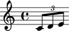
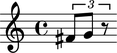
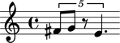
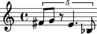
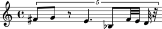
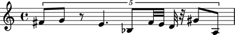
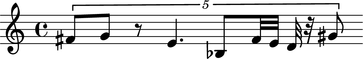
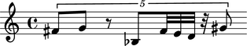
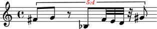
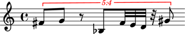

Tuplets
=======

Making a tuplet from a LilyPond input string
--------------------------------------------

You can create tuplets from a LilyPond input string:

::

   >>> tuplet = Tuplet(Multiplier(2, 3), "c'8 d'8 e'8")
   >>> show(tuplet)

Making a tuplet from a list of other components
-----------------------------------------------

You can also make tuplets from a list of other components:

::

   >>> leaves = [Note("fs'8"), Note("g'8"), Rest('r8')]
   >>> tuplet = Tuplet(Multiplier(2, 3), leaves)
   >>> show(tuplet)

Understanding the interpreter representation of a tuplet
--------------------------------------------------------

The interprer representation of an tuplet contains three parts:

::

   >>> tuplet
   Tuplet(Multiplier(2, 3), "fs'8 g'8 r8")

``Tuplet`` tells you the tuplet's class.

``Multiplier(2, 3)`` tells you the tuplet's multiplier.

``[fs'8, g'8, r8]`` tells you the top-level components the tuplet contains.

Understanding the string representation of a tuplet
---------------------------------------------------

The string representation of a tuplet contains four parts:

::

   >>> print tuplet
   {* 3:2 fs'8, g'8, r8 *}

Curly braces ``{`` and ``}`` indicate that the tuplet's music is interpreted
sequentially instead of simultaneously.

The asterisks ``*`` denote a fixed-multiplier tuplet.

``3:2`` tells you the tuplet's ratio.

The remaining arguments show the top-level components of tuplet.

Formatting tuplets
------------------

Use ``format()`` to get the LilyPond format a tuplet:

::

   >>> print format(tuplet, 'lilypond')
   \times 2/3 {
       fs'8
       g'8
       r8
   }

Selecting the music in a tuplet
-------------------------------

Select the music in a tuplet like this:

::

   >>> tuplet[:]
   SliceSelection(Note("fs'8"), Note("g'8"), Rest('r8'))

Selecting a tuplet's leaves
---------------------------

Use ``select_leaves()`` to get the leaves in a tuplet:

::

   >>> tuplet.select_leaves()
   ContiguousSelection(Note("fs'8"), Note("g'8"), Rest('r8'))

Getting the length of a tuplet
------------------------------

Use ``len()`` to get the length of a tuplet.

The length of a tuplet is defined equal to the number of top-level components
the tuplet contains:

::

   >>> len(tuplet)
   3

Inspecting tuplet duration
--------------------------

Use the inspector to get the duration of a tuplet:

::

   >>> inspect(tuplet).get_duration()
   Duration(1, 4)

Understanding rhythmic augmentation and diminution
--------------------------------------------------

A tuplet with a multiplier less than ``1`` constitutes a type of rhythmic
diminution:

::

   >>> tuplet.multiplier
   Multiplier(2, 3)

::

   >>> tuplet.is_diminution
   True

A tuplet with a multiplier greater than ``1`` is a type of rhythmic
augmentation:

::

   >>> tuplet.is_augmentation
   False

Getting and setting the multiplier of a tuplet
----------------------------------------------

Get the multiplier of a tuplet like this:

::

   >>> tuplet.multiplier
   Multiplier(2, 3)

Set the multiplier of a tuplet like this:

::

   >>> tuplet.multiplier = Multiplier(4, 5)
   >>> show(tuplet)

Appending one component to the end of a tuplet
----------------------------------------------

Use ``append()`` to append one component to the end of a tuplet:

::

   >>> tuplet.append(Note("e'4."))
   >>> show(tuplet)

You can also use a LilyPond input string:

::

   >>> tuplet.append("bf8")
   >>> show(tuplet)

Extending a tuplet with multiple components at once
---------------------------------------------------

Use ``extend()`` to extend a tuplet with multiple components at once:

::

   >>> notes = [Note("fs'32"), Note("e'32"), Note("d'32"), Rest((1, 32))]
   >>> tuplet.extend(notes)
   >>> show(tuplet)

You can also use a LilyPond input string:

::

   >>> tuplet.extend("gs'8 a8") 
   >>> show(tuplet)

Finding the index of a component in a tuplet
--------------------------------------------

Use ``index()`` to find the index of any component in a tuplet:

::

   >>> notes[1]
   Note("e'32")

::

   >>> tuplet.index(notes[1])
   6

Popping a tuplet component by index
-----------------------------------

Use ``pop()`` to remove the last component of a tuplet:

::

   >>> tuplet.pop()
   Note('a8')
   >>> show(tuplet)

Removing a tuplet component by reference
----------------------------------------

Use ``remove()`` to remove any component from a tuplet by reference:

::

   >>> tuplet.remove(tuplet[3])
   >>> show(tuplet)

Overriding attributes of the LilyPond tuplet number grob
--------------------------------------------------------

Override attributes of the LilyPond tuplet number grob like this:

::

   >>> string = 'tuplet-number::calc-fraction-text'
   >>> scheme = schemetools.Scheme(string)
   >>> override(tuplet).tuplet_number.text = scheme
   >>> override(tuplet).tuplet_number.color = 'red'
   >>> staff = Staff([tuplet])
   >>> show(staff)

See LilyPond's documentation for lists of grob attributes available.

Overriding attributes of the LilyPond tuplet bracket grob
---------------------------------------------------------

Override attributes of the LilyPond tuplet bracket grob like this:

::

   >>> override(tuplet).tuplet_bracket.color = 'red'
   >>> show(staff)

See LilyPond's documentation for lists of grob attributes available.
