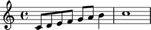
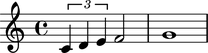
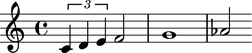
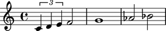
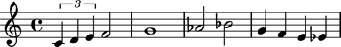
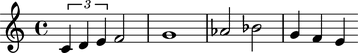
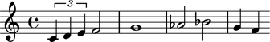

Voices
======

Making a voice from a LilyPond input string
-------------------------------------------

You can make a voice from a LilyPond input string:

::

   >>> voice = Voice("c'8 d'8 e'8 f'8 g'8 a'8 b'4 c''1")
   >>> show(voice)

Making a voice from a list of other components
----------------------------------------------

You can also make a voice from a list of other components:

::

   >>> tuplet = Tuplet(Multiplier(2, 3), "c'4 d'4 e'4")
   >>> components = [tuplet, Note("f'2"), Note("g'1")]
   >>> voice = Voice(components)
   >>> show(voice)

Understanding the interpreter representation of a voice
-------------------------------------------------------

The interpreter representation of a voice contains three parts:

::

   >>> voice
   Voice{3}

``Voice`` tells you the voice's class.

``3`` tells you the voice's length (which is the number of
top-level components the voice contains).

Curly braces ``{`` and ``}`` tell you that the music inside the voice is
interpreted sequentially rather than simultaneously.

Formatting voices
-----------------

Use ``format()`` to get the LilyPond format of a voice:

::

   >>> print format(voice, 'lilypond')
   \new Voice {
       \times 2/3 {
           c'4
           d'4
           e'4
       }
       f'2
       g'1
   }

Selecting the components in a voice
-----------------------------------

Select the components in a voice like this:

::

   >>> voice[:]
   SliceSelection(Tuplet(Multiplier(2, 3), "c'4 d'4 e'4"), Note("f'2"), Note("g'1"))

Selecting a voice's leaves
--------------------------

Use ``select_leaves()`` to select the leaves in a voice:

::

   >>> voice.select_leaves()
   ContiguousSelection(Note("c'4"), Note("d'4"), Note("e'4"), Note("f'2"), Note("g'1"))

Getting the length of a voice
-----------------------------

Use ``len()`` to get the length of a voice.

The length of a voice is defined equal to the number of top-level components
the voice contains:

::

   >>> len(voice)
   3

Inspecting voice duration
-------------------------

Use the inspector to get the duration of a voice:

::

   >>> inspect_(voice).get_duration()
   Duration(2, 1)

Appending one component to the end of a voice
---------------------------------------------

Use ``append()`` to append one component to the end of a voice:

::

   >>> voice.append(Note("af'2"))
   >>> show(voice)

You can also use a LilyPond input string:

::

   >>> voice.append("bf'2")
   >>> show(voice)

Extending a voice with multiple components at once
--------------------------------------------------

Use ``extend()`` to extend a voice with multiple components at once:

::

   >>> notes = [Note("g'4"), Note("f'4")]
   >>> voice.extend(notes)
   >>> show(voice)

.. image:: images/index-5.png

You can also use a LilyPond input string:

::

   >>> voice.extend("e'4 ef'4")
   >>> show(voice)

Finding the index of a component in a voice
-------------------------------------------

Use ``index()`` to find the index of any component in a voice:

::

   >>> notes[0]
   Note("g'4")

::

   >>> voice.index(notes[0])
   5

Popping a voice component by index
----------------------------------

Use ``pop()`` to pop the last component of a voice:

::

   >>> voice.pop()
   Note("ef'4")
   >>> show(voice)

Removing a voice component by reference
---------------------------------------

Use ``remove()`` to remove any component from a voice by reference:

::

   >>> voice.remove(voice[-1])
   >>> show(voice)

Naming voices
-------------

You can name Abjad voices:

::

   >>> voice.name = 'Upper Voice'

Voice names appear in LilyPond input but not in notation output:

::

   >>> f(voice)
   \context Voice = "Upper Voice" {
       \times 2/3 {
           c'4
           d'4
           e'4
       }
       f'2
       g'1
       af'2
       bf'2
       g'4
       f'4
   }

::

   >>> show(voice)

Changing the context of a voice
-------------------------------

The context of a voice is set to ``'Voice'`` by default:

::

   >>> voice.context_name
   'Voice'

But you can change the context of a voice if you want.

Change the context of a voice when you have defined a new LilyPond context
based on a LilyPond voice:

::

   >>> voice.context_name = 'SpeciallyDefinedVoice'

::

   >>> voice.context_name
   'SpeciallyDefinedVoice'

::

   >>> f(voice)
   \context SpeciallyDefinedVoice = "Upper Voice" {
       \times 2/3 {
           c'4
           d'4
           e'4
       }
       f'2
       g'1
       af'2
       bf'2
       g'4
       f'4
   }

