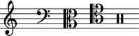
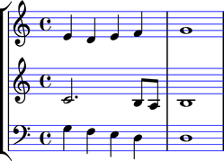
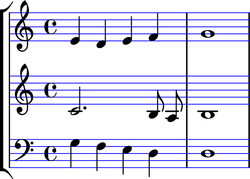

:tocdepth: 2

Version history
===============

Abjad 2.14
----------

Released 2013-12-21. Implements 429 public classes and 438 functions totaling
163,595 lines of code.

More classes available in the global namespace
^^^^^^^^^^^^^^^^^^^^^^^^^^^^^^^^^^^^^^^^^^^^^^

Abjad 2.14 makes more classes available to you in the global namespace:

::

   >>> dir()
   ['Articulation', 'Beam', 'Chord', 'Clef', 'Container', 'Crescendo', 'Decrescendo', 'Duration', 'Dynamic', 'Fraction', 'Glissando', 'Hairpin', 'KeySignature', 'Markup', 'Measure', 'Multiplier', 'NamedPitch', 'Note', 'Offset', 'Rest', 'Score', 'Slur', 'Staff', 'StaffGroup', 'Tempo', 'Tie', 'TimeSignature', 'Tuplet', 'Voice', '__builtins__', '__doc__', '__name__', '__package__', '__warningregistry__', 'abctools', 'abjad_configuration', 'abjadbooktools', 'agenttools', 'attach', 'contextualize', 'datastructuretools', 'detach', 'developerscripttools', 'documentationtools', 'durationtools', 'exceptiontools', 'f', 'indicatortools', 'inspect', 'instrumenttools', 'iterate', 'labeltools', 'layouttools', 'lilypondfiletools', 'lilypondnametools', 'lilypondparsertools', 'markuptools', 'mathtools', 'metertools', 'mutate', 'new', 'override', 'parse', 'persist', 'pitcharraytools', 'pitchtools', 'play', 'quantizationtools', 'rhythmmakertools', 'rhythmtreetools', 'schemetools', 'scoretools', 'select', 'selectiontools', 'sequencetools', 'show', 'sievetools', 'spannertools', 'stringtools', 'systemtools', 'templatetools', 'timespantools', 'tonalanalysistools', 'topleveltools']

``Articulation``, ``Beam``, ``Clef``, ``Crescendo``, ``Decrescendo``,
``Dynamic``, ``Glissando``, ``Hairpin``, ``KeySignature``, ``Markup``,
``Slur``, ``Tempo``, ``Tie`` and ``TimeSignature`` are available in the
global namespace for the first time in Abjad 2.14.

This means that you can now say ``Clef('treble')`` instead of
``indicatortoools.Clef('treble')`` and keep the score code you write more
compact than before.

Abjad system protocols
^^^^^^^^^^^^^^^^^^^^^^

Abjad 2.14 reorganizes important elements of the system's functionality
according to a collection of protocols. In the general sense a protocol is just
the recognized way of doing something. In the context of Python development a
protocol refers to the collection of classes and functions that must be called
in sequence to accomplish a task. (Experienced Python programmers will
recognize this use of protocol from the "pickle protocol" which describes how
to use the ``pickle`` and ``cPickle`` modules included in Python's standard
library and from the "copy protocol" which describes how implement
``__copy__()`` and ``__deepcopy__()`` methods on your classes to make them work
with Python's built-in ``copy`` module.)

Abjad 2.13 introduced an inspection protocol (for examining the derived
properties of score components) and a mutation protocol (for making structural
changes to score). The user interface to these two protocols are the
``inspect()`` and ``mutate()`` functions included in the global namespace when
Abjad starts.

Abjad 2.14 introduces a number of even newer protocols. These are the
attachment protocol (for attaching and detaching indicators like clefs and
articulations to score components); the iteration protocol (for stepping
through filtered components in a score); the format protocol (for
formatting objects as LilyPond input or as some other type of human-readable
string); the persistence protocol (for writing objects to disk as LilyPond
files or PDFs or something else); the typesetter protocol (for overriding the
attributes of LilyPond graphic objects and for making LilyPond context
settings); the illustration protocol (for class authors to make custom classes
viewable as music notation); and the make-new protocol (for making copies of
immutable objects with changes made to selected attributes at copy time). To
summarize:

    * attachment protcocol
    * format protocol
    * illustration protocol
    * inspection protocol
    * iteration protocol
    * make-new protocol
    * mutation protocol
    * persistence protocol
    * typesetter protocol 

These are described in the sections below.

The attachment protocol
^^^^^^^^^^^^^^^^^^^^^^^

New ``attach()`` and ``detach()`` functions are available when you start Abjad.

Use ``attach()`` to attach indicators to your score. Indicators are
things like clefs, key signatures, time signatures and articulations:

::

   >>> staff = Staff()
   >>> key_signature = KeySignature('g', 'major')
   >>> attach(key_signature, staff)
   >>> time_signature = TimeSignature((2, 4), partial=Duration(1, 8))
   >>> attach(time_signature, staff)
   >>> clef = Clef('treble')
   >>> attach(clef, staff)
   >>> staff.extend("d'8 f'8 a'8 d''8 f''8 gs'4 r8 e'8 gs'8 b'8 e''8 gs''8 a'4")
   >>> articulation = Articulation('turn')
   >>> attach(articulation, staff[5])
   >>> show(staff)

.. image:: images/index-1.png

You can also use ``attach()`` to attach spanners to your score:

::

   >>> slur = Slur()
   >>> attach(slur, staff[:6])
   >>> slur = Slur()
   >>> attach(slur, staff[-6:])
   >>> show(staff)

.. image:: images/index-2.png

Use ``detach()`` to detach indicators and spanners from your score:

::

   >>> detach(KeySignature, staff)
   (KeySignature('g', 'major'),)
   >>> detach(Slur, staff[0])
   (Slur(''),)
   >>> detach(Slur, staff[-1])
   (Slur(''),)
   >>> show(staff)

.. image:: images/index-3.png

``attach()`` and ``detach()`` functions replace the old ``attach()`` and
``detach()`` methods bound to indicators in older versions of Abjad. 

Indicator classes are housed in the new ``indicatortools`` package:

::

    Annotation
    Articulation
    BarLine
    BendAfter
    Clef
    Dynamic
    IsAtSoundingPitch
    IsUnpitched
    KeySignature
    LilyPondCommand
    LilyPondComment
    StaffChange
    StemTremolo
    Tempo
    TimeSignature

The new ``indicatortools`` package replaces the old ``marktools`` and
``contexttools`` packages.

The illustration protocol
^^^^^^^^^^^^^^^^^^^^^^^^^

In Abjad 2.14 you can use the top-level ``show()`` function on many objects.

You can show a clef inventory:

::

   >>> clef_inventory = indicatortools.ClefInventory()
   >>> clef_inventory.extend(['treble', 'bass', 'alto', 'tenor', 'percussion'])
   >>> show(clef_inventory)

You can show a pitch segment:

::

   >>> segment = pitchtools.PitchSegment([-2, -1.5, 6, 7, -1.5, 7])
   >>> show(segment)

You can show a pitch range:

::

   >>> pitch_range = pitchtools.PitchRange('[C2, C6]')
   >>> show(pitch_range)

Classes that "know what to do" when you call ``show()`` on them can be said to
follow the illustration protocol.

The iteration protocol
^^^^^^^^^^^^^^^^^^^^^^

A new ``iterate()`` function is now available when you start Abjad.

Here's an example score:

::

   >>> string = r"""
   ... \new Score <<
   ...     \new StaffGroup <<
   ...         \new Staff {
   ...             r2 ^ \markup { \center-column { tutti \line { ( con sord. ) } } }
   ...             r8
   ...             es'' [ ( \ppp
   ...             fs'''
   ...             es'''
   ...             fs''' \flageolet
   ...             es'''
   ...             fs'''
   ...             es''
   ...             fs'' ] )
   ...             r
   ...             r4
   ...         }
   ...         \new Staff {
   ...             r4 ^ \markup { ( con sord. ) }
   ...             r8
   ...             es' [ ( \ppp 
   ...             fs''
   ...             es'' ] )
   ...             r
   ...             es' [ (
   ...             fs''
   ...             es'
   ...             fs' ] )
   ...             r
   ...             fs'' [ (
   ...             es'
   ...             fs' ] )
   ...             r
   ...         }
   ...         \new Staff {
   ...             r8 ^ \markup { tutti }
   ...             ds' [ ( \ppp
   ...             es''
   ...             ds'' ]
   ...             es' [
   ...             ds'
   ...             es''
   ...             ds'' ] )
   ...             r4
   ...             es''8 [ (
   ...             ds'
   ...             es' ] )
   ...             r
   ...             es'' [ (
   ...             ds' ] )
   ...         }
   ...     >>
   ... >>
   ... """

::

   >>> score = parse(string)
   >>> show(score)

Here's how to iterate notes in the score's first staff:

::

   >>> staff_group = score[0]
   >>> first_staff = staff_group[0]
   >>> for note in iterate(first_staff).by_class(Note):
   ...     note
   ... 
   Note("es''8")
   Note("fs'''8")
   Note("es'''8")
   Note("fs'''8")
   Note("es'''8")
   Note("fs'''8")
   Note("es''8")
   Note("fs''8")

``iterate()`` is factory function that returns an instance of the new
``IterationAgent`` included in the ``agenttools`` package.

``IterationAgent`` provides the following interface:

::

    IterationAgent.by_class()
    IterationAgent.by_components_and_grace_containers()
    IterationAgent.by_leaf_pair()
    IterationAgent.by_logical_tie()
    IterationAgent.by_logical_voice()
    IterationAgent.by_logical_voice_from_component()
    IterationAgent.by_run()
    IterationAgent.by_semantic_voice()
    IterationAgent.by_timeline()
    IterationAgent.by_timeline_from_component()
    IterationAgent.by_topmost_logical_ties_and_components()
    IterationAgent.by_vertical_moment()
    IterationAgent.depth_first()

The new ``iterate()`` function replaces the old ``iterationtools`` package.

The persistence protocol
^^^^^^^^^^^^^^^^^^^^^^^^

A new ``persist()`` function is now available when you start Abjad.

``persist()`` is a factory function that creates an instance of the new
``PersistenceAgent`` housed in the ``agenttools`` package.

``PersistenceAgent`` offers the following public interface:

::

    as_ly()
    as_midi()
    as_module()
    as_pdf()

Use ``persist(score).as_pdf()`` to write a score to disk as a PDF and use
``persist(score).as_ly()`` to write a score to disk as a LilyPond file. See the
``PersistenceAgent`` API entry for examples.

The typesetter protocol
^^^^^^^^^^^^^^^^^^^^^^^

New ``override()`` and ``contextualize()`` functions are now available when you
start Abjad.

Here is an example score:

::

   >>> treble_staff_1 = Staff("e'4 d'4 e'4 f'4 g'1")
   >>> treble_staff_2 = Staff("c'2. b8 a8 b1")
   >>> bass_staff = Staff("g4 f4 e4 d4 d1")
   >>> clef = Clef('bass')
   >>> attach(clef, bass_staff)
   >>> staff_group = scoretools.StaffGroup()
   >>> staff_group.extend([treble_staff_1, treble_staff_2, bass_staff])
   >>> score = Score([staff_group])
   >>> show(score)

Use ``override()`` to override LilyPond graphic object attributes:

::

   >>> override(score).staff_symbol.color = 'blue'
   >>> show(score)

Use ``contextualize()`` to create LilyPond context settings:

::

   >>> contextualize(score).auto_beaming = False
   >>> show(score)

Older versions
--------------

..  toctree::
    :maxdepth: 1

    version_2_13
    version_2_12
    version_2_11
    version_2_10
    version_2_9
    version_2_8
    version_2_7
    version_2_6
    version_2_5
    version_2_4
    version_2_3
    version_2_2
    version_2_1
    version_2_0
