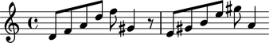

:orphan:

Abjad 2.13
----------

Released 2013-10-23. Built from r12,468. Implements 459 public classes and 465
functions totaling 199,144 lines of code.

API refactoring
^^^^^^^^^^^^^^^

More than half the functionality of the Abjad API has migrated from functions
to class methods. This means that the total number of functions in the API has
decreased from 1045 in Abjad 2.12 to only 465 in Abjad 2.13. This also means
that many classes now provide additional functionality in the form of public
methods. Check the API entries of the Abjad classes you work with the most
often for new features. And note that essentially all functionality
available in Abjad 2.12 has been ported to Abjad 2.13, usually with an
interface that is easier to use and better documented.

For example, the predicates previously implemented as ``pitchtools`` functions
are now implemented as methods bound to the Abjad ``NamedPitch`` class:

- ``NamedPitch.is_diatonic_pitch_name()``
- ``NamedPitch.is_diatonic_pitch_number()``
- ``NamedPitch.is_pitch_carrier()``
- ``NamedPitch.is_pitch_class_octave_number_string()``
- ``NamedPitch.is_pitch_name()``
- ``NamedPitch.is_pitch_number()``

Introducing ``inspect_()``
^^^^^^^^^^^^^^^^^^^^^^^^^^

A new ``inspect_()`` function is now available when you start Abjad.
``inspect_()`` is a factory function that returns an instance of the new
``InspectionAgent`` ("the inspector") when called on any score
component. Use the inspector to examine component attributes determined by
score structure.  Here's how to use ``inspect_()`` to get the duration of a
tupletted note:

::

   >>> staff = Staff(r"\times 4/5 { c'4 d'4 e'4 g'4 fs'4 }")
   >>> notes = staff.select_leaves()
   >>> note = notes[1]
   >>> note.override.note_head.color = 'red'
   Traceback (most recent call last):
     File "<stdin>", line 1, in <module>
   AttributeError: 'Note' object has no attribute 'override'
   >>> note.override.stem.color = 'red'
   Traceback (most recent call last):
     File "<stdin>", line 1, in <module>
   AttributeError: 'Note' object has no attribute 'override'
   >>> show(staff)

.. image:: images/index-1.png

::

   >>> note.written_duration
   Duration(1, 4)

::

   >>> inspect_(note).get_duration()
   Duration(1, 5)

These are the methods available as part of the new inspection interface:

- ``InspectionAgent.get_annotation()``
- ``InspectionAgent.get_badly_formed_components()``
- ``InspectionAgent.get_components()``
- ``InspectionAgent.get_contents()``
- ``InspectionAgent.get_descendants()``
- ``InspectionAgent.get_duration()``
- ``InspectionAgent.get_effective()``
- ``InspectionAgent.get_effective_staff()``
- ``InspectionAgent.get_grace_containers()``
- ``InspectionAgent.get_leaf()``
- ``InspectionAgent.get_lineage()``
- ``InspectionAgent.get_mark()``
- ``InspectionAgent.get_marks()``
- ``InspectionAgent.get_markup()``
- ``InspectionAgent.get_parentage()``
- ``InspectionAgent.get_spanner()``
- ``InspectionAgent.get_spanners()``
- ``InspectionAgent.get_logical_tie()``
- ``InspectionAgent.get_timespan()``
- ``InspectionAgent.get_vertical_moment()``
- ``InspectionAgent.get_vertical_moment_at()``
- ``InspectionAgent.is_bar_line_crossing()``
- ``InspectionAgent.is_well_formed()``
- ``InspectionAgent.report_modifications()``
- ``InspectionAgent.tabulate_well_formedness_violations()``

Introducing  ``mutate()``
^^^^^^^^^^^^^^^^^^^^^^^^^

A new ``mutate()`` function is now availble when you start Abjad.
``mutate()`` is a factory function that returns an instance of the
new ``MutationAgent`` class when called on any score component. Use
the ``MutationAgent`` to make structural changes to the component
or components on which it was called. Here's how to use ``mutate()``
to split the notes in a staff:

::

   >>> staff = Staff("c'4 d'4 e'4 f'4")
   >>> show(staff)

.. image:: images/index-2.png

::

   >>> leaves = staff.select_leaves()
   >>> result = mutate(leaves).split([Duration(5, 16)], cyclic=True)
   >>> show(staff)

.. image:: images/index-3.png

These are the methods available as part of the new mutation interface:

- ``MutationAgent.copy()``
- ``MutationAgent.extract()``
- ``MutationAgent.fuse()``
- ``MutationAgent.replace()``
- ``MutationAgent.scale()``
- ``MutationAgent.splice()``
- ``MutationAgent.split()``

``mutate()`` cleans up previously complex parts of the system.
There are now only a single copy function, a single split
function and a single fuse function implemented in Abjad.

Selections
^^^^^^^^^^

Abjad 2.13 uses a collection of classes implemented in the ``selectiontools``
package to group together the components output by most functions in the API.
Container slice operations, for example, now return a selection of components
instead of a list of components:

::

   >>> staff = Staff()
   >>> key_signature = indicatortools.KeySignature('g', 'major')
   >>> key_signature = key_signature.attach(staff)
   Traceback (most recent call last):
     File "<stdin>", line 1, in <module>
   AttributeError: 'KeySignature' object has no attribute 'attach'
   >>> time_signature = indicatortools.TimeSignature((2, 4), partial=Duration(1, 8))
   >>> time_signature = time_signature.attach(staff)
   Traceback (most recent call last):
     File "<stdin>", line 1, in <module>
   AttributeError: 'TimeSignature' object has no attribute 'attach'
   >>> staff.extend("d'8 f'8 a'8 d''8 f''8 gs'4 r8 e'8 gs'8 b'8 e''8 gs''8 a'4")
   >>> articulation = indicatortools.Articulation('turn')
   >>> articulation = articulation.attach(staff[5])
   Traceback (most recent call last):
     File "<stdin>", line 1, in <module>
   AttributeError: 'Articulation' object has no attribute 'attach'
   >>> show(staff)

::

   >>> staff[:4]
   SliceSelection(Note("d'8"), Note("f'8"), Note("a'8"), Note("d''8"))

You can also create your own selections of components with the new ``select()``
function that is available when you start Abjad.

``pitchtools`` refactoring
^^^^^^^^^^^^^^^^^^^^^^^^^^

The Abjad 2.13 ``pitchtools`` package has been greatly revised.  The package
has been reduced from 98 classes to 32 classes.  More than half the 
functions in the module have been eliminated or reimplemented as class methods.
``pitchtools`` collection classes like ``PitchClassSet`` and
``IntervalVector`` have been reimplemented in terms of five new generalized
collection classes introduced in the ``datastructuretools`` package:

- ``datastructuretools.TypedCounter``
- ``datastructuretools.TypedFrozenset``
- ``datastructuretools.TypedList``
- ``datastructuretools.TypedTuple``

Initialize a numbered pitch-class set like this:

::

   >>> pitch_numbers = [-2, -1.5, 6, 7, -1.5, 7]
   >>> numbered_pitch_class_set = pitchtools.PitchClassSet(pitch_numbers)
   >>> numbered_pitch_class_set
   PitchClassSet([6, 7, 10, 10.5])

Change a numbered pitch-class set to a named pitch-class set like this:

::

   >>> numbered_pitch_class_set.new(item_class=pitchtools.NamedPitchClass)
   Traceback (most recent call last):
     File "<stdin>", line 1, in <module>
   AttributeError: 'PitchClassSet' object has no attribute 'new'

The interfaces of all ``pitchtools`` classes have been made easier to use.

Docs
^^^^

All parts of the docs have been updated for Abjad 2.13.

Some of the new features you'll find:

- Extensive notation examples have been added to the API.
- LilyPond input code is now visible everywhere in the API.
  Click any piece of notation to see the LilyPond input code
  Abjad generated to create the image.
- Attribute summary tables now appear at the top of each class's API entry.
- Inheritance indicators now appear to the left of inherited class attributes
  and link back to the parent class.
- Static method indicators and class method indicators now accompany
  static and class methods everywhere in the API.
- Inheritance diagrams are cleaner and easier to read.
- All API entries have been edited for clarity and continuity.

Other new features will become apparent as you read through different parts of
the docs.

Other features
^^^^^^^^^^^^^^

Clef now understands octavation suffixes such as _8, _15, ^8 and ^15.
It takes these suffixes into account when determining its middle-C position.

A new ``StringOrchestraScoreTemplate`` is now available in the
``templatetools`` package.
