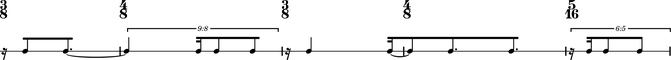
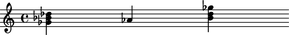

:tocdepth: 2

Abjad 2.15
----------

Released 2014-08-08. Implements 443 public classes and 399 functions totaling
172,384 lines of code.

Python 3.4+ compatibility
^^^^^^^^^^^^^^^^^^^^^^^^^

Abjad 2.15 is the first version of Abjad to be compatible with both Python 2
and 3. Our py.test and doctest suites pass under both 2.7.5 and 3.4.0.

We'll continue to work over the next year to improve documentation support
under Python 3.

IPython notebook extension
^^^^^^^^^^^^^^^^^^^^^^^^^^

Abjad 2.15 features an IPython notebook extension for capturing the output of
`show()` as PNGs.

To activate the extension in a notebook include the following two lines your
IPython notebook:

::
    
    from abjad import *
    %load_ext abjad.ext.ipython

Parameterized test suite
^^^^^^^^^^^^^^^^^^^^^^^^

Abjad 2.15 implements a suite of parameterized tests in its regression battery.
This parameterized test suite tests *every* public function and class in
Abjad's toolkit for a variety of common behaviors including `copy` and `pickle`
support, `__hash__` and `__repr__` implementations and complete documentation
coverage.

Improved tools package APIs
^^^^^^^^^^^^^^^^^^^^^^^^^^^

Abjad 2.15 simplifies important packages in its core API.

The ``scoretools`` package now contains only four key ``Context`` subclasses:

::

    scoretools.Score
    scoretools.StaffGroup
    scoretools.Staff
    scoretools.Voice

Use each class's ``context_name`` property to create custom contexts like
LilyPond's ``PianoStaff`` or ``ChoirStaff``.

::

   >>> piano_staff = scoretools.StaffGroup(context_name='Piano Staff')
   >>> print(format(piano_staff))
   \new Piano Staff <<
   >>

The ``lilypondfiletools`` package now contains only two key ``Block`` classes:

::

    lilypondfiletools.ContextBlock
    lilypondfiletools.Block

Use ``lilypondfiletools.Block``'s ``name`` property to creat custom LilyPond
block constructs like ``\layout {}``, ``\paper {}`` ``\header {}`` or ``\midi
{}``:

::

   >>> midi_block = lilypondfiletools.Block(name='midi')
   >>> print(format(midi_block))
   \midi {}

Abjad 2.15 also features a simpler and more powerful rhythm-maker API. Complex
rhythm-maker initializers have been streamlined by encapsulating related
keyword arguments into specifier classes:

::

   >>> talea = rhythmmakertools.Talea(
   ...     counts=(1, 2, 3, 4),
   ...     denominator=16,
   ...     )

::

   >>> beam_specifier = rhythmmakertools.BeamSpecifier(
   ...     beam_each_division=True,
   ...     beam_divisions_together=True
   ...     )

::

   >>> burnish_specifier = rhythmmakertools.BurnishSpecifier(
   ...     burnish_divisions=True,
   ...     lefts=(-1, 0),
   ...     left_lengths=(1,),
   ...     middles=(0,),
   ...     rights=(),
   ...     right_lengths=(0,),
   ...     )

::

   >>> tie_specifier = rhythmmakertools.TieSpecifier(
   ...     tie_across_divisions=True,
   ...     )

::

   >>> rhythm_maker = rhythmmakertools.TaleaRhythmMaker(
   ...     beam_specifier=beam_specifier,
   ...     burnish_specifier=burnish_specifier,
   ...     extra_counts_per_division=(0, 1, 0),
   ...     talea=talea,
   ...     tie_specifier=tie_specifier,
   ...     )

::

   >>> divisions = [(3, 8), (4, 8), (3, 8), (4, 8), (5, 16)]
   >>> music = rhythm_maker(divisions)
   >>> lilypond_file = rhythmmakertools.make_lilypond_file(
   ...     music,
   ...     divisions,
   ...     )
   >>> show(lilypond_file)

Mutation improvements
^^^^^^^^^^^^^^^^^^^^^

Abjad 2.15 adds a `transpose()` method to MutationAgent.

Use ``mutate(expr).transpose(transposition)`` to transpose an entire score
enharmonically:

::

   >>> staff = Staff("<c' e' g'>4 d'4 <e' g' c''>4")
   >>> show(staff)

.. image:: images/index-2.png

::

   >>> mutate(staff).transpose(+6)
   >>> show(staff)

New `indicatortools` classes
^^^^^^^^^^^^^^^^^^^^^^^^^^^^

Abjad 2.15 provides new indicator classes in its ``indicatortools`` package for
modeling instrumental techniques:

::

    Arpeggio
    BowContactPoint
    BowPressure
    KeyCluster
    LaissezVibrer
    StringContactPoint
    StringNumber
    Tuning

Thanks
^^^^^^

Special thanks to:

- George K. Thiruvathukal <thiruvathukal@gmail.com>
- Tiago Antão <tiagoantao@gmail.com>

for their help with Abjad's Python 3 conversion and IPython integration.