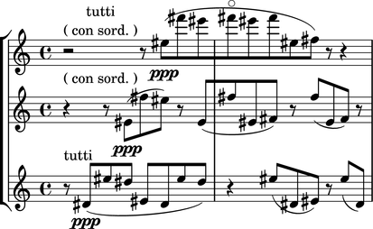
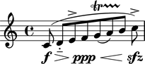
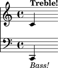
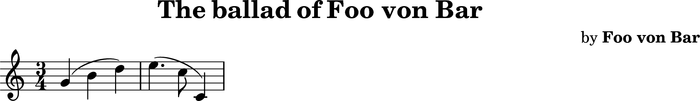
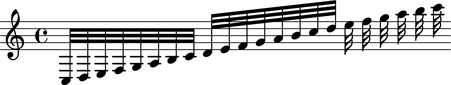
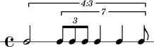
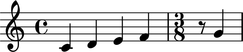

Parsing
=======

Abjad provides a small number of domain-specific language parsers.  The most
important of these is its LilyPond parser.

LilyPond Parsing
----------------

Abjad's LilyPond parser parses a large (although incomplete) subset of
LilyPond's syntax:

::

   >>> parser = lilypondparsertools.LilyPondParser()

::

   >>> string = r"""
   ... \new Score <<
   ...     \new StaffGroup <<
   ...         \new Staff {
   ...             r2 ^ \markup { \center-column { tutti \line { ( con sord. ) } } }
   ...             r8
   ...             es'' [ ( \ppp
   ...             fs'''
   ...             es'''
   ...             fs''' \flageolet
   ...             es'''
   ...             fs'''
   ...             es''
   ...             fs'' ] )
   ...             r
   ...             r4
   ...         }
   ...         \new Staff {
   ...             r4 ^ \markup { ( con sord. ) }
   ...             r8
   ...             es' [ ( \ppp 
   ...             fs''
   ...             es'' ] )
   ...             r
   ...             es' [ (
   ...             fs''
   ...             es'
   ...             fs' ] )
   ...             r
   ...             fs'' [ (
   ...             es'
   ...             fs' ] )
   ...             r
   ...         }
   ...         \new Staff {
   ...             r8 ^ \markup { tutti }
   ...             ds' [ ( \ppp
   ...             es''
   ...             ds'' ]
   ...             es' [
   ...             ds'
   ...             es''
   ...             ds'' ] )
   ...             r4
   ...             es''8 [ (
   ...             ds'
   ...             es' ] )
   ...             r
   ...             es'' [ (
   ...             ds' ] )
   ...         }
   ...     >>
   ... >>
   ... """

::

   >>> parsed = parser(string)

::

   >>> f(parsed)
   \new Score <<
       \new StaffGroup <<
           \new Staff {
               r2
                   ^ \markup {
                       \center-column
                           {
                               tutti
                               \line
                                   {
                                       (
                                       con
                                       sord.
                                       )
                                   }
                           }
                       }
               r8
               es''8 \ppp [ (
               fs'''8
               es'''8
               fs'''8 -\flageolet
               es'''8
               fs'''8
               es''8
               fs''8 ] )
               r8
               r4
           }
           \new Staff {
               r4
                   ^ \markup {
                       (
                       con
                       sord.
                       )
                       }
               r8
               es'8 \ppp [ (
               fs''8
               es''8 ] )
               r8
               es'8 [ (
               fs''8
               es'8
               fs'8 ] )
               r8
               fs''8 [ (
               es'8
               fs'8 ] )
               r8
           }
           \new Staff {
               r8 ^ \markup { tutti }
               ds'8 \ppp [ (
               es''8
               ds''8 ]
               es'8 [
               ds'8
               es''8
               ds''8 ] )
               r4
               es''8 [ (
               ds'8
               es'8 ] )
               r8
               es''8 [ (
               ds'8 ] )
           }
       >>
   >>

::

   >>> show(parsed)

The LilyPond parser understands most spanners, articulations and dynamics:

::

   >>> string = r'''
   ... \new Staff {
   ...     c'8 \f \> (
   ...     d' -_ [
   ...     e' ^>
   ...     f' \ppp \<
   ...     g' \startTrillSpan \(
   ...     a' \)
   ...     b' ] \stopTrillSpan
   ...     c'' ) \accent \sfz
   ... }
   ... '''
   >>> result = parser(string)

::

   >>> f(result)
   \new Staff {
       c'8 \f \> (
       d'8 -\portato [
       e'8 ^\accent
       f'8 \ppp \<
       g'8 \( \startTrillSpan
       a'8 \)
       b'8 ] \stopTrillSpan
       c''8 -\accent \sfz )
   }

::

   >>> show(result)

The LilyPond parser understands contexts and markup:

::

   >>> string = r'''\new Score <<
   ...     \new Staff = "Treble Staff" {
   ...         \new Voice = "Treble Voice" {
   ...             c' ^\markup { \bold Treble! }
   ...         }
   ...     }
   ...     \new Staff = "Bass Staff" {
   ...         \new Voice = "Bass Voice" {
   ...             \clef bass
   ...             c, _\markup { \italic Bass! }
   ...         }
   ...     }
   ... >>
   ... '''
   >>> result = parser(string)

::

   >>> f(result)
   \new Score <<
       \context Staff = "Treble Staff" {
           \context Voice = "Treble Voice" {
               c'4
                   ^ \markup {
                       \bold
                           Treble!
                       }
           }
       }
       \context Staff = "Bass Staff" {
           \context Voice = "Bass Voice" {
               \clef "bass"
               c,4
                   _ \markup {
                       \italic
                           Bass!
                       }
           }
       }
   >>

::

   >>> show(result)

The LilyPond parser also understands certain aspects of LilyPond file layouts,
such as header blocks:

::

   >>> string = r'''
   ... \header {
   ...     name = "Foo von Bar"
   ...     composer = \markup { by \bold \name }
   ...     title = \markup { The ballad of \name }
   ...     tagline = \markup { "" }
   ... }
   ... \score {
   ...     \new Staff {
   ...         \time 3/4
   ...         g' ( b' d'' )
   ...         e''4. ( c''8 c'4 )
   ...     }
   ... }
   ... '''
   >>> result = parser(string)

::

   >>> f(result)
   % Abjad revision 12387
   % 2013-10-17 19:39
   
   \version "2.17.28"
   \language "english"
   
   \header {
       composer = \markup {
           by
           \bold
               "Foo von Bar"
           }
       name = #"Foo von Bar"
       tagline = \markup {  }
       title = \markup {
           The
           ballad
           of
           "Foo von Bar"
           }
   }
   
   \score {
       \new Staff {
           \time 3/4
           g'4 (
           b'4
           d''4 )
           e''4. (
           c''8
           c'4 )
       }
   }

::

   >>> show(result)

The LilyPond parser supports a small number of LilyPond music functions, such
as ``\relative`` and ``\transpose``.

Music functions which mutate the score during compilation result in a
normalized Abjad score structure.  The resulting structure corresponds to the
music as it appears on the page, rather than as it was input to the parser:

::

   >>> string = r'''
   ... \new Staff \relative c { 
   ...     c32 d e f g a b c d e f g a b c d e f g a b c 
   ... }
   ... '''
   >>> result = parser(string)

::

   >>> f(result)
   \new Staff {
       c32
       d32
       e32
       f32
       g32
       a32
       b32
       c'32
       d'32
       e'32
       f'32
       g'32
       a'32
       b'32
       c''32
       d''32
       e''32
       f''32
       g''32
       a''32
       b''32
       c'''32
   }

::

   >>> show(result)

RhythmTree Parsing
------------------

Abjad's rhythm-tree parser parses a microlanguage resembling Ircam's RTM Lisp
syntax, and generates a sequence of RhythmTree structures, which can be
furthered manipulated by composers, before being converted into an Abjad score
object:

::

   >>> parser = rhythmtreetools.RhythmTreeParser()

::

   >>> string = '(3 (1 (1 ((2 (1 1 1)) 2 2 1))))'
   >>> result = parser(string)
   >>> result[0]
   RhythmTreeContainer(
       children=(
           RhythmTreeLeaf(
               preprolated_duration=Duration(1, 1),
               is_pitched=True
               ),
           RhythmTreeContainer(
               children=(
                   RhythmTreeContainer(
                       children=(
                           RhythmTreeLeaf(
                               preprolated_duration=Duration(1, 1),
                               is_pitched=True
                               ),
                           RhythmTreeLeaf(
                               preprolated_duration=Duration(1, 1),
                               is_pitched=True
                               ),
                           RhythmTreeLeaf(
                               preprolated_duration=Duration(1, 1),
                               is_pitched=True
                               )
                           ),
                       preprolated_duration=Duration(2, 1)
                       ),
                   RhythmTreeLeaf(
                       preprolated_duration=Duration(2, 1),
                       is_pitched=True
                       ),
                   RhythmTreeLeaf(
                       preprolated_duration=Duration(2, 1),
                       is_pitched=True
                       ),
                   RhythmTreeLeaf(
                       preprolated_duration=Duration(1, 1),
                       is_pitched=True
                       )
                   ),
               preprolated_duration=Duration(1, 1)
               )
           ),
       preprolated_duration=Duration(3, 1)
       )

::

   >>> tuplet = result[0]((1, 4))[0]
   >>> f(tuplet)
   \tweak #'text #tuplet-number::calc-fraction-text
   \times 3/4 {
       c'2
       \times 4/7 {
           \times 2/3 {
               c'8
               c'8
               c'8
           }
           c'4
           c'4
           c'8
       }
   }

::

   >>> staff = scoretools.RhythmicStaff([tuplet])

::

   >>> show(staff)

"Reduced-Ly" Parsing
--------------------

Abjad's "reduced-ly" parser parses the "reduced-ly" microlanguage, whose syntax
combines a very small subset of LilyPond syntax, along with affordances for
generating various types of Abjad containers. It also allows for rapidly
notating notes and rests without needing to specify pitches.  It is used mainly
for creating Abjad documentation:

::

   >>> parser = lilypondparsertools.ReducedLyParser()

::

   >>> string = "| 4/4 c' d' e' f' || 3/8 r8 g'4 |"
   >>> result = parser(string)

::

   >>> f(result)
   {
       {
           \time 4/4
           c'4
           d'4
           e'4
           f'4
       }
       {
           \time 3/8
           r8
           g'4
       }
   }

::

   >>> show(result)

