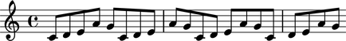
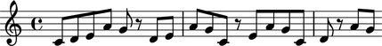

Changing notes to rests
=======================

Making a repeating pattern of notes
-----------------------------------

It is easy to make a repeating pattern of notes.

Multiplying the list ``[0, 2, 4, 9, 7]`` by ``4`` creates a new list of twenty
pitch numbers.

The call to ``scoretools.make_notes()`` creates our notes:

::

   >>> pitch_numbers = 4 * [0, 2, 4, 9, 7]
   >>> duration = Duration(1, 8)
   >>> notes = scoretools.make_notes(pitch_numbers, duration)
   >>> staff = Staff(notes)
   >>> show(staff)

Iterating the notes in a staff
------------------------------

Use ``iterationtools`` to iterate the notes in any expression:

::

   >>> for note in iterationtools.iterate_notes_in_expr(staff):
   ...     note
   ... 
   Note("c'8")
   Note("d'8")
   Note("e'8")
   Note("a'8")
   Note("g'8")
   Note("c'8")
   Note("d'8")
   Note("e'8")
   Note("a'8")
   Note("g'8")
   Note("c'8")
   Note("d'8")
   Note("e'8")
   Note("a'8")
   Note("g'8")
   Note("c'8")
   Note("d'8")
   Note("e'8")
   Note("a'8")
   Note("g'8")

Enumerating the notes in a staff
--------------------------------

Use Python's built-in ``enumerate()``
function to enumerate the elements in any iterable:

::

   >>> generator = iterationtools.iterate_notes_in_expr(staff)
   >>> for i, note in enumerate(generator):
   ...     i, note
   ... 
   (0, Note("c'8"))
   (1, Note("d'8"))
   (2, Note("e'8"))
   (3, Note("a'8"))
   (4, Note("g'8"))
   (5, Note("c'8"))
   (6, Note("d'8"))
   (7, Note("e'8"))
   (8, Note("a'8"))
   (9, Note("g'8"))
   (10, Note("c'8"))
   (11, Note("d'8"))
   (12, Note("e'8"))
   (13, Note("a'8"))
   (14, Note("g'8"))
   (15, Note("c'8"))
   (16, Note("d'8"))
   (17, Note("e'8"))
   (18, Note("a'8"))
   (19, Note("g'8"))

Changing notes to rests by index
--------------------------------

We can change every sixth note in a our score to a rest like this:

::

   >>> generator = iterationtools.iterate_notes_in_expr(staff)
   >>> for i, note in enumerate(generator):
   ...     if i % 6 == 5:
   ...         rest = Rest('r8')
   ...         staff[i] = rest
   ... 

::

   >>> show(staff)

Changing notes to rests by pitch
--------------------------------

Let's make a new staff:

::

   >>> pitch_numbers = 4 * [0, 2, 4, 9, 7]
   >>> duration = Duration(1, 8)
   >>> notes = scoretools.make_notes(pitch_numbers, duration)
   >>> staff = Staff(notes)
   >>> show(staff)

Now we can change every D4 to a rest like this:

::

   >>> generator = iterationtools.iterate_notes_in_expr(staff)
   >>> for i, note in enumerate(generator):
   ...     if note.sounding_pitch == "d'":
   ...         rest = Rest('r8')
   ...         staff[i] = rest
   ... 

::

   >>> show(staff)

