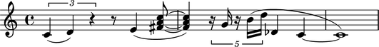
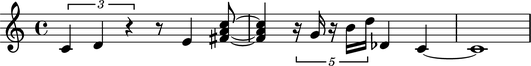

Creating rest-delimited slurs
=============================

Take a look at the slurs in the following example and notice that
there is a pattern to how they arranged.

The pattern?  Slurs in the example span groups of notes and chords separated by rests.

Abjad makes it easy to create rest-delimited slurs in a structured way.

Entering input
--------------

Let's start with the note input like this:

::

   >>> string = r"""
   ...     \times 2/3 { c'4 d' r } 
   ...     r8 e'4 <fs' a' c''>8 ~ q4 
   ...     \times 4/5 { r16 g' r b' d'' } 
   ...     df'4 c' ~ c'1
   ...     """
   >>> staff = Staff(string)
   >>> show(staff)

Grouping notes and chords
-------------------------

Next we'll group notes and chords together with one of the functions
available in the ``scoretools`` package.

We add slur spanners inside our loop:

::

   >>> leaves = iterate(staff).by_class(scoretools.Leaf)
   >>> for group in iterationtools.iterate_runs_in_expr(leaves, (Note, Chord)):
   ...     spannertools.Slur(group)
   ... 
   Slur(c'4, d'4)
   Slur(e'4, <fs' a' c''>8, <fs' a' c''>4)
   Slur(g'16)
   Slur(b'16, d''16, df'4, c'4, c'1)

Here's the result:

::

   >>> show(staff)

But there's a problem.

Four slur spanners were generated but only three slurs are shown.

Why? Because LilyPond ignores one-note slurs.

Skipping one-note slurs
-----------------------

Let's rewrite our example to prevent that from happening:

::

   >>> staff = Staff(string)
   >>> leaves = iterate(staff).by_class(scoretools.Leaf)
   >>> classes = (Note, Chord)
   >>> for group in iterationtools.iterate_runs_in_expr(leaves, classes):
   ...     if 1 < len(group):
   ...         spannertools.Slur(group)
   ... 
   Slur(c'4, d'4)
   Slur(e'4, <fs' a' c''>8, <fs' a' c''>4)
   Slur(b'16, d''16, df'4, c'4, c'1)

And here's the corrected result:

::

   >>> show(staff)

