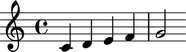
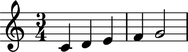
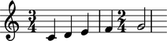

Understanding time signatures
==================================

In this tutorial we take a deeper look at what happens
when we attach time signatures to staves and other score components.

At the end of the tutorial you'll understand how time signatures are
created.

You'll also understand how the states of different objects change when
you attach and detach time signatures.

Getting started
---------------

We start by creating a staff full of notes:

::

   >>> staff = Staff("c'4 d'4 e'4 f'4 g'2")

The interpreter representation of our staff looks like this:

::

   >>> staff
   Staff{5}

The ``5`` in ``Staff{5}`` shows that the staff contains five top-level
components.  The curly braces in ``Staff{5}`` show that the contents of the
staff are to be read sequentially through time rather than simultaneously.

Before we get to time signatures let's take a moment and examine the state
of the staff we've created. We can motivate this a bit by asking two questions:

1. what time signature is currently in effect for the staff we have just
created?

2. what is the time signature currently in effect for the five notes contained
within the staff we have just created?

The answer to both questions is the same: there is no time signature currently
in effect for either our staff or for the five notes it contains.

We can use the inspector to see that this is the case:

::

   >>> print inspect(staff).get_effective_context_mark(marktools.TimeSignature)
   None

And:

::

   >>> for leaf in staff.select_leaves():
   ...     print inspect(leaf).get_effective_context_mark(
   ...         marktools.TimeSignature)
   ... 
   None
   None
   None
   None
   None

And we can iterate both the staff and its leaves at one and the same time like
this:

::

   >>> for component in iterationtools.iterate_components_in_expr(staff):
   ...     effective_time_signature = inspect(component).get_effective_context_mark(
   ...         marktools.TimeSignature)
   ...     print component, effective_time_signature
   ... 
   Staff{5} None
   c'4 None
   d'4 None
   e'4 None
   f'4 None
   g'2 None

This confirms the answers to our questions. There is not yet any time
signature in effect for any component in our staff because we have not yet
attached a time signature to any component in our staff.

LilyPond's implicit ``4/4``
---------------------------

So what happens if we format our staff and send it off to LilyPond to render as
a PDF? Will LilyPond render the staff with a time signature? Without a time
signature? Will LilyPond refuse to render the example at all?

We find out like this:

::

   >>> show(staff)

It turns out LilyPond defaults to a time signature of ``4/4``.

What's important to note here is that because we have not yet attached a time
signature any component in our staff Abjad says "no effective time
signature here" while LilyPond says "OK, I'll default to ``4/4`` so we can get
on with rendering your music."

We can further confirm that this is the case by asking Abjad for the LilyPond
format of our staff:

::

   >>> f(staff)
   \new Staff {
       c'4
       d'4
       e'4
       f'4
       g'2
   }

The LilyPond format of our staff contains no LilyPond ``\time`` command.
This is, again, because we have not yet attached a time signature
to any component in our staff.

Using time signatures
--------------------------

We can now practice attaching and detaching time signatures
to different components in our staff and study what happens as we do.

We'll start with ``3/4``.

The easiest thing to do is to attach a time signature to the staff itself.

We'll do this in two separate steps and study each step to understand exactly
what's going on.

First, we create a ``3/4`` time signature:

::

   >>> time_signature = marktools.TimeSignature((3, 4))

The interpreter representation of our time signature looks like this:

::

   >>> time_signature
   TimeSignature((3, 4))

All this tells us is that we have in fact created a ``3/4`` time signature
mark. Nothing too exciting yet. At this point our ``3/4`` time signature is
not yet attached to anything. We could say that the "state" of our time
signature is "unattached." And we can see this like so:

::

   >>> time_signature.start_component is None
   True

What does it mean for a time signature to have ``'start_component'`` equal
to none? It means that the time signature isn't yet attached to any score
component anywhere.

So now we attach our time signature to our staff:

::

   >>> time_signature.attach(staff)
   TimeSignature((3, 4))(Staff{5})

Abjad responds immediately by returning the time signature we have just
attached.

Notice that the interpreter representation of our time signature has
changed. The interpreter representation of our ``3/4`` time signature now
includes the staff to which we have just attached the time signature. That
is to say that the interpreter representation of our time signature is
statal.

Our time signature has transitioned from an "unattached" state to an
"attached" state. We can see this like so:

::

   >>> time_signature.start_component
   Staff{5}

And our staff has likewise transitioned from a state of having no effective
time signature to a state of having an effective time signature:

::

   >>> inspect(staff).get_effective_context_mark(marktools.TimeSignature)
   TimeSignature((3, 4))(Staff{5})

And what about the leaves inside our staff?
Do the leaves now "know" that they are governed by a ``3/4`` time signature?

Indeed they do:

::

   >>> for leaf in staff.select_leaves():
   ...     effective_time_signature = inspect(leaf).get_effective_context_mark(
   ...         marktools.TimeSignature)
   ...     print leaf, effective_time_signature
   ... 
   c'4 3/4
   d'4 3/4
   e'4 3/4
   f'4 3/4
   g'2 3/4

Briefly to resume:

What we just did was to:

1. create a time signature
2. attach the time signature to a score component

This 2-step pattern is always the same when dealing with context marks: create
then attach.

Before moving on let's look at the PDF corresponding to our staff:

::

   >>> show(staff)

And let's confirm what we see in the PDF in the staff's format:

::

   >>> f(staff)
   \new Staff {
       \time 3/4
       c'4
       d'4
       e'4
       f'4
       g'2
   }

The staff's format now contains a LilyPond ``\time`` command because we have
attached an Abjad time signature to the staff.

What we've just been through above will cover over 80% of what you'll ever wind
up doing with time signatures: creating them and attaching them directly
to staves. But what if we wan to get rid of a time signature? Or what if
the time signature will be changing all over the place? We cover those cases
next.

Detaching a time signature is easy:

::

   >>> time_signature.detach()
   TimeSignature((3, 4))

Abjad returns the mark we have just detached. And the interpreter
representation of the time signature has again changed state:
the time signature has transitioned from attached to unattached.
We confirm this like so:

::

   >>> time_signature.start_component is None
   True

And also like so:

::

   >>> print inspect(staff).get_effective_context_mark(marktools.TimeSignature)
   None

Our time signature now knows nothing about our staff. And vice versa.

So now what if we want to set up a time signature of ``2/4``?

We have a couple of options.

We can simply create and attach a new time signature:

::

   >>> duple_time_signature = marktools.TimeSignature((2, 4))
   >>> duple_time_signature.attach(staff)
   TimeSignature((2, 4))(Staff{5})

::

   >>> f(staff)
   \new Staff {
       \time 2/4
       c'4
       d'4
       e'4
       f'4
       g'2
   }

::

   >>> show(staff)

Yup. That works.

On the other hand, we could simply reuse our previous ``3/4`` time signature
mark.

To do this we'll first detach our ``2/4`` time signature ...

::

   >>> duple_time_signature.detach()
   TimeSignature((2, 4))

... confirm that our staff is now time signatureless ...

::

   >>> print inspect(staff).get_effective_context_mark(marktools.TimeSignature)
   None

::

   >>> f(staff)
   \new Staff {
       c'4
       d'4
       e'4
       f'4
       g'2
   }

... reattach our previous ``3/4`` time signature ...

::

   >>> time_signature.attach(staff)
   TimeSignature((3, 4))(Staff{5})

... change the numerator of our time signature ...

::

   >>> time_signature.numerator = 2

... and check to make sure that everything is as it should be:

::

   >>> inspect(staff).get_effective_context_mark(marktools.TimeSignature)
   TimeSignature((2, 4))(Staff{5})
   >>> time_signature.start_component
   Staff{5}

::

   >>> f(staff)
   \new Staff {
       \time 2/4
       c'4
       d'4
       e'4
       f'4
       g'2
   }

::

   >>> show(staff)

And everything works as it should.

To change to ``4/4`` we change just change the time signature's numerator
again:

::

   >>> time_signature.numerator = 4

::

   >>> show(staff)

::

   >>> f(staff)
   \new Staff {
       \time 4/4
       c'4
       d'4
       e'4
       f'4
       g'2
   }

First-measure pick-ups
----------------------

But what if our time signature has a ``2/4`` pick-up?

The LilyPond command for pick-ups is ``\partial``.
Abjad time signatures implement this as a read / write attribute:

::

   >>> time_signature.partial = Duration(2, 4)

::

   >>> f(staff)
   \new Staff {
       \partial 2
       \time 4/4
       c'4
       d'4
       e'4
       f'4
       g'2
   }

::

   >>> show(staff)

And what if time signature changes all over the place?

We'll use the trivial example of a measure in ``4/4`` followed by a measure in
``2/4``.

To do this we will need two time signatures.

We've already got a ``4/4`` time signature attached to our staff:

::

   >>> f(staff)
   \new Staff {
       \partial 2
       \time 4/4
       c'4
       d'4
       e'4
       f'4
       g'2
   }

Let's get rid of the pick-up:

::

   >>> time_signature.partial = None

::

   >>> f(staff)
   \new Staff {
       \time 4/4
       c'4
       d'4
       e'4
       f'4
       g'2
   }

Now what about the ``2/4`` time signature?

We create it in the usual way:

::

   >>> duple_time_signature = marktools.TimeSignature((2, 4))
   >>> duple_time_signature
   TimeSignature((2, 4))

But should we attach it? We can't attach our ``2/4`` time signature to our
staff because we've already attached our ``4/4`` time signature to our staff.
And it only makes sense to attach one time signature to any given score
component.

Observe that we've built our score in a very straightforward way: we have a
single staff that contains a (flat) sequence of notes. This means that we have
only one choice for where to attach the new ``2/4`` time signature. And
that is one the ``g'2`` that comes on the downbeat of the second measure. We
do that like this:

::

   >>> duple_time_signature.attach(staff[4])
   TimeSignature((2, 4))(g'2)

::

   >>> f(staff)
   \new Staff {
       \time 4/4
       c'4
       d'4
       e'4
       f'4
       \time 2/4
       g'2
   }

::

   >>> show(staff)

And everything works as we would like.

Incidentally, ``staff[4]`` means the component sitting at index ``4`` inside
our staff. Using the interpreter we can verify that this is ``g'2``:

::

   >>> staff[4]
   Note("g'2")

Depending on how we had chosen to build our staff we would have had more
options for where to attach our ``2/4`` time signature. If, for example,
we had chosen to populate our staff with a series of measures then it's
possible we could have attached our ``2/4`` time signature to a measure instead
of a note.
