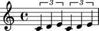

Working with component parentage
================================

Many score objects contain other score objects.

::

   >>> tuplet = Tuplet(Multiplier(2, 3), "c'4 d'4 e'4")
   >>> staff = Staff(2 * tuplet)
   >>> score = Score([staff])
   >>> show(score)

Abjad uses the idea of parentage to model the way objects contain each other.

Getting the parentage of a component
------------------------------------

Use the inspector to get the parentage of any component:

::

   >>> note = score.select_leaves()[0]
   >>> parentage = inspect(note).get_parentage()

::

   >>> parentage
   Parentage(Note("c'4"), Tuplet(2/3, [c'4, d'4, e'4]), Staff{2}, Score<<1>>)

Abjad returns a special type of selection.

Parentage attributes
--------------------

Use parentage to find the immediate parent of a component:

::

   >>> parentage.parent
   Tuplet(2/3, [c'4, d'4, e'4])

Or the root of the score in the which the component resides:

::

   >>> parentage.root
   Score<<1>>

Or to find the depth at which the component is embedded in its score:

::

   >>> parentage.depth
   3

Or the number of tuplets in which the component is nested:

::

   >>> parentage.tuplet_depth
   1

