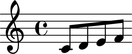

Make many notes
===============

Type the following and hit return. ::

   abjad> notes = construct.scale(4)
   abjad> notes
   [Note(c', 8), Note(d', 8), Note(e', 8), Note(f', 8)]

Abjad creates the first four notes of an ascending C major scale.

Wrap these notes in a staff and then show.

::

	abjad> staff = Staff(notes)
	abjad> show(staff)

The ``notes`` variable is now bound to a Python list of four Abjad notes.
The ``staff`` variable is bound to an Abjad staff containing those notes.

.. seealso:: See the API entry for :func:`construct.scale() <abjad.tools.construct.scale.scale>`.
