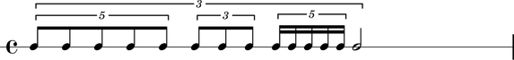
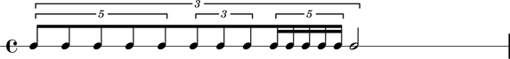

A containerized model of music notation
=======================================

Abjad implements a containerized model of music notation: notes, rests, chords
are collected into voices, staves, scores, and other types of container. Because
Abjad's containers may contain each other, the core of Abjad's object model
constitutes a graph-theoretic tree.

The example above shows 14 notes contained in three tuplets, themselves
contained in yet another tuplet; that tuplet is contained in a musical voice;
the voice is contained in a staff; the staff is contained in a score. The
tuplets' nesting makes the tree-like structure of the example easy to see.

Abjad declines to model musical measures as containers. Much notation software
of the early 2000s lost its way trying to model the musical measure as a
centrally important object of notation. The result was a confusion about the
function of barlines and the frequent inability of tuplets to cross measure
boundaries. Abjad's solution is to model the musical measure as a logical
concept rather than a container: composers may select notes grouped by measure
in Abjad any time a time signature is present; no containerized measures are
required.

What about the  many elements of music notation that are attached to the notes,
rests, chords that fill a page of music? Should the beaming patterns in the
examples below be modeled with containers, too?

.. image:: images/lci-3.png

.. image:: images/lci-4.png

Perhaps surprisingly, only a small number of musical symbols carry a duration:
notes, rests, chords and, by extension, the tuplets, voices, staves that
contain them. All the other symbols used to notate music are dependent on
notes, rests, chords for their moment of performance, and for their location on
the page: articulations, fingerings, pedal markings, slurs, phrase groupings,
clefs, key signatures all depend on notes, rests, chords for their location,
both temporal and spatial.

Abjad formalizes this distinction between durated and non-durated objects in
the idea of an indicator. Abjad's indicators model all the symbols that may be
attached to notes, rests, chords during composition. (The beamed examples above
were created by attaching "start-beam" and "stop-beam" indicators to different
notes.)
