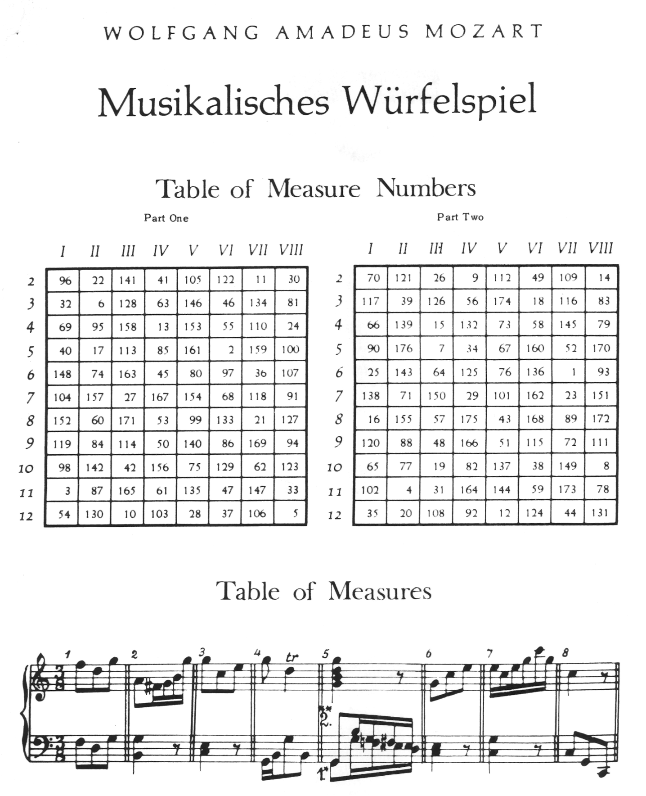

Corpus, figure selection from
=============================

::

    >>> import random
    >>> random.seed(0)

Mozart's dice game is a method for aleatorically generating sixteen-measure-long minuets.
For each measure, two six-sided dice are rolled, and the sum of the dice used to look up
a measure number in one of two tables. Each measure number locates a measure in a corpus
of musical fragments. The fragments are then concatenated and "music" results.

    *Part of a pen-and-paper implementation from the 20th century.*

At the heart of the dice game is a corpus of musical fragments. Each fragment is a single
3/8 measure, consisting of a treble voice and a bass voice. Traditionally, these
fragments are stored in a "table of measures."

Duplicate measures in the original corpus are common. Notably, the eighth measure ---
actually a pair of measures representing the first and second endings of the first half
of the minuet --- are always identical. The last measure of the piece is similarly
limited --- there are only two possibilities rather than the usual eleven.

We'll represent each fragment in the corpus as a pair of strings (for bass and treble)
keyed as ``"b"`` and ``"t"`` in a dictionary. Each of the sixteen measures in the piece
will be represented by a list of such fragment dictionaries:

::

    >>> fragment = {"b": "<c e>4 r8", "t": "g''8 ( e''8 c''8 )"}

Furthermore, the 8th measure, which breaks the pattern, will simply be a list of two
fragment dictionaries. Structuring our information in this way lets us avoid using
measure number tables entirely; Python's list-indexing affordances will take care of that
for us. The complete corpus looks like this:

::

    >>> measure_1_choices = [
    ...     ("c4 r8", "e''8 c''8 g'8"),
    ...     ("<c e>4 r8", "g'8 c''8 e''8"),
    ...     ("<c e>4 r8", "g''8 ( e''8 c''8 )"),
    ...     ("<c e>4 r8", "c''16 b'16 c''16 e''16 g'16 c''16"),
    ...     ("<c e>4 r8", "c'''16 b''16 c'''16 g''16 e''16 c''16"),
    ...     ("c4 r8", "e''16 d''16 e''16 g''16 c'''16 g''16"),
    ...     ("<c e>4 r8", "g''8 f''16 e''16 d''16 c''16"),
    ...     ("<c e>4 r8", "e''16 c''16 g''16 e''16 c'''16 g''16"),
    ...     ("<c e>16 g16 <c e>16 g16 <c e>16 g16", "c''8 g'8 e''8"),
    ...     ("<c e>4 r8", "g''8 c''8 e''8"),
    ...     ("c8 c8 c8", "<e' c''>8 <e' c''>8 <e' c''>8"),
    ... ]

    >>> measure_2_choices = [
    ...     ("c4 r8", "e''8 c''8 g'8"),
    ...     ("<c e>4 r8", "g'8 c''8 e''8"),
    ...     ("<c e>4 r8", "g''8 e''8 c''8"),
    ...     ("<e g>4 r8", "c''16 g'16 c''16 e''16 g'16 c''16"),
    ...     ("<c e>4 r8", "c'''16 b''16 c'''16 g''16 e''16 c''16"),
    ...     ("c4 r8", "e''16 d''16 e''16 g''16 c'''16 g''16"),
    ...     ("<c e>4 r8", "g''8 f''16 e''16 d''16 c''16"),
    ...     ("<c e>4 r8", "c''16 g'16 e''16 c''16 g''16 e''16"),
    ...     ("<c e>4 r8", "c''8 g'8 e''8"),
    ...     ("<c e>4 <c g>8", "g''8 c''8 e''8"),
    ...     ("c8 c8 c8", "<e' c''>8 <e' c''>8 <e' c''>8"),
    ... ]

    >>> measure_3_choices = [
    ...     ("<b, g>4 g,8", "d''16 e''16 f''16 d''16 c''16 b'16"),
    ...     ("g,4 r8", "b'8 d''8 g''8"),
    ...     ("g,4 r8", "b'8 d''16 b'16 a'16 g'16"),
    ...     ("<g b>4 r8", "f''8 d''8 b'8"),
    ...     ("<b, d>4 r8", "g''16 fs''16 g''16 d''16 b'16 g'16"),
    ...     ("<g b>4 r8", "f''16 e''16 f''16 d''16 c''16 b'16"),
    ...     ("<g, g>4 <b, g>8", "b'16 c''16 d''16 e''16 f''16 d''16"),
    ...     ("g8 g8 g8", "<b' d''>8 <b' d''>8 <b' d''>8"),
    ...     ("g,4 r8", "b'16 c''16 d''16 b'16 a'16 g'16"),
    ...     ("b,4 r8", "d''8 ( b'8 g'8 )"),
    ...     ("g4 r8", "b'16 a'16 b'16 c''16 d''16 b'16"),
    ... ]

    >>> measure_4_choices = [
    ...     ("<c e>4 r8", "c''16 b'16 c''16 e''16 g'8"),
    ...     ("c4 r8", "e''16 c''16 b'16 c''16 g'8"),
    ...     ("<e g>4 r8", "c''8 ( g'8 e'8 )"),
    ...     ("<e g>4 r8", "c''8 e''8 g'8"),
    ...     ("<e g>4 r8", "c''16 b'16 c''16 g'16 e'16 c'16"),
    ...     ("<c e>4 r8", "c''8 c''16 d''16 e''8"),
    ...     ("c4 r8", "<c'' e''>8 <c'' e''>16 <d'' f''>16 <e'' g''>8"),
    ...     ("<e g>4 r8", "c''8 e''16 c''16 g'8"),
    ...     ("<e g>4 r8", "c''16 g'16 e''16 c''16 g''8"),
    ...     ("<e g>4 r8", "c''8 e''16 c''16 g''8"),
    ...     ("<e g>4 r8", "c''16 e''16 c''16 g'16 e'8"),
    ... ]

    >>> measure_5_choices = [
    ...     ("c4 r8", "fs''8 a''16 fs''16 d''16 fs''16"),
    ...     ("c8 c8 c8", "<fs' d''>8 <d'' fs''>8 <fs'' a''>8"),
    ...     ("c4 r8", "d''16 a'16 fs''16 d''16 a''16 fs''16"),
    ...     ("c8 c8 c8", "<fs' d''>8 <fs' d''>8 <fs' d''>8"),
    ...     ("c4 r8", "d''8 a'8 ^\\turn fs''8"),
    ...     ("c4 r8", "d''16 cs''16 d''16 fs''16 a''16 fs''16"),
    ...     ("<c a>4 <c a>8", "fs''8 a''8 d''8"),
    ...     ("<c fs>8 <c fs>8 <c a>8", "a'8 a'16 d''16 fs''8"),
    ...     ("c8 c8 c8", "<d'' fs''>8 <d'' fs''>8 <d'' fs''>8"),
    ...     ("<c d>8 <c d>8 <c d>8", "fs''8 fs''16 d''16 a''8"),
    ...     ("<c a>4 r8", "fs''16 d''16 a'16 a''16 fs''16 d''16"),
    ... ]

    >>> measure_6_choices = [
    ...     ("<b, d>8 <b, d>8 <b, d>8", "g''16 fs''16 g''16 b''16 d''8"),
    ...     ("<b, d>4 r8", "g''8 b''16 g''16 d''16 b'16"),
    ...     ("<b, d>4 r8", "g''8 b''8 d''8"),
    ...     ("<b, g>4 r8", "a'8 fs'16 g'16 b'16 g''16"),
    ...     ("<b, d>4 <b, g>8", "g''16 fs''16 g''16 d''16 b'16 g'16"),
    ...     ("b,4 r8", "g''8 b''16 g''16 d''16 g''16"),
    ...     ("<b, g>4 r8", "d''8 g''16 d''16 b'16 d''16"),
    ...     ("<b, g>4 r8", "d''8 d''16 g''16 b''8"),
    ...     ("<b, d>8 <b, d>8 <b, g>8", "a''16 g''16 fs''16 g''16 d''8"),
    ...     ("<b, d>4 r8", "g''8 g''16 d''16 b''8"),
    ...     ("<b, d>4 r8", "g''16 b''16 g''16 d''16 b'8"),
    ... ]

    >>> measure_7_choices = [
    ...     ("c8 d8 d,8", "e''16 c''16 b'16 a'16 g'16 fs'16"),
    ...     ("c8 d8 d,8", "a'16 e''16 <b' d''>16 <a' c''>16 <g' b'>16 <fs' a'>16"),
    ...     ("c8 d8 d,8", "<b' d''>16 ( <a' c''>16 ) <a' c''>16 ( <g' b'>16 ) <g' b'>16 ( <fs' a'>16 )"),
    ...     ("c8 d8 d,8", "e''16 g''16 d''16 c''16 b'16 a'16"),
    ...     ("c8 d8 d,8", "a'16 e''16 d''16 g''16 fs''16 a''16"),
    ...     ("c8 d8 d,8", "e''16 a''16 g''16 b''16 fs''16 a''16"),
    ...     ("c8 d8 d,8", "c''16 e''16 g''16 d''16 a'16 fs''16"),
    ...     ("c8 d8 d,8", "e''16 g''16 d''16 g''16 a'16 fs''16"),
    ...     ("c8 d8 d,8", "e''16 c''16 b'16 g'16 a'16 fs'16"),
    ...     ("c8 d8 d,8", "e''16 c'''16 b''16 g''16 a''16 fs''16"),
    ...     ("c8 d8 d,8", "a'8 d''16 c''16 b'16 a'16"),
    ... ]

    >>> measure_8_choices = [
    ...     ("g,8 g16 f16 e16 d16", "<g' b' d'' g''>4 r8"),
    ...     ("g,8 b16 g16 fs16 e16", "<g' b' d'' g''>4 r8"),
    ... ]

    >>> measure_9_choices = [
    ...     ("d4 c8", "fs''8 a''16 fs''16 d''16 fs''16"),
    ...     ("<d fs>4 r8", "d''16 a'16 d''16 fs''16 a''16 fs''16"),
    ...     ("<d a>8 <d fs>8 <c d>8", "fs''8 a''8 fs''8"),
    ...     ("<c a>4 <c a>8", "fs''16 a''16 d'''16 a''16 fs''16 a''16"),
    ...     ("d4 c8", "d'16 fs'16 a'16 d''16 fs''16 a''16"),
    ...     ("d,16 d16 cs16 d16 c16 d16", "<a' d'' fs''>8 fs''4 ^\\trill"),
    ...     ("<d fs>4 <c fs>8", "a''8 ( fs''8 d''8 )"),
    ...     ("<d fs>4 <c fs>8", "d'''8 a''16 fs''16 d''16 a'16"),
    ...     ("<d fs>4 r8", "d''16 a'16 d''8 fs''8"),
    ...     ("<c a>4 <c a>8", "fs''16 d''16 a'8 fs''8"),
    ...     ("<d fs>4 <c a>8", "a'8 d''8 fs''8"),
    ... ]

    >>> measure_10_choices = [
    ...     ("<b, g>4 r8", "g''8 b''16 g''16 d''8"),
    ...     ("b,16 d16 g16 d16 b,16 g,16", "g''8 g'8 g'8"),
    ...     ("b,4 r8", "g''16 b''16 g''16 b''16 d''8"),
    ...     ("<b, d>4 <b, d>8", "a''16 g''16 b''16 g''16 d''16 g''16"),
    ...     ("<b, d>4 <b, d>8", "g''8 d''16 b'16 g'8"),
    ...     ("<b, d>4 <b, d>8", "g''16 b''16 d'''16 b''16 g''8"),
    ...     ("<b, d>4 r8", "g''16 b''16 g''16 d''16 b'16 g'16"),
    ...     ("<b, d>4 <b, d>8", "g''16 d''16 g''16 b''16 g''16 d''16"),
    ...     ("<b, d>4 <b, g>8", "g''16 b''16 g''8 d''8"),
    ...     ("g,16 b,16 g8 b,8", "g''8 d''4 ^\\trill"),
    ...     ("b,4 r8", "g''8 b''16 d'''16 d''8"),
    ... ]

    >>> measure_11_choices = [
    ...     ("c16 e16 g16 e16 c'16 c16", "<c'' e''>8 <c'' e''>8 <c'' e''>8"),
    ...     ("e4 e16 c16", "c''16 g'16 c''16 e''16 g''16 <c'' e''>16"),
    ...     ("<c g>4 <c e>8", "e''8 g''16 e''16 c''8"),
    ...     ("<c g>4 r8", "e''16 c''16 e''16 g''16 c'''16 g''16"),
    ...     ("<c g>4 <c g>8", "e''16 g''16 c'''16 g''16 e''16 c''16"),
    ...     ("c16 b,16 c16 d16 e16 fs16", "<g' c'' e''>8 e''4 ^\\trill"),
    ...     ("<c e>16 g16 <c e>16 g16 <c e>16 g16", "e''8 c''8 g'8"),
    ...     ("<c g>4 <c e>8", "e''8 c''16 e''16 g''16 c'''16"),
    ...     ("<c g>4 <c e>8", "e''16 c''16 e''8 g''8"),
    ...     ("<c g>4 <c g>8", "e''16 c''16 g'8 e''8"),
    ...     ("<c g>4 <c e>8", "e''8 ( g''8 c'''8 )"),
    ... ]

    >>> measure_12_choices = [
    ...     ("g4 g,8", "<c'' e''>8 <b' d''>8 r8"),
    ...     ("<g, g>4 g8", "d''16 b'16 g'8 r8"),
    ...     ("g8 g,8 r8", "<c'' e''>8 <b' d''>16 <g' b'>16 g'8"),
    ...     ("g4 r8", "e''16 c''16 d''16 b'16 g'8"),
    ...     ("g8 g,8 r8", "g''16 e''16 d''16 b'16 g'8"),
    ...     ("g4 g,8", "b'16 d''16 g''16 d''16 b'8"),
    ...     ("g8 g,8 r8", "e''16 c''16 b'16 d''16 g''8"),
    ...     ("<g b>4 r8", "d''16 b''16 g''16 d''16 b'8"),
    ...     ("<b, g>4 <b, d>8", "d''16 b'16 g'8 g''8"),
    ...     ("g16 fs16 g16 d16 b,16 g,16", "d''8 g'4"),
    ... ]

    >>> measure_13_choices = [
    ...     ("<c e>16 g16 <c e>16 g16 <c e>16 g16", "e''8 c''8 g'8"),
    ...     ("<c e>16 g16 <c e>16 g16 <c e>16 g16", "g'8 c''8 e''8"),
    ...     ("<c e>16 g16 <c e>16 g16 <c e>16 g16", "g''8 e''8 c''8"),
    ...     ("<c e>4 <e g>8", "c''16 b'16 c''16 e''16 g'16 c''16"),
    ...     ("<c e>4 <c g>8", "c'''16 b''16 c'''16 g''16 e''16 c''16"),
    ...     ("<c g>4 <c e>8", "e''16 d''16 e''16 g''16 c'''16 g''16"),
    ...     ("<c e>4 r8", "g''8 f''16 e''16 d''16 c''16"),
    ...     ("<c e>4 r8", "c''16 g'16 e''16 c''16 g''16 e''16"),
    ...     ("<c e>16 g16 <c e>16 g16 <c e>16 g16", "c''8 g'8 e''8"),
    ...     ("<c e>16 g16 <c e>16 g16 <c e>16 g16", "g''8 c''8 e''8"),
    ...     ("c8 c8 c8", "<e' c''>8 <e' c''>8 <e' c''>8"),
    ... ]

    >>> measure_14_choices = [
    ...     ("<c e>16 g16 <c e>16 g16 <c e>16 g16", "e''8 ( c''8 g'8 )"),
    ...     ("<c e>4 <c g>8", "g'8 ( c''8 e''8 )"),
    ...     ("<c e>16 g16 <c e>16 g16 <c e>16 g16", "g''8 e''8 c''8"),
    ...     ("<c e>4 <c e>8", "c''16 b'16 c''16 e''16 g'16 c''16"),
    ...     ("<c e>4 r8", "c'''16 b''16 c'''16 g''16 e''16 c''16"),
    ...     ("<c g>4 <c e>8", "e''16 d''16 e''16 g''16 c'''16 g''16"),
    ...     ("<c e>4 <e g>8", "g''8 f''16 e''16 d''16 c''16"),
    ...     ("<c e>4 r8", "c''16 g'16 e''16 c''16 g''16 e''16"),
    ...     ("<c e>16 g16 <c e>16 g16 <c e>16 g16", "c''8 g'8 e''8"),
    ...     ("<c e>16 g16 <c e>16 g16 <c e>16 g16", "g''8 c''8 e''8"),
    ...     ("c8 c8 c8", "<e' c''>8 <e' c''>8 <e' c''>8"),
    ... ]

    >>> measure_15_choices = [
    ...     ("<f a>4 <g d'>8", "d''16 f''16 d''16 f''16 b'16 d''16"),
    ...     ("f4 g8", "d''16 f''16 a''16 f''16 d''16 b'16"),
    ...     ("f4 g8", "d''16 f''16 a'16 d''16 b'16 d''16"),
    ...     ("f4 g8", "d''16 ( cs''16 ) d''16 f''16 g'16 b'16"),
    ...     ("f8 d8 g8", "f''8 d''8 g''8"),
    ...     ("f16 e16 d16 e16 f16 g16", "f''16 e''16 d''16 e''16 f''16 g''16"),
    ...     ("f16 e16 d8 g8", "f''16 e''16 d''8 g''8"),
    ...     ("f4 g8", "f''16 e''16 d''16 c''16 b'16 d''16"),
    ...     ("f4 g8", "f''16 d''16 a'8 b'8"),
    ...     ("f4 g8", "f''16 a''16 a'8 b'16 d''16"),
    ...     ("f4 g8", "a'8 f''16 d''16 a'16 b'16"),
    ... ]

    >>> measure_16_choices = [
    ...     ("c8 g,8 c,8", "c''4 r8"),
    ...     ("c4 c,8", "c''8 c'8 r8"),
    ... ]

    >>> measures = [
    ...     measure_1_choices,
    ...     measure_2_choices,
    ...     measure_3_choices,
    ...     measure_4_choices,
    ...     measure_5_choices,
    ...     measure_6_choices,
    ...     measure_7_choices,
    ...     measure_8_choices,
    ...     measure_9_choices,
    ...     measure_10_choices,
    ...     measure_11_choices,
    ...     measure_12_choices,
    ...     measure_13_choices,
    ...     measure_14_choices,
    ...     measure_15_choices,
    ...     measure_16_choices,
    ... ]

    >>> def make_list(strings):
    ...     choices = []
    ...     for bass_string, treble_string in strings:
    ...         dictionary = {"b": bass_string, "t": treble_string}
    ...         choices.append(dictionary)
    ...     return choices

    >>> def make_corpus(measures):
    ...     return [make_list(_) for _ in measures]

    >>> corpus = make_corpus(measures)

Here are other functions:

::

    >>> def choose_mozart_measures():
    ...     chosen_measures = []
    ...     for i, choices in enumerate(corpus):
    ...         if i == 7:  # get both alternative endings for mm. 8
    ...             chosen_measures.extend(choices)
    ...         else:
    ...             choice = random.choice(choices)
    ...             chosen_measures.append(choice)
    ...     return chosen_measures

::

    >>> def make_mozart_measure(measure_dict):
    ...     # parse the contents of a measure definition dictionary
    ...     # wrap the expression to be parsed inside a LilyPond { } block
    ...     treble = abjad.parse("{{ {} }}".format(measure_dict["t"]))
    ...     bass = abjad.parse("{{ {} }}".format(measure_dict["b"]))
    ...     return treble, bass

::

    >>> def make_mozart_score():
    ...     score_template = abjad.TwoStaffPianoScoreTemplate()
    ...     score = score_template()
    ...     # select the measures to use
    ...     choices = choose_mozart_measures()
    ...     # create and populate the volta containers
    ...     treble_volta = abjad.Container()
    ...     bass_volta = abjad.Container()
    ...     for choice in choices[:7]:
    ...         treble, bass = make_mozart_measure(choice)
    ...         treble_volta.append(treble)
    ...         bass_volta.append(bass)
    ...     # abjad.attach indicators to the volta containers
    ...     command = abjad.LilyPondLiteral(r"\repeat volta 2", "before")
    ...     abjad.attach(command, treble_volta)
    ...     command = abjad.LilyPondLiteral(r"\repeat volta 2", "before")
    ...     abjad.attach(command, bass_volta)
    ...     # append the volta containers to our staves
    ...     score["RH_Voice"].append(treble_volta)
    ...     score["LH_Voice"].append(bass_volta)
    ...     # create and populate the alternative ending containers
    ...     treble_alternative = abjad.Container()
    ...     bass_alternative = abjad.Container()
    ...     for choice in choices[7:9]:
    ...         treble, bass = make_mozart_measure(choice)
    ...         treble_alternative.append(treble)
    ...         bass_alternative.append(bass)
    ...     # abjad.attach indicators to the alternative containers
    ...     command = abjad.LilyPondLiteral(r"\alternative", "before")
    ...     abjad.attach(command, treble_alternative)
    ...     command = abjad.LilyPondLiteral(r"\alternative", "before")
    ...     abjad.attach(command, bass_alternative)
    ...     # append the alternative containers to our staves
    ...     score["RH_Voice"].append(treble_alternative)
    ...     score["LH_Voice"].append(bass_alternative)
    ...     # create the remaining measures
    ...     for choice in choices[9:]:
    ...         treble, bass = make_mozart_measure(choice)
    ...         score["RH_Voice"].append(treble)
    ...         score["LH_Voice"].append(bass)
    ...     # abjad.attach indicators
    ...     time_signature = abjad.TimeSignature((3, 8))
    ...     leaf = abjad.get.leaf(score["RH_Staff"], 0)
    ...     abjad.attach(time_signature, leaf)
    ...     bar_line = abjad.BarLine("|.")
    ...     leaf = abjad.get.leaf(score["RH_Staff"], -1)
    ...     abjad.attach(bar_line, leaf)
    ...     # remove the default piano instrument and add a custom one:
    ...     abjad.detach(abjad.Instrument, score["Piano_Staff"])
    ...     klavier = abjad.Piano(name="Katzenklavier", short_name="kk.")
    ...     leaf = abjad.get.leaf(score["Piano_Staff"], 0)
    ...     abjad.attach(klavier, leaf)
    ...     first_left_leaf = abjad.select(score["LH_Staff"]).leaves()[0]
    ...     bass_clef = abjad.Clef("bass")
    ...     abjad.attach(bass_clef, first_left_leaf)
    ...     return score

::

    >>> def make_mozart_lilypond_file():
    ...     score = make_mozart_score()
    ...     lilypond_file = abjad.LilyPondFile.new(music=score, global_staff_size=12)
    ...     title = abjad.Markup(r'\bold \sans "Ein Musikalisches Wuerfelspiel"')
    ...     composer = abjad.Scheme("W. A. Mozart (maybe?)")
    ...     lilypond_file.header_block.title = title
    ...     lilypond_file.header_block.composer = composer
    ...     lilypond_file.layout_block.ragged_right = True
    ...     list_ = abjad.SchemeAssociativeList([("basic_distance", 8)])
    ...     lilypond_file.paper_block.markup_system_spacing = list_
    ...     lilypond_file.paper_block.paper_width = 180
    ...     return lilypond_file

Let's try with a measure-definition of our own:

::

    >>> my_measure_dict = {'b': r'c4 ^\trill r8', 't': "e''8 ( c''8 g'8 )"}
    >>> treble, bass = make_mozart_measure(my_measure_dict)

::

    >>> string = abjad.lilypond(treble)
    >>> print(string)

::

    >>> string = abjad.lilypond(bass)
    >>> print(string)

Now with one from the Mozart measure collection defined earlier. We'll grab the very last
choice for the very last measure:

::

    >>> my_measure_dict = corpus[-1][-1]
    >>> treble, bass = make_mozart_measure(my_measure_dict)

::

    >>> string = abjad.lilypond(treble)
    >>> print(string)

::

    >>> string = abjad.lilypond(bass)
    >>> print(string)

After storing all of the musical fragments into a corpus, concatenating those elements
into a musical structure is relatively trivial. We'll use the :py:func:`~random.choice`
function from Python's `random` module. :py:func:`random.choice` randomly selects one
element from an input list.

::

    >>> list_ = [1, 'b', 3]
    >>> result = [random.choice(list_) for i in range(20)]
    >>> result

Our corpus is a list comprising sixteen sublists, one for each measure in the minuet. To
build our musical structure, we can simply iterate through the corpus and call `choice`
on each sublist, appending the chosen results to another list. The only catch is that the
eighth measure of our minuet is actually the first-and-second-ending for the repeat of
the first phrase. The sublist of the corpus for measure eight contains only the first and
second ending definitions, and both of those measures should appear in the final piece,
always in the same order. We'll have to intercept that sublist while we iterate through
the corpus and apply some different logic.

The easist way to intercept measure eight is to use the Python builtin enumerate
function, which allows you to iterate through a collection while also getting the index
of each element in that collection. Note that in ``choose_mozart_measures()`` we test for
index 7, rather then 8, because list indices count from 0 instead of 1.

The result will be a seventeen-item-long list of measure definitions:

::

    >>> choices = choose_mozart_measures()
    >>> for i, measure in enumerate(choices):
    ...     print(i, measure)
    ...

Now that we have our raw materials, and a way to organize them, we can start building our
score. The tricky part here is figuring out how to implement LilyPond's repeat structure
in Abjad. LilyPond structures its repeats something like this:

::

    \repeat volta n {
        music to be repeated
    }

    \alternative {
        { ending 1 }
        { ending 2 }
        { ending n }
    }

    ...music after the repeat...

What you see above is really just two containers, each with a little text ("\repeat volta
n" and "alternative") prepended to their opening curly brace. To create that structure in
Abjad, we'll need to use the :py:class:`abjad.LilyPondLiteral
<abjad.overrides.LilyPondLiteral>` class, which allows you to place LilyPond literals
like "\break" relative to any score component:

::

    >>> container = abjad.Container("c'4 d'4 e'4 f'4")
    >>> literal = abjad.LilyPondLiteral('before-the-container', 'before')
    >>> abjad.attach(literal, container)
    >>> literal = abjad.LilyPondLiteral('after-the-container', 'after')
    >>> abjad.attach(literal, container)
    >>> literal = abjad.LilyPondLiteral('opening-of-the-container', 'opening')
    >>> abjad.attach(literal, container)
    >>> literal = abjad.LilyPondLiteral('closing-of-the-container', 'closing')
    >>> abjad.attach(literal, container)
    >>> string = abjad.lilypond(container)
    >>> print(string)

Notice the second argument to each :py:class:`abjad.LilyPondLiteral
<abjad.overrides.LilyPondLiteral>` above, like `before` and `closing`. These are format
slot indications, which control where the literal is placed in the LilyPond code relative
to the score element it is attached to. To mimic LilyPond's repeat syntax, we'll have to
create two :py:class:`abjad.LilyPondLiteral <abjad.overrides.LilyPondLiteral>` instances,
both using the "before" format slot, insuring that their literal is placed before their
container's opening curly brace.

Now let's take a look at the code that puts our score together :

::

    >>> score = make_mozart_score()
    >>> abjad.show(score)

Our instrument name got cut off!  Looks like we need to do a little formatting.

As you can see above, we've now got our randomized minuet. However, we can still go a bit
further. LilyPond provides a wide variety of settings for controlling the overall look of
a musical document, often through its `\header`, `\layout` and `\paper` blocks. Abjad, in
turn, gives us object-oriented access to these settings through the the
:py:func:`abjad.LilyPondFile <abjad.lilypondfile.LilyPondFile>` class.

We'll use :py:func:`abjad.LilyPondFile.new <abjad.lilypondfile.LilyPondFile.new>` to wrap
our :py:class:`abjad.Score <abjad.score.Score>` inside a :py:class:`abjad.LilypondFile
<abjad.lilypondfile.LilyPondFile>` instance. From there we can access the other "blocks"
of our document to add a title, a composer's name, change the global staff size, paper
size, staff spacing and so forth.

::

    >>> lilypond_file = make_mozart_lilypond_file()
    >>> print(lilypond_file)

::

    >>> string = abjad.lilypond(lilypond_file.header_block)
    >>> print(string)

::

    >>> string = abjad.lilypond(lilypond_file.header_block)
    >>> print(string)

::

    >>> string = abjad.lilypond(lilypond_file.layout_block)
    >>> print(string)

::

    >>> string = abjad.lilypond(lilypond_file.layout_block)
    >>> print(string)

::

    >>> string = abjad.lilypond(lilypond_file.paper_block)
    >>> print(string)

::

    >>> string = abjad.lilypond(lilypond_file.paper_block)
    >>> print(string)

And now the final result:

::

    >>> abjad.show(lilypond_file)

:author:`[Oberholtzer (2.19), Bača (3.2). Music issued by Mozart's publisher in 1792.]`
