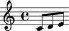
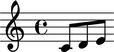
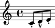

This is **paragraph 1**.
Now comes some Abjad code

::

   >>> voice = Voice("c'8 d'8 e'8")
   >>> beamtools.BeamSpanner(voice)
   BeamSpanner({c'8, d'8, e'8})
   >>> beam = _
   >>> show(voice)

::

   >>> len(beam)
   1
   >>> show(voice)

Here is **paragraph 2**, and more Abjad code.
Notice that in the second block of abjad code I can reference objects and variables created in previous blocks:

::

   >>> spannertools.TrillSpanner(voice[4:])
   TrillSpanner()
   >>> f(voice)
   \new Voice {
       c'8 [
       d'8
       e'8 ]
   }
   >>> show(voice)

Here is **paragraph 3**, and now a function definition.
Note that this function definition can be used later.
The **strip_prompt=true** option tells abjad-book to print the code block as though it wasn't passed to the interpreter.

::

   def apply_articulations(components):
       for i, component in enumerate(components):
           if i % 2 == 0:
               marktools.Articulation('.')(component)
           else:
               marktools.Articulation('^')(component)

Here is **paragraph** 4, where we use the previous function to change the Voice we previously instantiated.

::

   >>> apply_articulations(voice)
   >>> f(voice)
   \new Voice {
       c'8 -\staccato [
       d'8 -\marcato
       e'8 -\staccato ]
   }
   >>> show(voice)

And a final paragraph.
