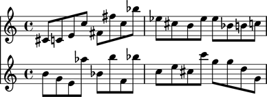
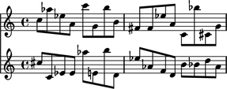
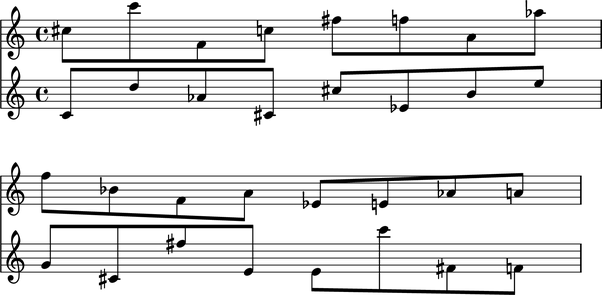
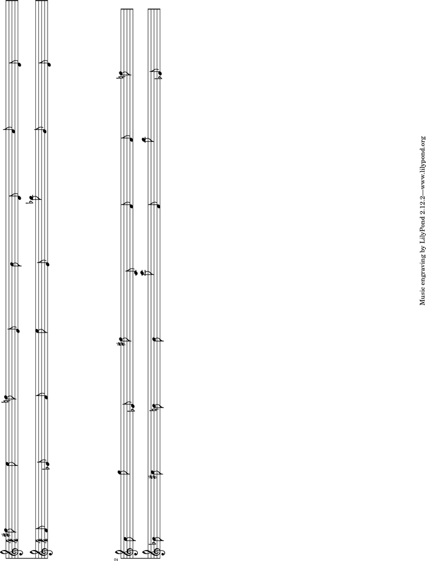
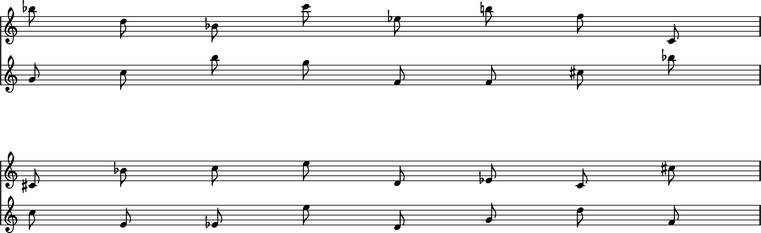
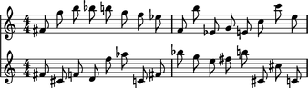

Template gallery
================

Abjad provides a growing number of score templates in the ``templates``
directory. ::

   abjad$ ls templates/

   __init__.py  lagos.ly     paris.ly     test
   coventry.ly  oedo.ly      tangiers.ly  tirnaveni.ly

Each template in the ``templates`` directory is a native LilyPond ``.ly``
file with layout, paper and grob settings appropriate for different
types of score.

Default LilyPond layout
-----------------------

::

	abjad> import random
	abjad> pitches = [random.randrange(0, 25) for x in range(32)]
	abjad> staff_1 = Staff([ ])
	abjad> staff_2 = Staff([ ])
	abjad> score = Score([staff_1, staff_2])
	abjad> staff_1.extend([Note(x, (1, 8)) for x in pitches[:16]])
	abjad> staff_2.extend([Note(x, (1, 8)) for x in pitches[16:]])
	abjad> show(score)

``coventry.ly``
---------------

.. note:: File is rotated because template is landscape.

::

	abjad> pitches = [random.randrange(0, 25) for x in range(32)]
	abjad> staff_1 = Staff([ ])
	abjad> staff_2 = Staff([ ])
	abjad> score = Score([staff_1, staff_2])
	abjad> staff_1.extend([Note(x, (1, 8)) for x in pitches[:16]])
	abjad> staff_2.extend([Note(x, (1, 8)) for x in pitches[16:]])
	abjad> show(score, template = 'coventry')

.. image:: images/_coventry.png

``lagos.ly``
------------

::

	abjad> pitches = [random.randrange(0, 25) for x in range(32)]
	abjad> staff_1 = Staff([ ])
	abjad> staff_2 = Staff([ ])
	abjad> score = Score([staff_1, staff_2])
	abjad> staff_1.extend([Note(x, (1, 8)) for x in pitches[:16]])
	abjad> staff_2.extend([Note(x, (1, 8)) for x in pitches[16:]])
	abjad> show(score, template = 'lagos')

``oedo.ly``
-----------

::

	abjad> pitches = [random.randrange(0, 25) for x in range(32)]
	abjad> staff_1 = Staff([ ])
	abjad> staff_2 = Staff([ ])
	abjad> score = Score([staff_1, staff_2])
	abjad> staff_1.extend([Note(x, (1, 8)) for x in pitches[:16]])
	abjad> staff_2.extend([Note(x, (1, 8)) for x in pitches[16:]])
	abjad> show(score, template = 'oedo')

``paris.ly``
------------

.. note:: File is rotated because template is landscape.

::

	abjad> pitches = [random.randrange(0, 25) for x in range(32)]
	abjad> staff_1 = Staff([ ])
	abjad> staff_2 = Staff([ ])
	abjad> score = Score([staff_1, staff_2])
	abjad> staff_1.extend([Note(x, (1, 8)) for x in pitches[:16]])
	abjad> staff_2.extend([Note(x, (1, 8)) for x in pitches[16:]])
	abjad> show(score, template = 'paris')

``tangiers.ly``
---------------

::

	abjad> pitches = [random.randrange(0, 25) for x in range(32)]
	abjad> staff_1 = Staff([ ])
	abjad> staff_2 = Staff([ ])
	abjad> score = Score([staff_1, staff_2])
	abjad> staff_1.extend([Note(x, (1, 8)) for x in pitches[:16]])
	abjad> staff_2.extend([Note(x, (1, 8)) for x in pitches[16:]])
	abjad> show(score, template = 'tangiers')

``tirnaveni.ly``
----------------

::

	abjad> pitches = [random.randrange(0, 25) for x in range(32)]
	abjad> staff_1 = Staff([ ])
	abjad> staff_2 = Staff([ ])
	abjad> score = Score([staff_1, staff_2])
	abjad> staff_1.extend([Note(x, (1, 8)) for x in pitches[:16]])
	abjad> staff_2.extend([Note(x, (1, 8)) for x in pitches[16:]])
	abjad> show(score, template = 'tirnaveni')

.. todo:: Teach ``abjad-book`` to recognize and rotate landscape images.

.. todo:: More whitespace between sections.

.. todo:: More complex comparison score with notes, rests, chords,
   tuplets and line breaks.
