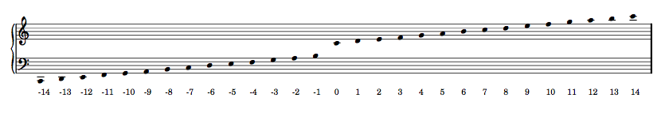

Diatonic pitch numbers
======================

The code to generate this table is as follows::

   score, treble_staff, bass_staff = scoretools.make_empty_piano_score( )
   duration = Fraction(1, 32)

   treble = measuretools.AnonymousMeasure([ ])
   bass = measuretools.AnonymousMeasure([ ])

   treble_staff.append(treble)
   bass_staff.append(bass)

   pitches =[ ]
   diatonic_pitches = [0, 2, 4, 5, 7, 9, 11]

   pitches.extend([-24 + x for x in diatonic_pitches])
   pitches.extend([-12 + x for x in diatonic_pitches])
   pitches.extend([0 + x for x in diatonic_pitches])
   pitches.extend([12 + x for x in diatonic_pitches])
   pitches.append(24)
   cfgtools.set_default_accidental_spelling('sharps')

   for i in pitches:
      note = Note(i, duration)
      rest = Rest(duration)
      clef = pitchtools.suggest_clef_for_named_chromatic_pitches([note.pitch])
      if clef == contexttools.ClefMark('treble'):
         treble.append(note)
         bass.append(rest)
      else:
         treble.append(rest)
         bass.append(note)
      diatonic_pitch_number = abs(note.pitch.numbered_diatonic_pitch)
      markuptools.Markup(diatonic_pitch_number, 'down')(bass[-1])

   score.override.rest.transparent = True
   score.override.stem.stencil = False

   show(score, 'paris.ly')
