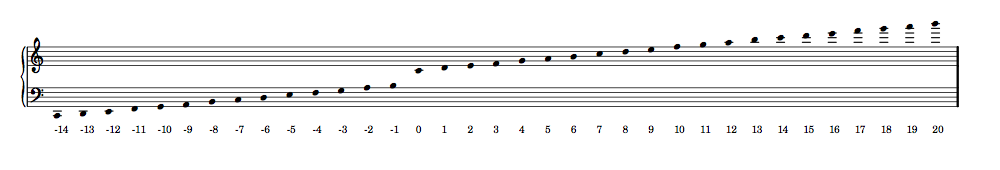

Pitch altitude values
=====================

The code to generate this table is as follows. ::

   score, treble_staff, bass_staff = scoretools.make_piano_staff( )
   duration = Rational(1, 32)

   treble = AnonymousMeasure([ ])
   bass = AnonymousMeasure([ ])

   treble_staff.append(treble)
   bass_staff.append(bass)

   pitches =[ ]
   diatonic_pitches = [0, 2, 4, 5, 7, 9, 11]

   pitches.extend([-24 + x for x in diatonic_pitches])
   pitches.extend([-12 + x for x in diatonic_pitches])
   pitches.extend([0 + x for x in diatonic_pitches])
   pitches.extend([12 + x for x in diatonic_pitches])
   pitches.extend([24 + x for x in diatonic_pitches])
   pitchtools.change_default_accidental_spelling('sharps')

   for i in pitches:
      note = Note(i, duration)
      rest = Rest(duration)
      clef = pitchtools.suggest_clef([note.pitch])
      if clef == Clef('treble'):
         treble.append(note)
         bass.append(rest)
      else:
         treble.append(rest)
         bass.append(note)
      bass[-1].markup.down.append(note.pitch.altitude)

   score.rest.transparent = True
   score.stem.stencil = False

   show(score, 'paris')
