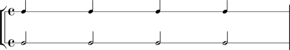

LilyPond multipliers
====================

LilyPond provides an asterisk `*` operator to scale the durations of
notes, rests and chords by arbitrarily positive rational
values. LilyPond multipliers are inivisible and generate no
typographic output of their own. However, while independent from the
typographic output, LilyPond multipliers do factor in in calculations
of duration and time.

Abjad implements LilyPond multpliers as the settable `duration.multiplier`
attribute of notes, rests and chords.

::

	abjad> note = Note("c'4")
	abjad> note.duration_multiplier = Fraction(1, 2)
	abjad> note.duration_multiplier
	Fraction(1, 2)

::

	abjad> f(note)
	c'4 * 1/2

Abjad also implements a `duration.multiplied` attribute to examine the
duration of a note, rest or chord as affected by the multiplier.

::

	abjad> note.multiplied_duration
	Duration(1, 8)

LilyPond multipliers give the half notes here multiplied durations equal to a quarter note.

::

	abjad> notes = Note("c'4") * 4
	abjad> multiplied_note = Note(0, (1, 2))
	abjad> multiplied_note.duration_multiplier = Fraction(1, 2)
	abjad> multiplied_notes = multiplied_note * 4
	abjad> top = stafftools.RhythmicStaff(notes)
	abjad> bottom = stafftools.RhythmicStaff(multiplied_notes)
	abjad> staves = scoretools.StaffGroup([top, bottom])

.. note::

    Abjad models multiplication fundamentally differently than prolation .
    See the chapter on :doc:`../prolation/index` for more
    information.

.. note::

    The LilyPond multiplication `*` operator differs from the Abjad
    multiplication `*` operator. LilyPond multiplication scales duration
    of LilyPond notes, rests and chords. Abjad multiplication
    copies Abjad containers and leaves.
