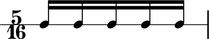
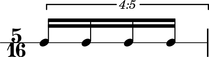
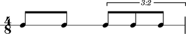
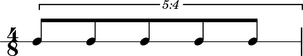
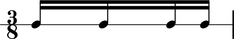

Duration types
==============

Abjad publishes duration information about all score components.

Written duration
----------------

Abjad uses **written duration** to refer to the face value of
notes, rests and chords prior to prolation.
Abjad written duration corresponds to the informal names most frequently used
when talking about note duration.

These sixteenth notes are worth a sixteenth of a whole note:

::

	abjad> measure = Measure((5, 16), Note(0, (1, 16)) * 5)
	abjad> spannertools.BeamSpanner(measure)
	abjad> staff = stafftools.RhythmicStaff([measure])
	abjad> note = measure[0]
	abjad> note.written_duration
	Duration(1, 16)

These sixteenth notes are worth more than a sixteenth of a whole note:

::

	abjad> tuplet = tuplettools.FixedDurationTuplet(Duration(5, 16), Note(0, (1, 16)) * 4)
	abjad> spannertools.BeamSpanner(tuplet)
	abjad> measure = Measure((5, 16), [tuplet])
	abjad> staff = stafftools.RhythmicStaff([measure])
	abjad> note = tuplet[0]
	abjad> note.written_duration
	Duration(1, 16)

The notes in these examples are 'sixteenth notes' that carry different prolated durations.
Abjad written duration captures the fact that the note heads and flag counts of the two
examples match.

Written duration is a user-assignable rational number.
Users can assign and reassign the written duration of notes, rests and chords
at initialization and at any time during the life of the note, rest or chord.
Written durations must be assignable;
see the chapter on :doc:`assignability <../assignability/index>` for details.
Note that Abjad containers do not carry written duration.

Prolated duration
-----------------

:doc:`Prolation <../prolation/index>` refers to the duration-scaling
effects of tuplets and special types of time signature.
Prolation is a way of thinking about the contribution that musical structure makes to
the duration of score objects.
All durated Abjad objects carry a prolated duration.
Prolated duration is an emergent property of notes, tuplets and other durated objects.
The prolated duration of notes, rests and chords equals the product
of the written duration and prolation of those objects.
The prolated duration of tuplets, measures and other containers equals the
the container's duration interface multiplied by the container's prolation.

Contents duration
-----------------

Abjad defines the **contents duration** of tuplets, measures, voices, staves
and other containers equal to the sum of the **preprolated duration** of each
of the elements in the container.

The measure here contains two eighth notes and tuplet.
These elements carry preprolated durations equal to 1/8, 1/8 and 2/8, respectively:

::

	abjad> notes = Note(0, (1, 8)) * 2
	abjad> spannertools.BeamSpanner(notes)
	abjad> tuplet = tuplettools.FixedDurationTuplet(Duration(2, 8), Note(0, (1, 8)) * 3)
	abjad> spannertools.BeamSpanner(tuplet)
	abjad> measure = Measure((4, 8), notes + [tuplet])
	abjad> staff = stafftools.RhythmicStaff([measure])
	abjad> measure.contents_duration
	Duration(1, 2)

The contents duration of the measure here equals 1/8 + 1/8 + 2/8 = 4/8.

Target duration
---------------

Abjad defines the target duration of fixed-duration tuplets equal to
composer-settable duration to which the tuplet prolates its contents.

This fixed-duration tuplet carries a target duration equal to 4/8:

::

	abjad> tuplet = tuplettools.FixedDurationTuplet(Duration(4, 8), Note(0, (1, 8)) * 5)
	abjad> spannertools.BeamSpanner(tuplet)
	abjad> measure = Measure((4, 8), [tuplet])
	abjad> staff = stafftools.RhythmicStaff([measure])
	abjad> print tuplet.contents_duration
	5/8
	abjad> tuplet.target_duration
	Duration(1, 2)

The tuplet contents sum to 5/8. But tuplet target duration always equals 4/8.

Multiplied duration
-------------------

Abjad defines the multiplied duration of notes, rests and chords equal to
the product of written duration and leaf multiplier.

The first two notes below carry leaf mulitipliers equal to 2/1:

::

	abjad> notes = Note(0, (1, 16)) * 4
	abjad> notes[0].duration_multiplier = Fraction(2, 1)
	abjad> notes[1].duration_multiplier = Fraction(2, 1)
	abjad> measure = Measure((3, 8), notes)
	abjad> spannertools.BeamSpanner(measure)
	abjad> staff = stafftools.RhythmicStaff([measure])
	abjad> note = measure[0]
	abjad> note.written_duration
	Duration(1, 16)

::

	abjad> note.duration_multiplier
	Fraction(2, 1)

::

	abjad> note.written_duration * note.duration_multiplier
	Duration(1, 8)
	abjad> note.multiplied_duration
	Duration(1, 8)

The written duration of these first two notes equals 1/16 and so
the multiplied duration of these first two notes equals 1/16 * 2/1 = 1/8.
