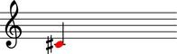
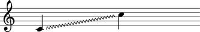

Overriding LilyPond grobs
=========================

The term 'grob' stands for 'graphical object' and is borrowed from LilyPond:

   A grob represents a piece of music notation ... often associated with a symbol, 
   but some grobs do not print any symbols. They take care of grouping objects. 
   For example, there is a separate grob that stacks staves vertically. 
   The ``NoteCollision`` object is also an abstract grob: 
   It only moves around chords, but doesn’t print anything.

   Grobs have properties ... that can be read and set. 
   Two types of them exist: immutable and mutable. 
   Immutable variables define the default style and behavior. 
   They are shared between many objects. 
   They can be changed using ``\override`` and ``\revert``. 
   Mutable properties are variables that are specific to one grob. 
   Typically, lists of other objects, or results from computations 
   are stored in mutable properties. 

You can override any LilyPond grob on any Abjad component:

::

	abjad> n = Note(1, (1, 4))
	abjad> n.override.note_head.color = 'red'

And you can override LilyPond grobs on any Abjad spanner:

::

	abjad> s = Staff([Note(0, (1, 4)), Note(12, (1, 4))])
	abjad> g = spannertools.GlissandoSpanner(s.leaves)
	abjad> g.override.glissando.style = 'zigzag'

Refer to the `LilyPond documentation 
<http://lilypond.org/doc/v2.13/Documentation/internals/all-layout-objects>`__
for the complete list of LilyPond grobs and the attributes that they implement.
