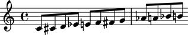
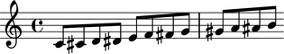
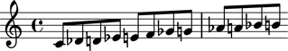

Pitch conventions
=================

Accidental abbreviations
------------------------

Abjad abbreviates accidentals according to the LilyPond ``english.ly`` module:

   ======================       ============================
   accidental name              abbreviation
   ======================       ============================
   quarter sharp                 'qs'
   quarter flat                  'qf' 
   sharp                         's' 
   flat                          'f' 
   three-quarters sharp          'tqs' 
   three-quarters flat           'tqf' 
   double sharp                  'ss' 
   double flat                   'ff'
   ======================       ============================

Chromatic pitch numbers
-----------------------

Abjad numbers chromatic pitches by semitone with middle C set equal to 0:

.. image:: images/chromatic-pitch-numbers.png

The code to generate this table is as follows::

   score, treble_staff, bass_staff = scoretools.make_empty_piano_score( )
   duration = Fraction(1, 32)

   treble = measuretools.AnonymousMeasure([ ])
   bass = measuretools.AnonymousMeasure([ ])

   treble_staff.append(treble)
   bass_staff.append(bass)

   pitches = range(-12, 12 + 1)

   cfgtools.set_default_accidental_spelling('sharps')

   for i in pitches:
      note = Note(i, duration)
      rest = Rest(duration)
      clef = pitchtools.suggest_clef_for_named_chromatic_pitches([note.pitch])
      if clef == contexttools.ClefMark('treble'):
         treble.append(note)
         bass.append(rest)
      else:
         treble.append(rest)
         bass.append(note)
      diatonic_pitch_number = str(note.pitch.numbered_chromatic_pitch)
      markuptools.Markup(diatonic_pitch_number, 'down')(bass[-1])

   score.override.rest.transparent = True
   score.override.stem.stencil = False

   show(score, 'paris.ly')

Diatonic pitch numbers
----------------------

Abjad numbers diatonic pitches by staff space with middle C set equal to 0:

.. image:: images/diatonic-pitch-numbers.png

The code to generate this table is as follows::

   score, treble_staff, bass_staff = scoretools.make_empty_piano_score( )
   duration = Fraction(1, 32)

   treble = measuretools.AnonymousMeasure([ ])
   bass = measuretools.AnonymousMeasure([ ])

   treble_staff.append(treble)
   bass_staff.append(bass)

   pitches =[ ]
   diatonic_pitches = [0, 2, 4, 5, 7, 9, 11]

   pitches.extend([-24 + x for x in diatonic_pitches])
   pitches.extend([-12 + x for x in diatonic_pitches])
   pitches.extend([0 + x for x in diatonic_pitches])
   pitches.extend([12 + x for x in diatonic_pitches])
   pitches.append(24)
   cfgtools.set_default_accidental_spelling('sharps')

   for i in pitches:
      note = Note(i, duration)
      rest = Rest(duration)
      clef = pitchtools.suggest_clef_for_named_chromatic_pitches([note.pitch])
      if clef == contexttools.ClefMark('treble'):
         treble.append(note)
         bass.append(rest)
      else:
         treble.append(rest)
         bass.append(note)
      diatonic_pitch_number = abs(note.pitch.numbered_diatonic_pitch)
      markuptools.Markup(diatonic_pitch_number, 'down')(bass[-1])

   score.override.rest.transparent = True
   score.override.stem.stencil = False

   show(score, 'paris.ly')

Octave designation
------------------

Abjad designates octaves with both numbers and ticks:

   ===============      =============
   Octave notation      Tick notation
   ===============      =============
         C7                   c'''' 
         C6                   c''' 
         C5                   c'' 
         C4                   c' 
         C3                   c 
         C2                   c, 
         C1                   c,,
   ===============      =============

Accidental spelling
-------------------

Abjad chooses between enharmonic spellings at pitch-initialization 
according to the following table:

   ============================      ====================================
   Chromatic pitch-class number      Chromatic pitch-class name (default)
   ============================      ====================================
      0                              C 
      1                              C♯ 
      2                              D 
      3                              E♭ 
      4                              E 
      5                              F 
      6                              F♯ 
      7                              G 
      8                              G♭ 
      9                              A 
      10                             B♭ 
      11                             B
   ============================      ====================================

::

	abjad> staff = Staff([Note(n, (1, 8)) for n in range(12)])
	abjad> show(staff)

Use pitch tools to respell with sharps:

::

	abjad> pitchtools.respell_named_chromatic_pitches_in_expr_with_sharps(staff)
	abjad> show(staff)

Or flats:

::

	abjad> pitchtools.respell_named_chromatic_pitches_in_expr_with_flats(staff)
	abjad> show(staff)

