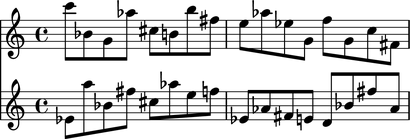
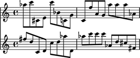
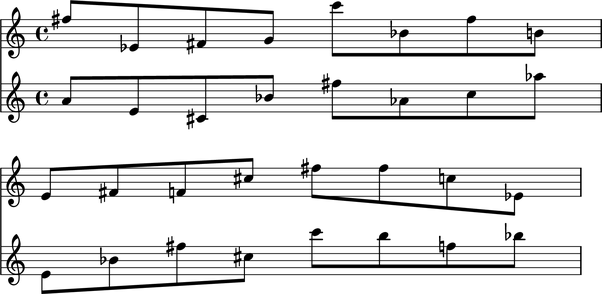
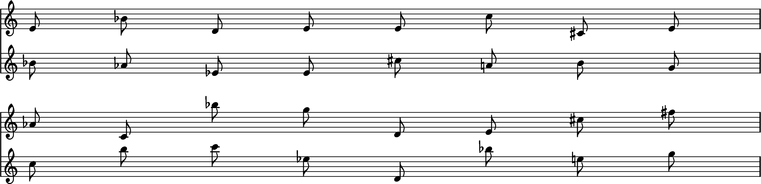
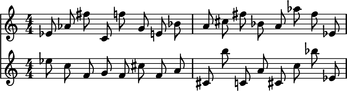

LilyPond template gallery
=========================

Abjad provides a number of score templates in the ``abjad/templates`` directory:

::

	abjad> from abjad.tools import configurationtools
	abjad> configurationtools.list_abjad_templates()
	('coventry.ly', 'lagos.ly', 'oedo.ly', 'paris.ly', 'tangiers.ly', 'thebes.ly', 'tirnaveni.ly')

Templates provide header, layout, paper and grob settings for different types of score.

Default LilyPond layout
-----------------------

::

	abjad> import random
	abjad> pitches = [random.randrange(0, 25) for x in range(32)]
	abjad> staff_1 = Staff([])
	abjad> staff_2 = Staff([])
	abjad> score = Score([staff_1, staff_2])
	abjad> staff_1.extend([Note(x, (1, 8)) for x in pitches[:16]])
	abjad> staff_2.extend([Note(x, (1, 8)) for x in pitches[16:]])
	abjad> show(score)

``lagos.ly``
------------

::

	abjad> pitches = [random.randrange(0, 25) for x in range(32)]
	abjad> staff_1 = Staff([])
	abjad> staff_2 = Staff([])
	abjad> score = Score([staff_1, staff_2])
	abjad> staff_1.extend([Note(x, (1, 8)) for x in pitches[:16]])
	abjad> staff_2.extend([Note(x, (1, 8)) for x in pitches[16:]])
	abjad> show(score, template = 'lagos')

``oedo.ly``
-----------

::

	abjad> pitches = [random.randrange(0, 25) for x in range(32)]
	abjad> staff_1 = Staff([])
	abjad> staff_2 = Staff([])
	abjad> score = Score([staff_1, staff_2])
	abjad> staff_1.extend([Note(x, (1, 8)) for x in pitches[:16]])
	abjad> staff_2.extend([Note(x, (1, 8)) for x in pitches[16:]])
	abjad> show(score, template = 'oedo')

``tangiers.ly``
---------------

::

	abjad> pitches = [random.randrange(0, 25) for x in range(32)]
	abjad> staff_1 = Staff([])
	abjad> staff_2 = Staff([])
	abjad> score = Score([staff_1, staff_2])
	abjad> staff_1.extend([Note(x, (1, 8)) for x in pitches[:16]])
	abjad> staff_2.extend([Note(x, (1, 8)) for x in pitches[16:]])
	abjad> show(score, template = 'tangiers')

``tirnaveni.ly``
----------------

::

	abjad> pitches = [random.randrange(0, 25) for x in range(32)]
	abjad> staff_1 = Staff([])
	abjad> staff_2 = Staff([])
	abjad> score = Score([staff_1, staff_2])
	abjad> staff_1.extend([Note(x, (1, 8)) for x in pitches[:16]])
	abjad> staff_2.extend([Note(x, (1, 8)) for x in pitches[16:]])
	abjad> show(score, template = 'tirnaveni')

