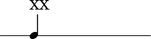
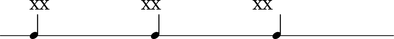
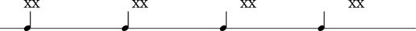

LilyPond text alignment
=======================

LilyPond provides many ways to position text.

Default alignment
-----------------

LilyPond left-aligns markup relative to the left edge of note head by default.

::

	abjad> notes = notetools.make_repeated_notes(1, Fraction(1, 4))
	abjad> staff = stafftools.RhythmicStaff(notes)
	abjad> leaves = staff.leaves
	abjad> markuptools.Markup('XX', 'up')(leaves[0])
	abjad> show(staff, 'thebes')

``TextScript #'self-alignment-X``
---------------------------------

Use ``#'self-alignment-X`` to left-, center- or right-align markup
relative to the left edge of note head.

.. note:: changes to ``#'self-alignment-X`` do not change the fact
    that markup positioning is by default relative to the
    LEFT edge of note head.

::

	abjad> notes = notetools.make_repeated_notes(3, Fraction(1, 4))
	abjad> staff = stafftools.RhythmicStaff(notes)
	abjad> leaves = staff.leaves
	abjad> markuptools.Markup('XX', 'up')(leaves[0])
	abjad> leaves[0].override.text_script.self_alignment_X = 'left'
	abjad> markuptools.Markup('XX', 'up')(leaves[1])
	abjad> leaves[1].override.text_script.self_alignment_X = 'center'
	abjad> markuptools.Markup('XX', 'up')(leaves[2])
	abjad> leaves[2].override.text_script.self_alignment_X = 'right'
	abjad> show(staff, 'thebes')

``TextScript #'X-offset``
-------------------------

Use ``#'X-offset`` to offset markup by some number of magic units in the horizontal direction.

.. note:: Specify ``#'X-offset`` arguments as numbers like ``#2.5``.
    Do not specify ``#'X-offset`` arguments as direction contstants
    like ``#right``.

.. note:: changes to ``#'X-offset`` do not change the fact
    that markup positioning is by default relative to the
    LEFT edge of note head.

::

	abjad> notes = notetools.make_repeated_notes(4, Fraction(1, 4))
	abjad> staff = stafftools.RhythmicStaff(notes)
	abjad> leaves = staff.leaves
	abjad> markuptools.Markup('XX', 'up')(leaves[0])
	abjad> leaves[0].override.text_script.X_offset = 0
	abjad> markuptools.Markup('XX', 'up')(leaves[1])
	abjad> leaves[1].override.text_script.X_offset = 2
	abjad> markuptools.Markup('XX', 'up')(leaves[2])
	abjad> leaves[2].override.text_script.X_offset = 4
	abjad> markuptools.Markup('XX', 'up')(leaves[3])
	abjad> leaves[3].override.text_script.X_offset = 6
	abjad> show(staff, 'thebes')

