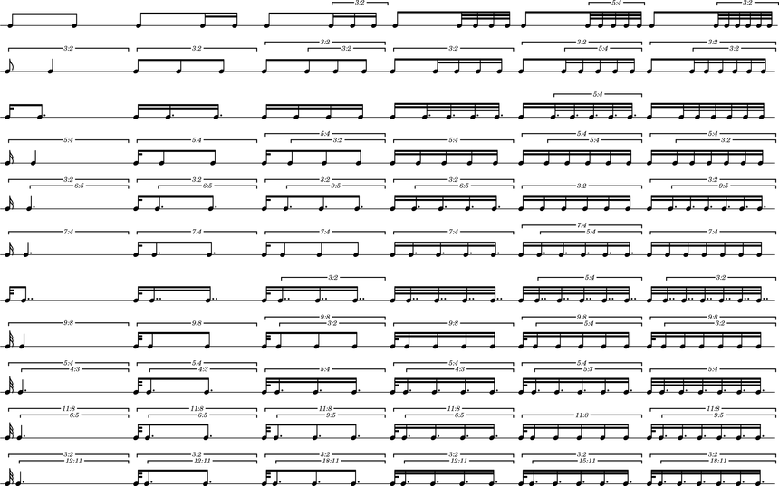

Ferneyhough: *Unsichtbare Farben*
=================================

Mikhïal Malt analyzes the rhythmic materials of Ferneyhough's `Unsichtbare Farben` in
`The OM Composer's Book 2`.

Malt explains that Ferneyhough used OpenMusic to create an "exhaustive catalogue
of rhythmic cells" such that:

    1. They are subdivided into two pulses, with proportions from ``1/1`` to ``1/11``.

    2. The second pulse is subdivided successively by ``1``, ``2``, ``3``, ``4``, ``5`` and ``6``.

Let's recreate Malt's results in Abjad.

The proportions
---------------

First we define proportions:

::

	abjad> proportions = [(1, n) for n in range(1, 11 + 1)]

::

	abjad> proportions
	[(1, 1), (1, 2), (1, 3), (1, 4), (1, 5), (1, 6), (1, 7), (1, 8), (1, 9), (1, 10), (1, 11)]

The transforms
--------------

Then we make aliases to give shorter names to two functions with long names:

::

	abjad> make_tuplet = tuplettools.make_diminished_tuplet_from_duration_and_proportions_and_encourage_dots
	abjad> tie_chain_to_tuplet = tietools.tie_chain_to_diminished_tuplet_with_proportions_and_encourage_dots

And then define a helper function:

::

    def divide_tuplet(tuplet, n):
        last_tie_chain = tietools.get_tie_chain(tuplet[-1])
        proportions = n * [1]
        new = tie_chain_to_tuplet(last_tie_chain, proportions)
        return new

The rhythms
-----------

We set the duration of each tuplet equal to a quarter note:

::

	abjad> duration = Fraction(1, 4)

And then we make the rhythms:

::

    for proportion in proportions:
        tuplets = []
        for n in range(1, 6 + 1):
            tuplet = make_tuplet(duration, proportion)
            divide_tuplet(tuplet, n)
            tuplets.append(tuplet)
        staff.extend(tuplets)

The score
---------

Finally we make the score:

::

	abjad> staff = stafftools.RhythmicStaff(music)
	abjad> score = Score([staff])
	abjad> lilypond_file = lilyfiletools.make_basic_lilypond_file(score)

Configure containers:

::

	abjad> contexttools.TimeSignatureMark((1, 4))(staff)
	abjad> score.override.bar_number.transparent = True
	abjad> score.set.proportional_notation_duration = schemetools.SchemeMoment(1, 56)
	abjad> score.set.tuplet_full_length = True
	abjad> score.override.spacing_spanner.uniform_stretching = True
	abjad> score.override.spacing_spanner.strict_note_spacing = True
	abjad> score.override.tuplet_bracket.padding = 2
	abjad> score.override.tuplet_bracket.staff_padding = 4
	abjad> score.override.tuplet_number.text = schemetools.SchemeFunction('tuplet-number::calc-fraction-text')
	abjad> score.override.time_signature.stencil = False
	abjad> score.override.bar_line.stencil = False

Configure the LilyPond file:

::

	abjad> lilypond_file.default_paper_size = '11x17', 'portrait'
	abjad> lilypond_file.global_staff_size = 12
	abjad> lilypond_file.layout_block.indent = 0
	abjad> lilypond_file.layout_block.ragged_right = True
	abjad> lilypond_file.paper_block.ragged_bottom = True
	abjad> space = schemetools.SchemePair('space', 18)
	abjad> stretchability = schemetools.SchemePair('stretchability', 0)
	abjad> vector = schemetools.SchemeVector(space, stretchability)
	abjad> lilypond_file.paper_block.between_system_spacing = vector

And show the result:

::

	abjad> show(lilypond_file)

