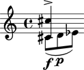
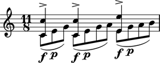
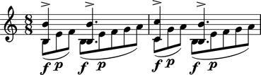
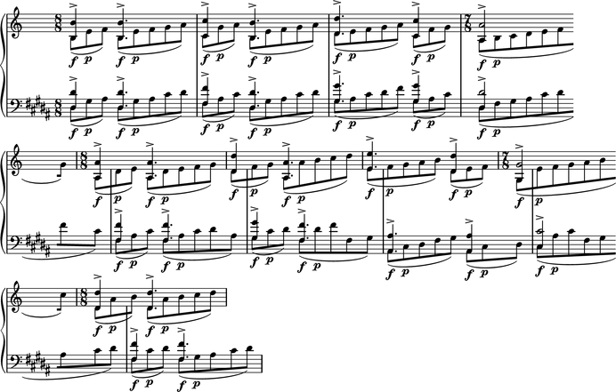

Ligeti: *Désordre*
==================

This example demonstrates the power of exploiting redundancy to model musical structure. The piece that concerns us here is Ligeti's *Désordre*: the first piano study from Book I. Specifically, we will focus on modeling the first section of the piece:

.. image :: images/desordre.jpg

The redundancy is immediately evident in the repeating pattern found in both staves. The pattern is hierarchical. At the smallest level we have what we will here call a *cell*:

.. image :: images/desordre-cell.png

There are two of these cells per measure. Notice that the cells are strictly contained within the measure (i.e., there are no cells crossing a bar line). So, the next level in the hierarchy is the measure.  Notice that the measure sizes (the meters) change and that these changes occur independently for each staff, so that each staff carries it's own sequence of measures. Thus, the staff is the next level in the hierarchy.
Finally there's the piano staff, which is composed of the right hand and left hand staves.

In what follows we will model this structure in this order (*cell*, measure, staff, piano staff), from bottom to top.

The cell
--------

Before plunging into the code, observe the following characteristic of the *cell*:

1. It is composed of two layers: the top one which is an octave "chord" and the bottom one which is a straight eighth note run.
2. The total duration of the *cell* can vary, and is always the sum of the eight note funs.
3. The eight note runs are always stem down while the octave "chord" is always stem up.
4. The eight note runs are always beamed together and slurred, and the first two notes always have the dynamic markings 'f' 'p'.

The two "layers" of the *cell* we will model with two Voices inside a parallel Container. The top Voice will hold the octave "chord" while the lower Voice will hold the eighth note run. First the eighth notes:

::

	abjad> pitches = [1,2,3]
	abjad> notes = notetools.make_notes(pitches, [(1, 8)])
	abjad> spannertools.BeamSpanner(notes)
	abjad> spannertools.SlurSpanner(notes)
	abjad> contexttools.DynamicMark('f')(notes[0])
	abjad> contexttools.DynamicMark('p')(notes[1])

::

	abjad> voice_lower = Voice(notes)
	abjad> voice_lower.name = 'rh_lower'
	abjad> marktools.LilyPondCommandMark('voiceTwo')(voice_lower)

The notes belonging to the eighth note run are first beamed and slurred. Then we add the dynamic marks to the first two notes, and finally we put them inside a Voice. After naming the voice we number it ``2`` so that the stems of the notes point down.

Now we construct the octave:

::

	abjad> import math
	abjad> n = int(math.ceil(len(pitches) / 2.))
	abjad> chord = Chord([pitches[0], pitches[0] + 12], (n, 8))
	abjad> marktools.Articulation('>')(chord)

::

	abjad> voice_higher = Voice([chord])
	abjad> voice_higher.name = 'rh_higher'
	abjad> marktools.LilyPondCommandMark('voiceOne')(voice_higher)

The duration of the chord is half the duration of the running eighth notes if the duration of the running notes is divisible by two. Otherwise the duration of the chord is the next integer greater than this half.
We add the articulation marking and finally ad the Chord to a Voice, to which we set the number to 1, forcing the stem to always point up.

Finally we combine the two voices in a parallel Container:

::

	abjad> p = Container([voice_lower, voice_higher])
	abjad> p.is_parallel = True

This results in the complete *Désordre* *cell*:

::

	LilyPond file written to 'desordre-cell.ly' ...

Because this *cell* appears over and over again, we want to reuse this code to generate any number of these *cells*. We here encapsulate it in a function that will take only a list of pitches::

    def desordre_cell(pitches):
        '''The function constructs and returns a *Désordre cell*.
            - `pitches` is a list of numbers or, more generally, pitch tokens.
        '''
        notes = [Note(p, (1, 8)) for p in pitches]
        spannertools.BeamSpanner(notes)
        spannertools.SlurSpanner(notes)
        contexttools.DynamicMark('f')(notes[0])
        contexttools.DynamicMark('p')(notes[1])
        v_lower = Voice(notes)
        v_lower.name = 'rh_lower'
        marktools.LilyPondCommandMark('voiceTwo')(v_lower)

        n = int(math.ceil(len(pitches) / 2.))
        chord = Chord([pitches[0], pitches[0] + 12], (n, 8))
        marktools.Articulation('>')(chord)
        v_higher = Voice([chord])
        v_higher.name = 'rh_higher'
        marktools.LilyPondCommandMark('voiceOne')(v_higher)
        p = Container([v_lower, v_higher])
        p.is_parallel = True
        # make all 1/8 beats breakable
        for n in v_lower.leaves[:-1]:
            marktools.BarLine('')(n)
        return p

Now we can call this function to create any number of *cells*. That was actually the hardest part of reconstructing the opening of Ligeti's *Désordre*. Because the repetition of patters occurs also at the level of measures and staves, we will now define functions to create these other higher level constructs.

The measure
-----------

We define a function to create a measure from a list of lists of numbers::

    def measure_build(pitches):
        '''Constructs a measure composed of *Désordre cells*.
            - `pitches` is a list of lists of number (e.g., [[1, 2, 3], [2, 3, 4]])
        The function returns a DynamicMeasure.
        '''
        result = measuretools.DynamicMeasure([ ])
        for seq in pitches:
            result.append(desordre_cell(seq))
        # make denominator 8
        if contexttools.get_effective_time_signature(result).denominator == 1:
            result.denominator = 8
        return result

The function is very simple. It simply creates a DynamicMeasure and then populates it with *cells* that are created internally with the function previously defined. The function takes a list `pitches` which is actually a list of lists of pitches (e.g., ``[[1,2,3], [2,3,4]]``. The list of lists of pitches is iterated to create each of the *cells* to be appended to the DynamicMeasures. We could have defined the function to take ready made *cells* directly, but we are building the hierarchy of functions so that we can pass simple lists of lists of numbers to generate the full structure.
To construct a Ligeti measure we would call the function like so:

::

	abjad> measure = measure_build([[0, 4, 7], [0, 4, 7, 9], [4, 7, 9, 11]])
	LilyPond file written to 'desordre-measure.ly' ...
	abjad> show(Staff([measure]))

The staff
---------

Now we move up to the next level, the staff::

    def staff_build(pitches):
        '''Returns a Staff containing DynamicMeasures.'''
        result = Staff([])
        for seq in pitches:
            measure = measure_build(seq)
            result.append(measure)
        return result

The function again takes a plain list as argument. The list must be a list of lists (for measures) of lists (for cells) of pitches. The function simply constructs the Ligeti measures internally by calling our previously defined function and puts them inside a Staff.
As with measures, we can now create full measure sequences with this new function:

::

	abjad> pitches = [[[-1, 4, 5], [-1, 4, 5, 7, 9]], [[0, 7, 9], [-1, 4, 5, 7, 9]]]
	abjad> staff = staff_build(pitches)
	LilyPond file written to 'desordre-staff.ly' ...
	abjad> show(staff)

The score
---------

Finally a function that will generate the whole opening section of the piece *Désordre*::

    def desordre_build(pitches):
        '''Returns a complete PianoStaff with Ligeti music!'''
        assert len(pitches) == 2
        piano = PianoStaff([])
        # build the music...
        for hand in pitches:
            seq = staff_build(hand)
            piano.append(seq)
        # set clef and key signature to left hand staff...
        piano[1].clef.forced = stafftools.Clef('bass')
        piano[1].key_signature.forced = tonalitytools.KeySignature('b', 'major')
        return piano

The function creates a PianoStaff, constructs Staves with Ligeti music and appends these to the empty PianoStaff. Finally it sets the clef and key signature of the lower staff to match the original score.
The argument of the function is a list of length 2, depth 3. The first element in the list corresponds to the upper staff, the second to the lower staff.

The final result:

::

	abjad> top = [[[-1, 4, 5], [-1, 4, 5, 7, 9]], [[0, 7, 9], [-1, 4, 5, 7, 9]], [[2, 4, 5, 7, 9], [0, 5, 7]], [[-3, -1, 0, 2, 4, 5, 7]], [[-3, 2, 4], [-3, 2, 4, 5, 7]], [[2, 5, 7], [-3, 9, 11, 12, 14]], [[4, 5, 7, 9, 11], [2, 4, 5]], [[-5, 4, 5, 7, 9, 11, 12]], [[2, 9, 11], [2, 9, 11, 12, 14]]]
	abjad> bottom = [[[-9, -4, -2], [-9, -4, -2, 1, 3]], [[-6, -2, 1], [-9, -4, -2, 1, 3]], [[-4, -2, 1, 3, 6], [-4, -2, 1]], [[-9, -6, -4, -2, 1, 3, 6, 1]], [[-6, -2, 1], [-6, -2, 1, 3, -2]], [[-4, 1, 3], [-6, 3, 6, -6, -4]], [[-14, -11, -9, -6, -4], [-14, -11, -9]], [[-11, -2, 1, -6, -4, -2, 1, 3]], [[-6, 1, 3], [-6, -4, -2, 1, 3]]]
	abjad> 
	abjad> desordre = desordre_build([top, bottom])
	LilyPond file written to 'desordre-final.ly' ...
	abjad> show(desordre)

Now that we have the redundant aspect of the piece compactly expressed and encapsulated, we can play around with it by changing the sequence of pitches.

.. note::
    In order for each staff to carry its own sequence of independent measure changes, LilyPond requires some special setting up prior to rendering. Specifically, one must move the *Timing_translator* from the score level to the level of staves. In this example we used the 'tirnaveni' template, which is configured to do just that. You may want to study this template (in the "templates" directory of the abjad distribution). Refer to the LilyPond documentation on `Polymetric notation <http://lilypond.org/doc/v2.12/Documentation/user/lilypond/Displaying-rhythms#Polymetric-notation>`_ to learn all about how this works.
