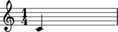
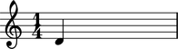
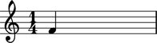
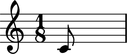

Working with notes
==================

Creating notes
--------------

Create notes with a `pitch token` and a `duration token`.

::

	abjad> note = Note(0, (1, 4))

Pitch assignment
----------------

Change pitch with a number:

::

	abjad> note = Note(0, (1, 4))
	abjad> note.pitch = 2

With a pair:

::

	abjad> note = Note(2, (1, 4))
	abjad> note.pitch = ('e', 4)

.. image:: images/example3.png

Or with a :class:`Pitch <abjad.pitch.pitch.Pitch>` instance:

::

	abjad> note = Note(('e', 4), (1, 4))
	abjad> note.pitch = Pitch('f', 4)

Any `pitch token` will work.

Pitch comparison
----------------

To a :class:`Pitch <abjad.pitch.pitch.Pitch>` instance:

::

	abjad> note = Note(0, (1, 4))
	abjad> note.pitch == Pitch('c', 4)

Or to another pitched Abjad object:

::

	abjad> note = Note(0, (1, 4))
	abjad> chord = Chord([0, 2, 10], (1, 4))
	abjad> note.pitch == chord.noteheads[0].pitch

Types of pitch comparison
-------------------------

All six Python comparison operators work as expected.
::

	abjad> n1 = Note(0, (1, 4))
	abjad> n2 = Note(2, (1, 4))

::

	abjad> print n1.pitch == n2.pitch
	False

::

	abjad> print n1.pitch != n2.pitch
	True

::

	abjad> print n1.pitch > n2.pitch
	False

::

	abjad> print n1.pitch < n2.pitch
	True

::

	abjad> print n1.pitch >= n2.pitch
	False

::

	abjad> print n1.pitch <= n2.pitch
	True

.. note::
   
   Is this the comparison we want?

Duration initialization
-----------------------

Initialize :class:`Note <abjad.note.note.Note>` duration with a :class:`Rational <abjad.rational.rational.Rational>`.

::

	abjad> note = Note(0, Rational(1, 8))

You can also use a `duration token` as a shortcut.

Duration attributes
-------------------

:class:`Note <abjad.note.note.Note>`  has a :class:`_LeafDurationInterface <abjad.leaf.duration._LeafDurationInterface>`.

::

	abjad> tuplet = FixedDurationTuplet((1, 4), Note(0, (1, 8)) * 3)
	abjad> note = tuplet[0]
	abjad> print note.duration
	<_LeafDurationInterface>

:class:`_LeafDurationInterface <abjad.leaf.duration._LeafDurationInterface>` bundles six public attributes.

::

	abjad> tuplet = FixedDurationTuplet((1, 4), Note(0, (1, 8)) * 3)
	abjad> note = tuplet[0]
	abjad> print note.duration.multiplied
	1/8

::

	abjad> tuplet = FixedDurationTuplet((1, 4), Note(0, (1, 8)) * 3)
	abjad> note = tuplet[0]
	abjad> print note.duration.multiplier
	None

::

	abjad> tuplet = FixedDurationTuplet((1, 4), Note(0, (1, 8)) * 3)
	abjad> note = tuplet[0]
	abjad> print note.duration.preprolated
	1/8

::

	abjad> tuplet = FixedDurationTuplet((1, 4), Note(0, (1, 8)) * 3)
	abjad> note = tuplet[0]
	abjad> print note.duration.prolated
	1/12

::

	abjad> tuplet = FixedDurationTuplet((1, 4), Note(0, (1, 8)) * 3)
	abjad> note = tuplet[0]
	abjad> print note.duration.prolation
	2/3

::

	abjad> tuplet = FixedDurationTuplet((1, 4), Note(0, (1, 8)) * 3)
	abjad> note = tuplet[0]
	abjad> print note.duration.written
	1/8

Duration attribute assignment
-----------------------------

You can reassign ``note.duration.written``.

::

	abjad> note = Note(0, (1, 4))

::

	abjad> note = Note(0, (1, 8))
	abjad> note.duration.written = Rational(3, 16)

.. image:: images/duration_assign1.png

You must use an :term:`assignable` 
:class:`Rational <abjad.rational.rational.Rational>`.
You can also assign ``note.duration.multiplier``.

::

	abjad> note = Note(0, (1, 4))
	abjad> note.duration.multiplier = Rational(1, 6)

::

	abjad> note = Note(0, (1, 4))
	abjad> note.duration.multiplier = Rational(1, 6)
	abjad> print note.duration.written
	1/4
	abjad> print note.duration.multiplier
	1/6
	abjad> print note.duration.multiplied
	1/24

Use any positive Rational.
All other duration attributes are read-only.

