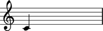
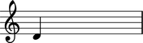
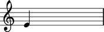
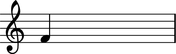

Working with notes
==================

Creating notes
--------------

Create notes with a name:

::

	abjad> note = Note("c'4")

Or with numbers:

::

	abjad> note = Note(0, Fraction(1, 4))

.. image:: images/example-2.png

Changing pitch
--------------

Change pitch with a name:

::

	abjad> note.pitch = "d'"

With a pair:

::

	abjad> note.pitch = ('e', 4)

With a number:

::

	abjad> note.pitch = 5

Or with a pitch object:

::

	abjad> note.pitch = pitchtools.NamedChromaticPitch('g', 4)

.. image:: images/example-6.png

Making pitch comparisons
------------------------

Compare one named chromatic pitch to another:

::

	abjad> note.pitch
	NamedChromaticPitch("g'")

::

	abjad> note.pitch == pitchtools.NamedChromaticPitch('c', 4)
	False

All six Python comparison operators work as expected.

::

	abjad> note_1 = Note("c'4")
	abjad> note_2 = Note("d'4")

::

	abjad> note_1.pitch == note_2.pitch
	False

::

	abjad> note_1.pitch != note_2.pitch
	True

::

	abjad> note_1.pitch > note_2.pitch
	False

::

	abjad> note_1.pitch < note_2.pitch
	True

::

	abjad> note_1.pitch >= note_2.pitch
	False

::

	abjad> note_1.pitch <= note_2.pitch
	True

Inspecting duration attributes
------------------------------

Leaves bundle six duration attributes.

::

	abjad> tuplet = Tuplet((2, 3), macros.scale(3))
	abjad> note = tuplet[0]
	abjad> note.duration.multiplied
	Fraction(1, 8)

::

	abjad> note.duration.multiplier
	None

::

	abjad> note.duration.preprolated
	Fraction(1, 8)

::

	abjad> note.duration.prolated
	Fraction(1, 12)

::

	abjad> note.duration.prolation
	Fraction(2, 3)

::

	abjad> note.duration.written
	Fraction(1, 8)

Reassigning duration attributes
-------------------------------

You can reassign written duration:

::

	abjad> note = Note(0, (1, 4))

::

	abjad> note.duration.written = Fraction(3, 16)

.. image:: images/example-7.png

You can assign a LilyPond multiplier:

::

	abjad> note = Note(0, (1, 4))
	abjad> note.duration.multiplier = Fraction(1, 6)

::

	abjad> note.duration.written
	Fraction(1, 4)
	abjad> note.duration.multiplier
	Fraction(1, 6)
	abjad> note.duration.multiplied
	Fraction(1, 24)

All other duration attributes are read-only.

.. seealso:: 

   :doc:`Pitch conventions (appendix) </chapters/appendices/pitch_conventions/index>`
