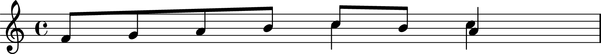

Threads
=======

What is a thread?
-----------------

Abjad has the notion of a :term:`thread`. A thread is a structural relationship binding a set of strictly sequential :class:`~abjad.voice.voice.Voice` level Abjad component, such as notes, rests, chords, tuplets or plain containers.

Threads may be *explicitly* defined via :class:`~abjad.voice.voice.Voice` instances: 

::

	abjad> v = Voice( )

or they may exist *implicitly* in certain score constructs in the absence of :class:`~abjad.voice.voice.Voice` containers:

::

	abjad> staff = Staff(construct.scale(4))

The existence of :class:`~abjad.voice.voice.Voice` objects does not, however, guarantee the existence of a thread between the element contained in different voices. Two contiguous voices *must* have the same name in order to be part of the same thread. 

Here a thread does *not* exist between notes in the different :class:`~abjad.voice.voice.Voice` contexts:

::

	abjad> v_one = Voice(construct.scale(4, (1, 16)))
	abjad> v_two = Voice(construct.scale(2))
	abjad> staff = Staff([v_one, v_two])
	abjad> f(staff)
	\new Staff {
		\new Voice {
			c'16
			d'16
			e'16
			f'16
		}
		\new Voice {
			c'8
			d'8
		}
	}

Here a thread does exist:

::

	abjad> v_one.name = 'flute'
	abjad> v_two.name = 'flute'
	abjad> f(staff)
	\new Staff {
		\context Voice = "flute" {
			c'16
			d'16
			e'16
			f'16
		}
		\context Voice = "flute" {
			c'8
			d'8
		}
	}

What are threads for?
---------------------

Consider the following situation:

Are the two eighth notes in the second half of the measure the continuation of the ascending line in the first half, or is it the quarter note? 
Is the very last *C* the continuation of the top melodic line or is it the *A*?  
The stems might suggest an answer, but for Abjad, stem direction is not structural.  
What path should Abjad take to traverse this little score from the first note to the last *A*? This same problem appears when trying to apply spanners to parallel structures.  Thus, threads are important in both score navigation (also called score traversal) and :class:`~abjad.spanner.spanner.Spanner` application.
In fact, threads are a *requirement* for :class:`~abjad.spanner.spanner.Spanner` application. 

In Abjad, the ambiguity is resolved through the explicit use of named Voices, i.e. the explicit definition of threads. 

The above musical fragment is constructed with the following code:

::

	abjad> vA = Voice(construct.notes([5, 7, 9, 11], [(1, 8)] * 4))
	abjad> vB = Voice(construct.notes([12, 11, 9], [(1, 8), (1, 8), (1, 4)]))
	abjad> vC = Voice(Note(12, (1, 4)) * 2)
	abjad> vA.voice.number = 1
	abjad> vB.voice.number = 1
	abjad> vC.voice.number = 2
	abjad> p = Container([vB, vC])
	abjad> p.parallel = True
	abjad> staff = Staff([vA, p])

There's a :class:`~abjad.staff.staff.Staff` that sequentially contains a :class:`~abjad.voice.voice.Voice` and a parallel :class:`~abjad.container.container.Container`. The :class:`~abjad.container.container.Container` in turn holds two Voices running simultaneously. 

It is now clear from the code that the last *A* belongs with the two descending eighth notes. But there's still no indication about a relationship of continuity between the first :class:`~abjad.voice.voice.Voice` in the sequence (`vA`) and any of the two following Voices. 
Note that, while the voice number setting (``vA.voice.number = 1``) may suggest that vA and vB belong together, this is not the case. The ``voice.number`` attribute simply sets the direction of the stems in the final printed output. 

To see this more clearly, suppose we want to add a :class:`~abjad.slur.spanner.Slur` starting on the first :class:`~abjad.note.note.Note` and ending on one of the last simultaneous Notes. To attach the :class:`~abjad.slur.slur.Slur` spanner to Voices we could either try: 

::

   abjad> Slur([vA, vB])

or

::

   abjad> Slur([vA, vC])

but both throw a :class:`~abjad.exceptions.exceptions.ContiguityError`. *Abjad* needs to see an explicit connection between either `vA` and `vB` or `vA` and `vC`. 

Observe the behavior of the :func:`~abjad.tools.iterate.thread.thread` iterator on the `staff`.

::

	abjad> notes = iterate.thread(staff, Note, vA.thread.signature)
	abjad> print list(notes)
	[Note(f', 8), Note(g', 8), Note(a', 8), Note(b', 8)]

::

	abjad> notes = iterate.thread(staff, Note, vB.thread.signature)
	abjad> print list(notes)
	[Note(c'', 8), Note(b', 8), Note(a', 4)]

::

	abjad> notes = iterate.thread(staff, Note, vC.thread.signature)
	abjad> print list(notes)
	[Note(c'', 4), Note(c'', 4)]

In each case we are passing a different *thread signature* to the :func:`~abjad.tools.iterate.thread.thread` iterator, so each case returns a different list of Notes.

.. note::
   All *Abjad* Components have a :class:`~abjad.thread.interface._ThreadInterface`.

We can see that the *thread signature* of each voice is indeed different by calling the ``report( )`` method on each of the Voice's :class:`~abjad.thread.interface._ThreadInterface`.

::

	abjad> vA.thread.report( )
	      root: Staff-138424236 (138424236)
	     score:
	staffgroup:
	     staff: Staff-138424236
	     voice: Voice-137756396
	      self: Voice-137756396

::

	abjad> vB.thread.report( )
	      root: Staff-138428332 (138428332)
	     score:
	staffgroup:
	     staff: Staff-138428332
	     voice: Voice-137284492
	      self: Voice-137284492

::

	abjad> vC.thread.report( )
	      root: Staff-138428332 (138428332)
	     score:
	staffgroup:
	     staff: Staff-138428332
	     voice: Voice-138331052
	      self: Voice-138331052

And by comparing them with the ``==`` binary operator:

::

	abjad> print vA.thread.signature == vB.thread.signature
	False
	abjad> print vA.thread.signature == vC.thread.signature
	False
	abjad> print vB.thread.signature == vC.thread.signature
	False

To allow *Abjad* to treat the content of, say, voices `vA` and `vB` as belonging together, we explicitly define a thread between them. To do this  all we need to do is name these Voices equally:

::

	abjad> vA.name = 'piccolo'
	abjad> vB.name = 'piccolo'

Now `vA` and `vB` and all their content belong to the same thread.

::

	abjad> print vA.thread.signature == vB.thread.signature
	True

Note how the *thread signatures* have changed:

::

	abjad> vA.thread.report( )
	      root: Staff-138428396 (138428396)
	     score:
	staffgroup:
	     staff: Staff-138428396
	     voice: Voice-piccolo
	      self: Voice-piccolo

::

	abjad> vB.thread.report( )
	      root: Staff-138428396 (138428396)
	     score:
	staffgroup:
	     staff: Staff-138428396
	     voice: Voice-piccolo
	      self: Voice-piccolo

::

	abjad> vC.thread.report( )
	      root: Staff-138428396 (138428396)
	     score:
	staffgroup:
	     staff: Staff-138428396
	     voice: Voice-138331116
	      self: Voice-138331116

And how the ``iterate.thread( )`` function returns all the Notes belonging to both `vA` and `vB` when passing it the full `staff` and the *thread signature* of `vA`.

::

	abjad> notes = iterate.thread(staff, Note, vA.thread.signature)
	abjad> print list(notes)
	[Note(f', 8), Note(g', 8), Note(a', 8), Note(b', 8), Note(c'', 8), Note(b', 8), Note(a', 4)]

Now the :class:`~abjad.slur.spanner.Slur` spanner can be applied to Voices `vA` and `vB`:

::

   abjad> Slur([vA, vB])

or directly to the Notes returned by the :func:`~abjad.tools.iterate.thread.thread` iteration tool, which are the Notes belonging to both `vA` and `vB`:

::

	abjad> notes = iterate.thread(staff, Note, vA.thread.signature)
	abjad> Slur(list(notes))

::

	abjad> show(staff)

.. image:: images/thread-resolution_2.png

Coda
^^^^

Incidentally, we could have constructed this score in a simpler way with only two Voices, one of them starting with a :class:`~abjad.skip.skip.Skip`:

.. note:: 
   A :class:`~abjad.skip.skip.Skip` is like an invisible :class:`~abjad.rest.rest.Rest`.

::

	abjad> vX = Voice(construct.notes([5, 7, 9, 11, 12, 11, 9], [(1, 8)] * 6 + [(1, 4)]))
	abjad> vY = Voice([Skip((2, 4))] + Note(12, (1, 4)) * 2)
	abjad> vX.voice.number = 1
	abjad> vY.voice.number = 2
	abjad> staff = Staff([vX, vY])
	abjad> staff.parallel = True

But that would have defeated the purpose of this section!

