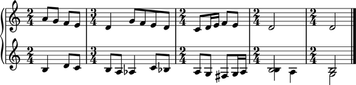
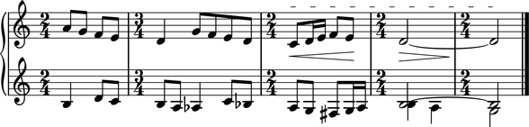

Bartók's *Wandering*
====================

This example reconstructs the last five measures of Bartók's *Wandering* from Mikrokosmos vol. III.  It demonstrates the use of many of the main classes in Abjad. The end result is just a few measures long, but the example covert most of the basic features you'll usually need.

Here is what we want to end up with:

.. image :: images/bartok_final.png

We will construct the fragment `top-down`, going from the high level containers to the details. We could have done it the other way around, but it will be easier to keep the big picture in mind this way. We encourage you to try rebuilding the example `bottom-down` as an exercise. 
First let's create the high level framework of the score:

::

	abjad> piano = scoretools.PianoStaff([ ])
	abjad> upper_staff = Staff([ ])
	abjad> lower_staff = Staff([ ])
	abjad> piano.append(upper_staff)
	abjad> piano.append(lower_staff)

Here we created an empty piano staff and we've assigned it to the ``piano`` variable.
Then we created two staves and assigned them to the ``upper_staff`` and ``lower_staff`` variables.
Finally, we appended the staves to the piano staff.  

Now let's add some measures to the framework:

::

	abjad> m1 = Measure((2, 4), [ ])
	abjad> m2 = Measure((3, 4), [ ])
	abjad> m3 = Measure((2, 4), [ ])
	abjad> m4 = Measure((2, 4), [ ])
	abjad> m5 = Measure((2, 4), [ ])
	abjad> upper_measures = [m1, m2, m3, m4, m5]
	abjad> lower_measures = componenttools.clone_components_and_covered_spanners(upper_measures)
	abjad> upper_staff.extend(upper_measures)
	abjad> lower_staff.extend(lower_measures)

Notice that the `lower_measures` are simply copies of the `upper_measures`. 

.. note::

   The component tools house the different copying functions that Abjad provides 
   for object duplication. 
   The difference between them resides in the way each handles spanners attached 
   to components during the duplication process.

Notice also that the measures are added to their corresponding staff via the ``extend`` method. 

.. note::

   Remember that ``extend`` is used for appending multiple objects that are 
   grouped together in an iterable while ``append`` is used for single objects.

Now lets actually start adding some notes. Let's begin with the upper staff:

::

	abjad> upper_measures[0].extend([Note(i, (1, 8)) for i in [9, 7, 5, 4]])
	abjad> upper_measures[1].extend(notetools.make_notes([2,7,5,4,2], [(1, 4)]+[(1, 8)]*4))
	abjad> notes = notetools.make_notes([0,2,4,5,4], [(1, 8), (1, 16), (1, 16), (1, 8), (1, 8)])
	abjad> upper_measures[2].extend(notes)
	abjad> upper_measures[3].append(Note(2, (1, 2)))
	abjad> upper_measures[4].append(Note(2, (1, 2)))

Let's now create the notes for the lower staff. This will be a more intricate process that that needed for the upper staff. Notice that, for the upper staff, we simply added notes directly to the measures. This will not be possible for the lower staff due to the parallel `threads` (voices or melodic lines) found in the last two measures. 

.. note::
   The usual term for a melodic line is `voice`. Generally speaking, the language developed in Abjad uses the term *thread* to refer to this notion. A `thread` however, has a more concrete interpretation in Abjad. Please refer to the :doc:`/chapters/fundamentals/threads/index` section for a complete explanation of `threads`.
   The term Voice (with upper case) we use specifically for either the voice class or an instance of the class. 

When two or more melodic lines are simultaneously present in the same staff, we need some way of grouping notes to disambiguate the paths of the possible melodic lines. We do this by creating explicit threads via the instantiation of the voice class. Here we create two threads: one called ``main_voice`` the other called ``appendix_voice``. The threads are made explicit by instantiating voice classes and by naming them appropriately.  

Let's move measure by measure in the construction of the lower staff:

::

	abjad> main_voice_m1 = Voice(notetools.make_notes([-1, 2, 0], [(1, 4), (1, 8), (1, 8)]))
	abjad> main_voice_m1.name = 'main_voice'
	abjad> lower_measures[0].append(main_voice_m1)

::

	abjad> main_voice_m2 = Voice(notetools.make_notes([-1, -3, -4, 0, -2], [(1, 8), (1, 8), (1, 4), (1, 8), (1, 8)]))
	main_voice_m2.name = 'main_voice'
	abjad> lower_measures[1].append(main_voice_m2)

::

	abjad> main_voice_m3 = Voice(notetools.make_notes([-3, -5, -6, -5, -3], [(1, 8), (1, 8), (1, 8), (1, 16), (1, 16)]))
	main_voice_m3.name = 'main_voice'
	abjad> lower_measures[2].append(main_voice_m3)

Notice that every voice we create is equally named `main_voice` to guarantee the existence of a continuous thread. Many transformations and score traversal operations are possible across threads, so this is another reason why threads are important.  

It is in the last two measures where we suddenly have two simultaneous voices in the lower staff. The new, second voice that seems to appear out of nowhere we will label `appendix_voice`:

::

	abjad> appendix_voice_m4 = Voice([Note(-1, (1, 2))])
	abjad> appendix_voice_m4.name = 'appendix_voice'
	abjad> marktools.LilyPondCommandMark('voiceOne')(appendix_voice_m4)
	abjad> main_voice_m4 = Voice([Note(-1, (1, 4)), Note(-3, (1, 4))])
	abjad> main_voice_m4.name = 'main_voice'
	abjad> marktools.LilyPondCommandMark('voiceTwo')(main_voice_m4)
	abjad> p = Container([appendix_voice_m4, main_voice_m4])
	abjad> p.parallel = True
	abjad> lower_measures[3].append(p)

Note that the `number` property of the `appendix_voice` is set to ``1``, and the `number` property of the `main_voice` is set to ``2``. These determine the direction of the stem for each voice.

Note too that because both voices occur simultaneously in the score, we must put them in a parallel container to tell Abjad that they indeed run in parallel. Notice the setting of the boolean `parallel` property of the container. It is this container that is passed to the measure.

We now do a similar thing for the last measure:

::

	abjad> appendix_voice_m5 = Voice([Note(-1, (1, 2))])
	abjad> appendix_voice_m5.name = 'appendix_voice'
	abjad> marktools.LilyPondCommandMark('voiceOne')(appendix_voice_m5)
	abjad> main_voice_m5 =  Voice([Note(-5, (1, 2))])
	abjad> main_voice_m5.name = 'main_voice'
	abjad> marktools.LilyPondCommandMark('voiceTwo')(main_voice_m5)
	abjad> p = Container([appendix_voice_m5, main_voice_m5])
	abjad> p.parallel = True
	abjad> lower_measures[4].append(p)

Let's see what we have up till now:

::

	abjad> show(piano)

.. image:: images/bartok_framework.png

Ok, let's add some detail. First, notice that the bottom staff has a treble clef, just like the top staff. Let's change that:

::

	abjad> contexttools.ClefMark('bass')(lower_staff)

Now let's sprinkle some dynamic markings. For the top staff, we will add them to the first note of the first measure and the second note of the second measure. For the bottom staff, we will add dynamic markings to the second note of the first measure and the fourth note of the second measure. Note that because we created Voices inside the measures of the lower staff, we need to index those too:

::

	abjad> contexttools.DynamicMark('pp')(upper_measures[0][0])
	abjad> contexttools.DynamicMark('mp')(upper_measures[1][1])
	abjad> contexttools.DynamicMark('pp')(lower_measures[0][0][1])
	abjad> contexttools.DynamicMark('mp')(lower_measures[1][0][3])

Let's also add a double bar line to the end of the piece:

::

	abjad> marktools.LilyPondCommandMark('bar "|."', format_slot = 'closing')(lower_staff.leaves[-1])

Let's see how this is coming out:

::

	abjad> show(piano)

.. image:: images/bartok_notes.png

Notice that the beams of the eighth and sixteenth notes appear as you would usually expect: grouped by beat. We get this for free thanks to LilyPond's default rendering algorithm. This is not, however, the way Bartok notated his score. Let's set the beams as Bartok did, running some across the bar lines: 

::

	abjad> spannertools.BeamSpanner(upper_measures[0])
	abjad> spannertools.BeamSpanner(lower_staff.leaves[1:5])
	abjad> spannertools.BeamSpanner(lower_staff.leaves[6:10])

::

	abjad> show(piano)

Now some slurs: 

::

	abjad> spannertools.SlurSpanner(upper_staff.leaves[0:5])
	abjad> spannertools.SlurSpanner(upper_staff.leaves[5:])
	abjad> spannertools.SlurSpanner(lower_staff.leaves[1:6])
	abjad> slr = spannertools.SlurSpanner(lower_staff.leaves[6:13] + (main_voice_m4, main_voice_m5))
	abjad> slr.position = 'down'

Notice that we store the last slur in the `slr` variable to change its ``position`` attribute to ``'down'``. This does what you would expect!

Now hairpins:

::

	abjad> spannertools.CrescendoSpanner(upper_staff.leaves[-7:-2])
	abjad> spannertools.DecrescendoSpanner(upper_staff.leaves[-2:])

And a ritardando marking above the last seven notes of the upper staff:

::

	abjad> tx = spannertools.TextSpanner(upper_staff.leaves[-7:])
	abjad> tx.bound_details__left__text = markuptools.Markup('ritard.')

And two ties connecting the last notes in the upper and lower staves:

::

	abjad> spannertools.TieSpanner(upper_staff[-2:])
	abjad> spannertools.TieSpanner([appendix_voice_m4[0], appendix_voice_m5[0]])

The final result:

::

	abjad> show(piano)

