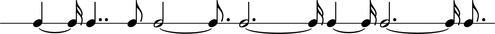
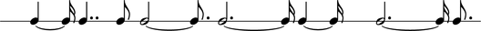
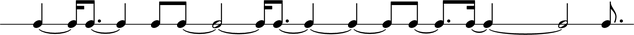

Floating metric grid, slicing and dicing
========================================

This example demonstrates how you can compose a sequence of notes with
arbitrary durations outside the metric hierarchy of a series of measures.
Then you can slice and dice the notes to have them fit a metric overlay added afterwards.

Let us first define a set of durations from prime numbers:

::

	abjad> durations = [5, 7, 2, 11, 13, 5, 13, 3]
	abjad> durations = zip(durations, [16] * len(durations))

::

	abjad> durations
	[(5, 16), (7, 16), (2, 16), (11, 16), (13, 16), (5, 16), (13, 16), (3, 16)]

Let us then create a list of notes from these durations:

::

	abjad> notes = notetools.make_notes(0, durations)

And then put these notes inside a rhythmic sketch staff:

::

	abjad> staff = stafftools.make_rhythmic_sketch_staff(notes)

::

	abjad> show(staff)

As this will become part of a piece for ensemble to be conducted,
we would like all the parts to have a common measure structure.
We now apply a metric grid spanner with the desired metric sequence to our staff:

::

	abjad> spannertools.MetricGridSpanner(staff, [(4, 4), (4, 4), (4, 4), (11, 16)])

::

	abjad> show(staff)

Notice how some notes span more than one measure and cross barlines.
This is a good thing because it shows that note
durations and meter are treated independently. 
It also shows the flexibility and exactness of LilyPond's internal rhythmic model. 
We may not want these spanning notes in our final score, however. 
We may also want to show each beat by splitting notes every quarter or every
half note duration. 
To do this we will slice the music to a second sequence of meters using component tools.
Because tied note may be created by the partitioning function, 
we then fuse all tied notes within each of the metric units
to guarantee that our durations are represented in the most compact form:

::

	abjad> meters = [(1, 4)] * 4 + [(2, 4)] + [(1, 4)] * 6 + [(2, 4)] + [(3, 16)]
	abjad> meters = [Fraction(*x) for x in meters]
	abjad> tmp = componenttools.split_components_once_by_prolated_durations_and_do_not_fracture_crossing_spanners
	abjad> tmp(staff.leaves, meters, tie_after=True)
	abjad> leaftools.fuse_tied_leaves_in_components_once_by_prolated_durations_without_overhang(staff.leaves, meters)

::

	abjad> show(staff)

Which gives our score.

.. note::

   This example reconstructs the first few measures of Stephen Lehman's `Rai` 
   following the composer's own process: 
   *"I basically created a duration row, and then applied a meter to it after the fact. 
   Then, once I started changing the distribution of prime number values 
   over the course of the piece, I tried to make them fit in the same time span."*
