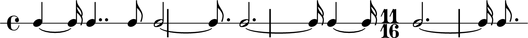
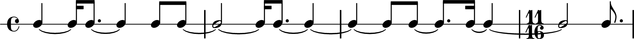

Example: metric grid
====================

This example [#f1]_ demonstrates how you can compose a sequence of notes with
arbitrary durations outside a metric hierarchy (e.g. Measures) and
then slice and dice the notes to have them fit a metric overlay added
`a posteriori`.

Let us first define a set of durations from prime numbers:

::

	abjad> durations = [5, 7, 2, 11, 13, 5, 13, 3]
	abjad> durations = zip(durations, [16] * len(durations))
	abjad> print durations
	[(5, 16), (7, 16), (2, 16), (11, 16), (13, 16), (5, 16), (13, 16), (3, 16)]

Let us now create a list of notes from these durations.

::

	abjad> notes = construct.notes(0, durations)
	abjad> print notes
	[Note(c', 4), Note(c', 16), Note(c', 4..), Note(c', 8), Note(c', 2), Note(c', 8.), Note(c', 2.), Note(c', 16), Note(c', 4), Note(c', 16), Note(c', 2.), Note(c', 16), Note(c', 8.)]

Let us now put these notes inside a :class:`RhythmicSketchStaff <abjad.staff.rhythmicsketchstaff.RhythmicSketchStaff>`

::

	abjad> staff = RhythmicSketchStaff(notes)
	abjad> show(staff)

As this will become part of a piece for ensemble to be conducted, we
would like all the parts to have a common metric (measure) structure.
We now apply a :class:`MetricGrid <abjad.metricgrid.spanner.MetricGrid>` spanner with the desired metric sequence
to our staff.

::

	abjad> MetricGrid(staff, [(4, 4), (4, 4), (4, 4), (11, 16)])
	abjad> staff.meter.clear( )
	abjad> staff.barline.clear( )
	abjad> show(staff)

Notice how some notes **span** more than one measure (i.e. they extend
over the bar lines). This is a good thing because it shows that note
durations and meter are treated independently. It also shows the
flexibility and exactness of LilyPond's internal rhythmic model. We
may not want these spanning notes in our final score, however. We may
also want to show each beat by splitting notes every quarter or every
half note duration. To do this we will slice the music to a second
sequence of meters using the  ``partition.unfractured_by_durations( )``
function. Because tied note may be created by the partitioning function, we then
fuse all tied notes within each of the metric units --via the 
``fuse.tie_chains_by_durations( )`` function-- to guarantee that our durations
are represented in the most compact form. 

::

	abjad> meters = [(1, 4)] * 4 + [(2, 4)] + [(1, 4)] * 6 + [(2, 4)] + [(3, 16)]
	abjad> meters = durtools.rationalize(meters)
	abjad> partition.unfractured_by_durations(staff.leaves, meters, tie_after=True)
	abjad> fuse.tie_chains_by_durations(staff.leaves, meters)
	abjad> show(staff)

And this gives us our final score snippet.

.. [#f1] This example reconstructs the first few measures of Stephen Lehman's `Rai` following the composer's own process: *"I basically created a duration row, and then applied a meter to it after the fact. Then, once I started changing the distribution of prime number values over the course of the piece, I tried to make them fit in the same time span."*

