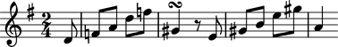
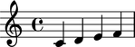
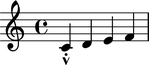
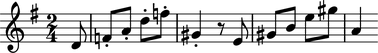
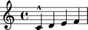
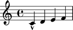
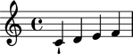
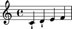
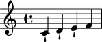
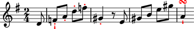

Articulations
=============

Articulations model staccati, marcati, tenuti and other symbols.
Articulations attach notes, rests or chords.

Creating articulations
----------------------

Use ``marktools`` to create articulations:

::

	articulation = marktools.Articulation('turn')

::

	abjad> articulation
	Articulation('turn')

Attaching articulations to a leaf
---------------------------------

Use ``attach()`` to attach articulations to a leaf:

::

	abjad> staff = Staff([])
	abjad> key_signature = contexttools.KeySignatureMark('g', 'major')
	abjad> key_signature.attach(staff)
	time_signature = contexttools.TimeSignatureMark((2, 4), partial = Duration(1, 8))
	abjad> time_signature.attach(staff)

::

	abjad> staff.extend("d'8 f'8 a'8 d''8 f''8 gs'4 r8 e'8 gs'8 b'8 e''8 gs''8 a'4")

::

	abjad> articulation.attach(staff[5])

::

	abjad> show(staff)

(The example is based on Haydn's piano sonata number 42, Hob. XVI/27.)

Attaching articulations to many notes and chords at once
--------------------------------------------------------

Use ``marktools`` to attach articulations to many notes and chords at one time:

::

	abjad> marktools.attach_articulations_to_notes_and_chords_in_expr(staff[:6], ['.'])

::

	abjad> show(staff)

Getting the articulations attached to a leaf
--------------------------------------------

Use ``marktools`` to get the articulations attached to a leaf:

::

	abjad> marktools.get_articulations_attached_to_component(staff[5])
	(Articulation('turn')(gs'4), Articulation('.')(gs'4))

Detaching articulations from a leaf one at a time
-------------------------------------------------

Detach articulations by hand with ``detach()``:

::

	abjad> articulation.detach()

::

	abjad> articulation
	-\turn

::

	abjad> show(staff)

Detaching all articulations attached to a leaf at once
------------------------------------------------------

Use ``marktools`` to detach all articulations attached to a leaf at once:

::

	abjad> staff[0]
	Note("d'8")

::

	abjad> marktools.detach_articulations_attached_to_component(staff[0])

::

	abjad> show(staff)

Inspecting the leaf to which an articulation is attached
--------------------------------------------------------

Use ``start_component`` to inspect the component to which an articulation is attached:

::

	abjad> articulation = marktools.Articulation('turn')
	abjad> articulation.attach(staff[-1])

::

	abjad> show(staff)

.. image:: images/articulations-5.png

::

	abjad> articulation.start_component
	Note("a'4")

Understanding the interpreter display of an articulation that is not attached to a leaf
---------------------------------------------------------------------------------------

The interpreter display of an articulation that is not attached to a leaf
contains three parts:

::

	abjad> articulation = marktools.Articulation('staccato')

::

	abjad> articulation
	abjad> print repr(articulation)
	Articulation('staccato')

``Articulation`` tells you the articulation's class.

``'staccato'`` tells you the articulation's name.

If you set the direction string of the articulation then that will appear, too:

::

	abjad> articulation.direction_string = '^'

::

	abjad> articulation
	abjad> print repr(articulation)
	Articulation('staccato', '^')

Understanding the interpreter display of an articulation that is attached to a leaf
-----------------------------------------------------------------------------------

The interpreter display of an articulation that is attached to a leaf
contains four parts:

::

	abjad> articulation.attach(staff[-1])

::

	abjad> articulation
	abjad> print repr(articulation)
	Articulation('staccato', '^')(a'4)

::

	abjad> show(staff)

``Articulation`` tells you the articulation's class.

``'staccato'`` tells you the articulation's name.

``'^'`` tells you the articulation's direction string.

``(a''4)`` tells you the component to which the articulation is attached.

If you set the direction string of the articulation to none then the direction
will no longer appear:

::

	abjad> articulation.direction_string = None

::

	abjad> articulation
	Articulation('staccato')(a'4)

Understanding the string representation of an articulation
----------------------------------------------------------

The string representation of an articulation comprises two parts:

::

	abjad> str(articulation)
	'-\\staccato'

``-`` tells you the articulation's direction string.

``staccato`` tells you the articulation's name.

Inspecting the LilyPond format of an articulation
-------------------------------------------------

Get the LilyPond input format of an articulation with ``format``:

::

	abjad> articulation.format
	'-\\staccato'

Use ``f()`` as a short-cut to print the LilyPond format of an articulation:

::

	abjad> f(articulation)
	-\staccato

Controlling whether an articulation appears above or below the staff
--------------------------------------------------------------------

Set ``direction_string`` to ``'^'`` to force an articulation to appear
above the staff:

::

	abjad> articulation.direction_string = '^'

::

	abjad> show(staff)

Set ``direction_string`` to ``'_'`` to force an articulation to appear
above the staff:

::

	abjad> articulation.direction_string = '_'

::

	abjad> show(staff)

Set ``direction_string`` to none to allow LilyPond to position
an articulation automatically:

::

	abjad> articulation.direction_string = None

::

	abjad> show(staff)

Getting and setting the name of an articulation
-----------------------------------------------

Set the ``name`` of an articulation to change the symbol an articulation prints:

::

	abjad> articulation.name = 'staccatissimo'

::

	abjad> show(staff)

Copying articulations
---------------------

Use ``copy.copy()`` to copy an articulation:

::

	abjad> import copy

::

	abjad> articulation_copy_1 = copy.copy(articulation)

::

	abjad> articulation_copy_1
	Articulation('staccatissimo')

::

	abjad> articulation_copy_1.attach(staff[1])

::

	abjad> show(staff)

Or use ``copy.deepcopy()`` to do the same thing.

Comparing articulations
-----------------------

Articulations compare equal with equal direction names and direction strings:

::

	abjad> articulation.name
	'staccatissimo'
	abjad> articulation.direction_string
	None

::

	abjad> articulation_copy_1.name
	'staccatissimo'
	abjad> articulation_copy_1.direction_string
	None

::

	abjad> articulation == articulation_copy_1
	True

Otherwise articulations do not compare equal.

Overriding attributes of the LilyPond script grob
-------------------------------------------------

Override attributes of the LilyPond script grob like this:

::

	abjad> staff.override.script.color = 'red'

::

	abjad> f(staff)
	\new Staff \with {
		\override Script #'color = #red
	} {
		\key g \major
		\partial 8
		\time 2/4
		d'8
		f'8 -\staccatissimo -\staccato
		a'8 -\staccato
		d''8 -\staccato
		f''8 -\staccato
		gs'4 -\staccato
		r8
		e'8
		gs'8
		b'8
		e''8
		gs''8
		a'4 -\staccatissimo -\turn
	}

::

	abjad> show(staff)

See the LilyPond documentation for a list of script grob attributes available.
